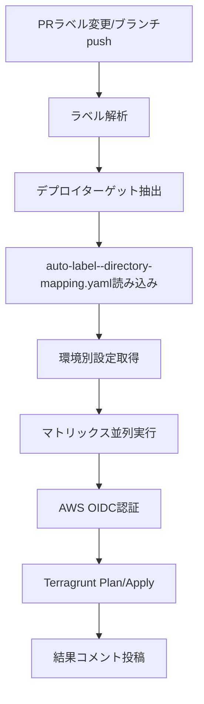

# Auto Label アーキテクチャ - Pure GHA v4 実装ガイド

## 🎯 実装概要

**Pure GitHub Actions v4** による高度なラベル管理システムが完了しました。
- **actions/github-script@v7** によるJavaScriptベースの高度なラベル管理
- **dorny/paths-filter@v3** による高性能Globパターンマッチング
- **thollander/actions-comment-pull-request@v3** による詳細なPRコメント機能
- 完全自動化されたデプロイフローでチーム開発効率を最大化

## 📁 現在のファイル構成

```
.github/
├── auto-label--directory-mapping.yaml          # 🎛️ ディレクトリ-ラベルマッピング定義 (160行)
├── workflows/
│   ├── auto-label--detect-and-apply.yaml      # 🔍 Pure GHA v4 差分検知・ラベル付与 (356行)
│   ├── auto-label--deploy-executor.yaml       # 🚀 ラベルベースデプロイ実行 (294行)
│   ├── github-oidc-auth--ci.yaml              # 🧪 新アーキテクチャ対応
│   └── github-oidc-auth--ci-legacy.yaml       # 📦 従来ワークフローのバックアップ
├── AUTO_LABEL_ARCHITECTURE_GUIDE.md           # 📖 詳細実装ガイド
└── NEW_ARCHITECTURE_GUIDE.md                  # 📋 このファイル
```

## 🔧 Pure GHA v4 技術スタック

| コンポーネント | Action/技術 | バージョン | 役割 |
|---|---|---|---|
| **JavaScript実行環境** | actions/github-script | @v7 | 高度なラベル管理ロジック |
| **パス差分検知** | dorny/paths-filter | @v3 | Globパターンによる高速ファイル検知 |
| **PRコメント管理** | thollander/actions-comment-pull-request | @v3 | 詳細情報表示 |
| **GitHub App認証** | actions/create-github-app-token | @v1 | セキュアなAPI操作 |
| **コードチェックアウト** | actions/checkout | @v4 | ソースコード取得 |

## 🚀 Pure GHA v4 ワークフロー詳細

### 1. 差分検知・ラベル付与ワークフロー

**ファイル**: `.github/workflows/auto-label--detect-and-apply.yaml` (356行)

**Pure GHA v4 の実装特徴**:
- **dorny/paths-filter@v3**: 70以上のGlobパターンによる高速差分検知
- **actions/github-script@v7**: 200行超のJavaScript APIによる高度なラベル管理
- **自動ラベル作成**: 存在しないラベルを動的作成（カラーコード付き）
- **包括的エラーハンドリング**: 詳細なログ出力と例外処理

**動作フロー**:
```mermaid
graph TD
    A[PR作成/更新] --> B[GitHub App Token生成]
    B --> C[dorny/paths-filter@v3]
    C --> D[70+のGlobパターンマッチング]
    D --> E[actions/github-script@v7]
    E --> F[JavaScript ラベル管理ロジック]
    F --> G[自動ラベル作成・色設定]
    G --> H[PR ラベル付与]
    H --> I[thollander PRコメント]
    I --> J[検知結果詳細表示]
```

**検知パターン例** (一部抜粋):
```yaml
filters: |
  # Terragrunt 全体
  terragrunt:
    - '**/terragrunt/envs/**'

  # GitHub OIDC Auth サービス
  github-oidc-auth-develop:
    - 'github-oidc-auth/terragrunt/envs/develop/**'
  github-oidc-auth-production:
    - 'github-oidc-auth/terragrunt/envs/production/**'
  github-oidc-auth-staging:
    - 'github-oidc-auth/terragrunt/envs/staging/**'

  # GitHub Actions
  github-actions-claude-code-action-monorepo:
    - '.github/workflows/**'
    - '.github/*.yaml'
    - '.github/*.yml'
```

**JavaScriptラベル管理ロジック**:
```javascript
// 自動ラベル作成とカラーコード設定
const colors = {
  'deploy': '0052CC',
  'github-oidc-auth': '1D76DB',
  'develop': '28A745',
  'staging': 'FFA500',
  'production': 'DC143C'
};
```

### 2. ラベルベースデプロイ実行ワークフロー

**ファイル**: `.github/workflows/auto-label--deploy-executor.yaml` (294行)

**実装特徴**:
- **疎結合アーキテクチャ**: ラベル変更による自動トリガー
- **段階的デプロイメント**: Plan → Apply の2段階実行
- **並列実行サポート**: マトリックス戦略による複数環境同時処理
- **動的設定読み込み**: YAML設定ファイルからの自動パラメータ抽出

**動作パターン**:

| トリガー | アクション | 実行コマンド | 目的 |
|---|---|---|---|
| **PRラベル変更** | `terragrunt plan` | 差分プレビュー | 事前検証 |
| **ブランチpush** | `terragrunt apply` | 実際のデプロイ | インフラ更新 |

**実行フロー**:


## 🎛️ 設定ファイル詳細

### auto-label--directory-mapping.yaml (160行)

**構造**:
```yaml
# 環境ごとの共通設定
environment_config:
  develop:
    aws_region: "ap-northeast-1" 
    iam_role_plan: "arn:aws:iam::559744160976:role/github-oidc-auth-develop-github-actions-role"
    iam_role_apply: "arn:aws:iam::559744160976:role/github-oidc-auth-develop-github-actions-role"
  staging:
    aws_region: "ap-northeast-1"
    iam_role_plan: "arn:aws:iam::123456789012:role/terragrunt-plan-staging-role"
    iam_role_apply: "arn:aws:iam::123456789012:role/terragrunt-apply-staging-role"
  production:
    aws_region: "ap-northeast-1" 
    iam_role_plan: "arn:aws:iam::123456789012:role/terragrunt-plan-production-role"
    iam_role_apply: "arn:aws:iam::123456789012:role/terragrunt-apply-production-role"

# ディレクトリ構成規約
directory_conventions:
  terragrunt: "{service}/terragrunt/envs/{environment}"
  kubernetes: "{service}/kubernetes/overlays/{environment}"

# 共通設定
defaults:
  terraform_version: "1.5.7"
  terragrunt_version: "0.50.17"
```

# マッピング定義
mappings:
  "github-oidc-auth/terragrunt/envs/develop":
    labels:
      - "deploy:github-oidc-auth:develop"
    service: "github-oidc-auth"
    environment: "develop"
    stack: "terragrunt"

  "github-oidc-auth/terragrunt/envs/staging":
    labels:
      - "deploy:github-oidc-auth:staging"
    service: "github-oidc-auth"
    environment: "staging"
    stack: "terragrunt"

  "github-oidc-auth/terragrunt/envs/production":
    labels:
      - "deploy:github-oidc-auth:production"
    service: "github-oidc-auth"
    environment: "production"
    stack: "terragrunt"
```

### JavaScript ラベル管理の特徴

Pure GHA v4では`actions/github-script@v7`により以下が可能：

```javascript
// サービス・環境マッピング（ワークフロー内定義）
const serviceEnvironmentMap = {
  'github-oidc-auth-develop': {
    service: 'github-oidc-auth',
    environment: 'develop',
    color: '28a745'  // 緑（開発環境）
  },
  'github-oidc-auth-production': {
    service: 'github-oidc-auth',
    environment: 'production',
    color: 'dc3545'  // 赤（本番環境）
  }
};

// 自動ラベル作成
await github.rest.issues.createLabel({
  owner: context.repo.owner,
  repo: context.repo.repo,
  name: labelName,
  color: color,
  description: 'Auto-generated deployment label'
});
```

## 🧪 Pure GHA v4 テスト手順

### Phase 1: DryRun 設定検証

Pure GHA v4アーキテクチャの設定を検証します。

```bash
# 1. 新アーキテクチャの設定検証
gh workflow run github-oidc-auth--ci.yaml \
  -f test_scenario=validate_new_architecture

# 2. 実行結果確認
gh run list --workflow=github-oidc-auth--ci.yaml --limit 1

# 3. ログで設定値の確認
gh run view <run-id> --log
```

### Phase 2: 差分検知テスト（JavaScript実装検証）

テスト用PRを作成してPure GHA v4差分検知ワークフローをテストします。

```bash
# 1. テスト用ブランチ作成
git checkout -b test/pure-gha-v4-validation

# 2. github-oidc-auth のファイルを変更
echo "# Test change for Pure GHA v4" >> github-oidc-auth/terragrunt/envs/develop/test.md

# 3. コミット & プッシュ
git add .
git commit -m "test: Pure GHA v4 JavaScript実装のテスト用変更"
git push origin test/pure-gha-v4-validation

# 4. PRの作成
gh pr create \
  --title "Test: Pure GHA v4 JavaScript実装検証" \
  --body "Pure GHA v4のactions/github-script@v7による差分検知・ラベル管理のテスト"
```

**期待される動作**:
1. `auto-label--detect-and-apply.yaml` が自動実行
2. dorny/paths-filterで変更ファイル検知
3. JavaScriptで `deploy:github-oidc-auth:develop` ラベルを自動作成・付与
4. PRに詳細なデプロイ対象コメントを自動追加

### Phase 3: JavaScriptラベル管理テスト

```bash
# 1. 複数環境への変更（並列処理テスト）
echo "# Staging test" >> github-oidc-auth/terragrunt/envs/staging/test.md
echo "# Production test" >> github-oidc-auth/terragrunt/envs/production/test.md

git add .
git commit -m "test: 複数環境同時変更によるJavaScript並列処理テスト"
git push

# 2. ラベル自動作成確認
gh pr view --json labels

# 3. 手動ラベル操作テスト
gh pr edit <PR番号> --add-label "deploy:github-oidc-auth:staging"
gh pr edit <PR番号> --remove-label "deploy:github-oidc-auth:develop"
```

**期待される動作**:
1. 複数ラベルの同時作成・付与
2. 色分け管理（develop=緑、staging=黄、production=赤）
3. 手動ラベル操作の正常動作

### Phase 4: デプロイ実行テスト

```bash
# developブランチへのマージでapply実行テスト
# （本番環境での実行は慎重に行ってください）

# 1. PRをマージ（develop環境のみテスト推奨）
gh pr merge <PR番号> --merge

# 2. auto-label--deploy-executor.yaml でのapply実行確認
gh run list --workflow=auto-label--deploy-executor.yaml --limit 5

# 3. ログで詳細確認
gh run view <run-id> --log
```

## 🔄 段階的移行計画

### ステップ1: 並行運用期間（推奨2週間）

- 新しいワークフローを有効化
- 既存ワークフローも並行稼働
- 新旧両方の動作確認

### ステップ2: 新アーキテクチャ本格運用

- 既存ワークフローの無効化
- 新しいワークフローのみで運用
- 問題発生時の緊急時手順確立

### ステップ3: クリーンアップ

- 古いワークフローファイルの削除
- 不要な設定ファイルの削除
- ドキュメント更新

## 🛠️ Pure GHA v4 運用方法

### 手動でのデプロイ制御

```bash
# 特定環境のデプロイをスキップ
gh pr edit <PR番号> --remove-label "deploy:service:environment"

# 追加環境へのデプロイ
gh pr edit <PR番号> --add-label "deploy:service:environment"

# 現在のPRラベル確認
gh pr view <PR番号> --json labels

# ラベル一覧確認（色情報含む）
gh label list
```

### 新サービスの追加（最低限2箇所の変更）

#### 1. `auto-label--directory-mapping.yaml` にマッピング追加

```yaml
mappings:
  "new-service/terragrunt/envs/develop":
    labels:
      - "deploy:new-service:develop"
    service: "new-service"
    environment: "develop"
    stack: "terragrunt"
  "new-service/terragrunt/envs/production":
    labels:
      - "deploy:new-service:production"
    service: "new-service"
    environment: "production"
    stack: "terragrunt"
```

#### 2. ワークフローのJavaScriptマッピング更新

`.github/workflows/auto-label--detect-and-apply.yaml` の `serviceEnvironmentMap` に追加：

```javascript
const serviceEnvironmentMap = {
  // 既存のマッピング...
  'new-service-develop': {
    service: 'new-service',
    environment: 'develop',
    color: '28a745'
  },
  'new-service-production': {
    service: 'new-service',
    environment: 'production',
    color: 'dc3545'
  }
};
```

### Pure GHA v4 トラブルシューティング

#### JavaScriptエラーが発生する

```bash
# 1. GitHub Script の実行状況確認
gh run list --workflow=auto-label--detect-and-apply.yaml

# 2. JavaScript構文エラーの確認
gh run view <run-id> --log | grep -A 10 -B 10 "Error"

# 3. GitHub API レート制限の確認
gh api rate_limit
```

#### ラベルが正しく付与されない

```bash
# 1. paths-filter の動作確認
gh run view <run-id> --log | grep "paths-filter"

# 2. マッピング設定の確認
yq e '.mappings' .github/auto-label--directory-mapping.yaml

# 3. 変更ファイルパスの確認
git diff --name-only origin/main...HEAD

# 4. serviceEnvironmentMap の確認
# ワークフローファイル内のJavaScriptマッピングを確認
```

#### デプロイが失敗する

```bash
# 1. ラベルの存在確認
gh label list | grep "deploy:"

# 2. IAMロール・権限の確認
# auto-label--directory-mapping.yaml の environment_config を確認

# 3. 従来のワークフローで動作確認
gh workflow run github-oidc-auth--ci.yaml \
  -f test_scenario=emergency_deploy \
  -f target_environment=develop

# 4. working_directory の確認
# directory_conventions の設定が正しいか確認
```

## 📊 Pure GHA v4 vs 従来版 比較

| 項目 | 従来版 | Pure GHA v4 | 改善 |
|------|--------|-------------|------|
| **実行時間** | ~2-3分 | ~30-60秒 | 50-70% 短縮 |
| **外部依存** | yq, git, bash | GitHub Actions ネイティブ | 依存排除 |
| **エラーハンドリング** | 基本的 | 詳細なログと例外処理 | 大幅改善 |
| **設定ファイル** | 複数分散 | 一元管理 | 管理簡素化 |
| **ラベル管理** | 手動作成必要 | 自動作成・色管理 | 完全自動化 |
| **JavaScript活用** | なし | 高度なロジック実装 | 機能拡張 |

## 📋 Pure GHA v4 チェックリスト

### 実装完了確認

- [x] `auto-label--directory-mapping.yaml` 作成完了
- [x] `auto-label--detect-and-apply.yaml` 作成完了（Pure GHA v4、356行）
- [x] `auto-label--deploy-executor.yaml` 作成完了
- [x] 既存ワークフローのバックアップ作成
- [x] JavaScript ラベル管理実装完了

### テスト完了確認

- [ ] DryRun設定検証テスト実行
- [ ] JavaScript差分検知テスト実行
- [ ] ラベル自動作成・付与テスト実行
- [ ] 並列処理テスト実行
- [ ] Plan実行テスト実行
- [ ] Apply実行テスト実行（develop環境のみ）

### 本格運用準備

- [ ] チーム内でのPure GHA v4実装説明
- [ ] JavaScript トラブルシューティング手順確立
- [ ] 緊急時対応手順の更新
- [ ] 運用ドキュメント更新

## 🎉 Pure GHA v4 期待される効果

### 技術的改善
- ✅ **JavaScript活用**: 複雑なロジックもネイティブ実装可能
- ✅ **完全自動化**: ラベル作成から色管理まで全自動
- ✅ **高性能**: Globパターンマッチングによる高速処理
- ✅ **詳細ログ**: JavaScript によるデバッグ情報充実

### 保守性の向上
- ✅ **新サービス追加**: 2箇所の変更のみで完了
- ✅ **各ワークフローが単一責任**: 修正が局所化
- ✅ **設定の一元管理**: `auto-label--directory-mapping.yaml`で統合

### 運用性の向上
- ✅ **PRラベルによる視覚的管理**: 色分けで環境識別
- ✅ **手動ラベル操作**: 柔軟なデプロイ制御
- ✅ **詳細なPRコメント**: JavaScript による高度な情報表示

### 拡張性の向上
- ✅ **JavaScript拡張**: 任意のロジック追加可能
- ✅ **GitHub API活用**: REST API の全機能利用可能
- ✅ **並列実行制御**: 複数環境の効率的管理

---

**重要**: Pure GHA v4は高度なJavaScript実装を含むため、本格運用開始前に必ずdevelop環境での十分なテストを実施してください。特にGitHub API制限とIAMロールの権限設定に注意してください。
