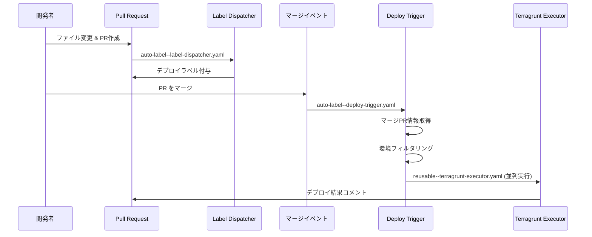
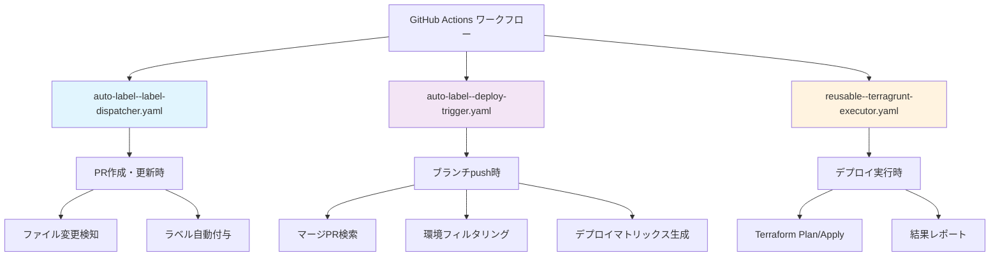
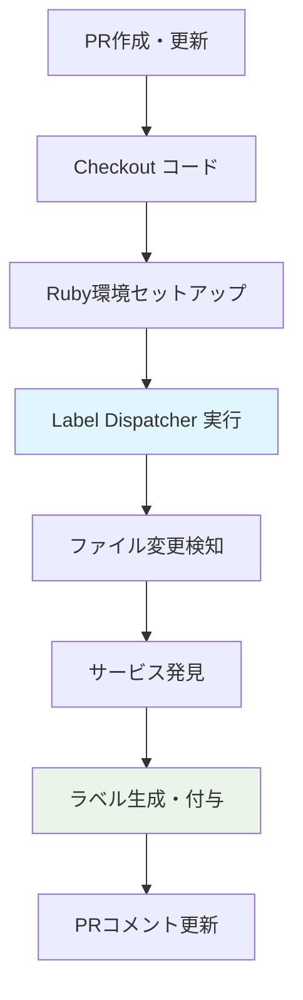
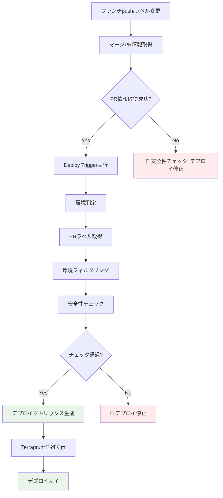
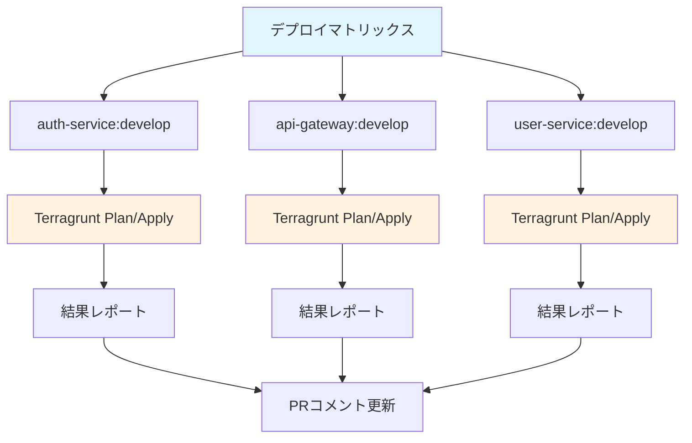
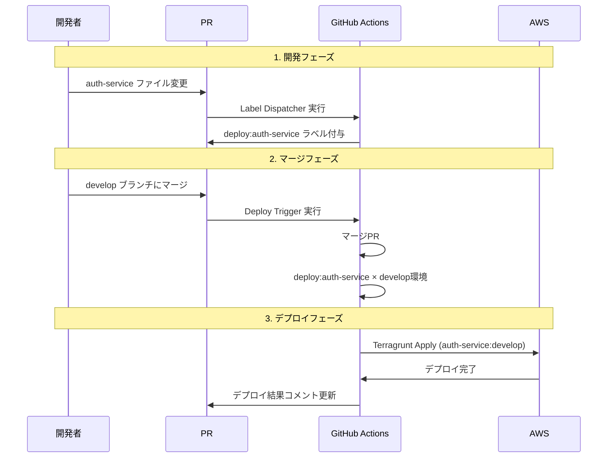
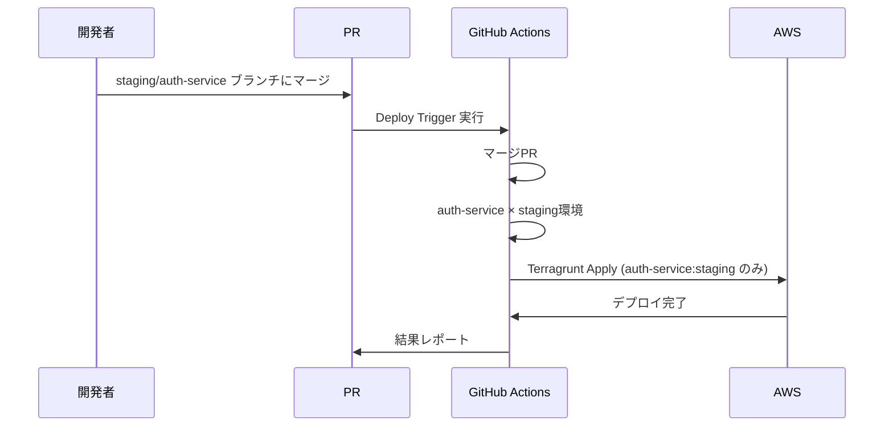

# GitHub Actions 統合完全ガイド

## 🎯 概要

ワークフロー自動化システムと GitHub Actions の統合により、Issue #107 で定義された統一デプロイメント戦略が完全に自動化されます。

## 🔄 ワークフロー全体図



## 📁 ワークフローファイル構成

### 3つの主要ワークフロー


## 🏷️ Label Dispatcher ワークフロー

### トリガー条件
```yaml
on:
  pull_request:
    types: [opened, synchronize]  # PR作成・更新時
    branches: ['**']              # 全ブランチ対象
```

### 処理フロー


### 重要なステップ
```yaml
- name: Setup Ruby
  uses: ruby/setup-ruby@v1
  with:
    ruby-version: '3.4'
    bundler-cache: true
    working-directory: .github/scripts/shared

- name: Dispatch labels with label-dispatcher
  working-directory: .github/scripts/shared
  run: |
    bundle exec ruby ../label-dispatcher/bin/dispatcher dispatch ${{ github.event.pull_request.number }} \
      --base-ref=${{ github.event.pull_request.base.sha }} \
      --head-ref=${{ github.event.pull_request.head.sha }}
  env:
    GITHUB_TOKEN: ${{ steps.app-token.outputs.token }}
    GITHUB_REPOSITORY: ${{ github.repository }}
```

### 依存関係管理のポイント
- **Gemfile の場所**: `shared/Gemfile` で統一管理
- **bundler-cache**: `shared` ディレクトリで有効化
- **実行方法**: `bundle exec` で正しい gem 環境を使用
- **スクリプトパス**: 相対パス `../機能名/bin/スクリプト` で指定

## 🚀 Deploy Trigger ワークフロー

### トリガー条件
```yaml
on:
  pull_request:
    types: [labeled, unlabeled]    # ラベル変更時（Plan実行）
  push:
    branches:                      # ブランチpush時（Apply実行）
      - develop
      - main
      - 'staging/**'
      - 'production/**'
```

### 処理フロー詳細


### 核心: マージPR情報取得
```yaml
- name: Get merged PR information
  if: github.event_name == 'push'
  id: get-merged-pr
  uses: actions-ecosystem/action-get-merged-pull-request@v1
  with:
    github_token: ${{ steps.app-token.outputs.token }}
  continue-on-error: true

- name: Deploy Trigger - Extract targets from branch push
  if: github.event_name == 'push'
  working-directory: .github/scripts/shared
  run: |
    if [ -n "${{ steps.get-merged-pr.outputs.number }}" ]; then
      echo "Found merged PR #${{ steps.get-merged-pr.outputs.number }}"
      bundle exec ruby ../deploy-trigger/bin/trigger from_pr ${{ steps.get-merged-pr.outputs.number }}
    else
      echo "::error::No merged PR found - deployment stopped"
      exit 1
    fi
```

### 安全性チェック
```yaml
- name: Safety check validation
  if: env.ERROR_OCCURRED == 'true'
  run: |
    echo "::error::Deployment safety validation failed: ${ERROR_MESSAGE}"
    echo "This prevents unauthorized or accidental deployments."
    exit 1
```

## ⚙️ Terragrunt Executor ワークフロー

### 再利用可能ワークフロー
```yaml
uses: ./.github/workflows/reusable--terragrunt-executor.yaml
secrets: inherit
with:
  project-name: ${{ matrix.target.service }}
  environment: ${{ matrix.target.environment }}
  action-type: ${{ github.event_name == 'pull_request' && 'plan' || 'apply' }}
  # ... その他のパラメータ
```

### 並列実行マトリックス


### 重要な検証ステップ
```yaml
- name: Validate working directory
  run: |
    if [ ! -d "${{ inputs.working-directory }}" ]; then
      echo "::error::Working directory '${{ inputs.working-directory }}' does not exist"
      exit 1
    fi
    echo "✅ Working directory validated: ${{ inputs.working-directory }}"
```

## 🔒 セキュリティとアクセス制御

### GitHub App Token
```yaml
- name: Generate GitHub App token
  id: app-token
  uses: actions/create-github-app-token@v2
  with:
    app-id: ${{ vars.APP_ID }}
    private-key: ${{ secrets.APP_PRIVATE_KEY }}
```

### AWS 認証
```yaml
- name: Configure AWS credentials
  uses: aws-actions/configure-aws-credentials@v4
  with:
    role-to-assume: ${{ inputs.action-type == 'plan' && inputs.plan-iam-role || inputs.apply-iam-role }}
    aws-region: ${{ inputs.aws-region }}
    role-session-name: GitHubActions-Terragrunt-${{ inputs.action-type }}-${{ inputs.environment }}
    audience: sts.amazonaws.com
```

### 権限設定
```yaml
permissions:
  id-token: write        # AWS OIDC用
  contents: read         # リポジトリ読み取り
  pull-requests: write   # PR操作
  packages: read         # パッケージ読み取り
```

## 📊 出力とモニタリング

### GitHub Actions 出力
```yaml
outputs:
  targets: ${{ steps.extract.outputs.targets }}
  has_targets: ${{ steps.extract.outputs.has_targets }}
  target_environment: ${{ steps.extract.outputs.target_environment }}
  safety_status: ${{ steps.extract.outputs.safety_status }}
```

### 環境変数設定
```bash
# Deploy Trigger が設定する環境変数
DEPLOYMENT_TARGETS=[{"service":"auth-service","environment":"develop",...}]
HAS_TARGETS=true
TARGET_ENVIRONMENT=develop
SAFETY_STATUS=passed
BRANCH_NAME=develop
MERGED_PR_NUMBER=123
DEPLOY_LABELS=["deploy:auth-service", "deploy:api-gateway"]
```

### PRコメント自動更新
```yaml
- name: Create or update PR comment
  uses: thollander/actions-comment-pull-request@v3
  with:
    message: |
      ## 🚀 Terragrunt Apply Completed
      **Project**: ${{ inputs.project-name }}
      **Environment**: `${{ inputs.environment }}`
      **Status**: ${{ steps.parse-results.outputs.status }}
      <details>
      <summary>📝 Apply Output</summary>
      ```hcl
      ${{ steps.parse-results.outputs.output }}
      ```
      </details>
    comment-tag: 'terragrunt-apply-${{ inputs.environment }}-${{ inputs.project-name }}'
    mode: upsert
```

## 🔄 実行フロー例

### develop ブランチへのマージ


### staging/auth-service ブランチへのマージ


## 🐛 トラブルシューティング

### よくあるエラーと対処法

#### 1. "No merged PR found"
```yaml
# 原因: 直接pushでPR経由でない
# 対処: PR経由でマージするか、緊急時は safety_checks を一時的に無効化
```

#### 2. "Working directory does not exist"
```yaml
# 原因: 設定ファイルのディレクトリパスが間違っている
# 対処: workflow-config.yaml の directory_conventions を確認
```

#### 3. "AWS credentials configuration failed"
```yaml
# 原因: IAMロール設定が間違っている
# 対処: IAMロールARNとOIDC設定を確認
```

### デバッグ方法
```yaml
# GitHub Actions ログの確認
- name: Debug environment
  run: |
    echo "Event: ${{ github.event_name }}"
    echo "Branch: ${{ github.ref_name }}"
    echo "PR Number: ${{ github.event.pull_request.number }}"
    env | grep GITHUB_ | sort
```

### 段階的ロールバック
```yaml
# 問題発生時の緊急対応
- name: Emergency rollback
  if: failure()
  run: |
    echo "::error::Deployment failed, initiating rollback"
    # 前回の成功したデプロイメントに戻す
    terragrunt apply -auto-approve -target=previous_version
```

## 🔧 カスタマイズとベストプラクティス

### 通知設定
```yaml
- name: Slack notification
  if: always()
  uses: 8398a7/action-slack@v3
  with:
    status: ${{ job.status }}
    channel: '#deployments'
    webhook_url: ${{ secrets.SLACK_WEBHOOK }}
```

### パフォーマンス最適化
```yaml
# 依存関係キャッシュ
- name: Cache dependencies
  uses: actions/cache@v3
  with:
    path: |
      ~/.bundle
      .terraform
    key: ${{ runner.os }}-deps-${{ hashFiles('Gemfile.lock', '**/*.tf') }}
```

### 設定検証の強化
```yaml
- name: Pre-deployment validation
  run: |
    # 設定ファイル検証
    ruby .github/scripts/config-manager/bin/config-manager validate

    # リソースクォータ確認
    aws servicequotas get-service-quota --service-code ec2 --quota-code L-1216C47A

    # デプロイ前のヘルスチェック
    curl -f https://api.example.com/health || exit 1
```

---

この GitHub Actions 統合により、Issue #107 の戦略が完全に自動化され、開発チームは安全で効率的なデプロイメントを実現できます。全てのステップが自動化されているため、人的エラーのリスクが最小限に抑えられ、一貫性のあるデプロイメントプロセスが保証されます。
