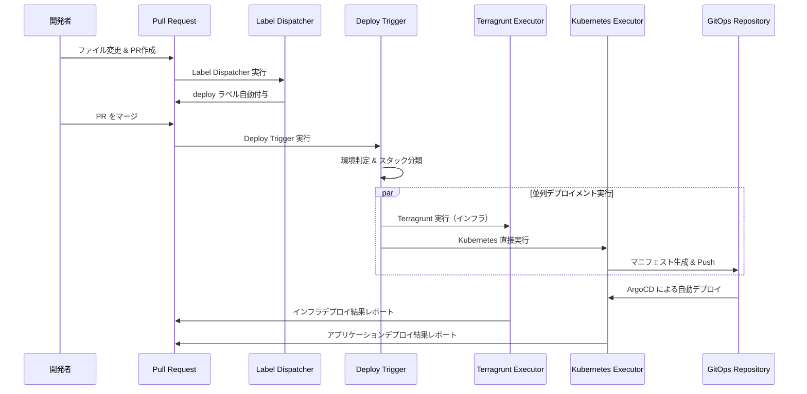
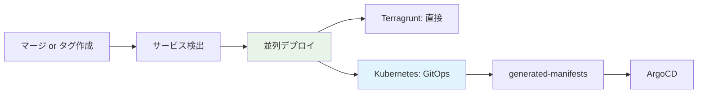
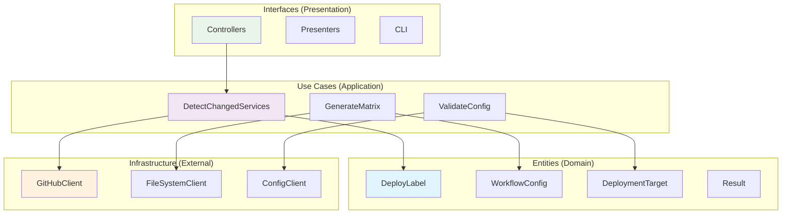

# GitHub Actions ワークフロー自動化システム

## 🎯 概要

このシステムは、monorepo 環境でのデプロイメント自動化を実現する統合ワークフローです。ファイル変更を検知し、適切なサービスにデプロイラベルを付与し、安全な自動デプロイメントを実行します。

## 🔄 システム全体像



## 📁 ワークフロー構成

### 3つの主要ワークフロー

| ワークフロー             | 役割                               | トリガー                    | 実装場所                     |
| ------------------------ | ---------------------------------- | --------------------------- | ---------------------------- |
| **Label Dispatcher**     | ファイル変更検知 → ラベル付与      | PR作成・更新時              | `scripts/label-dispatcher/`  |
| **Deploy Trigger**       | ラベル → デプロイ実行              | ブランチpush・タグ作成時    | `scripts/deploy-trigger/`    |
| **Deployment Executors** | インフラ・アプリケーション変更適用 | Deploy Trigger から呼び出し | `workflows/reusable--*.yaml` |

### デプロイメント戦略

| 環境           | Kubernetes | その他スタック | トリガー           | 目的                         |
| -------------- | ---------- | -------------- | ------------------ | ---------------------------- |
| **develop**    | **GitOps** | 直接デプロイ   | **ブランチマージ** | 開発効率・迅速フィードバック |
| **staging**    | **GitOps** | 直接デプロイ   | **ブランチマージ** | **本番リハーサル**           |
| **production** | **GitOps** | 直接デプロイ   | **タグ作成**       | 安全性・追跡可能性           |



## 🚀 使用方法

### 1. 通常の開発フロー

```bash
# 1. 機能開発
git checkout -b feature/new-feature
# ファイル変更...

# 2. PR作成
git push origin feature/new-feature
# → Label Dispatcher が自動でラベル付与

# 3. develop ブランチにマージ
# → Deploy Trigger が自動でdevelop環境にデプロイ
```

### 2. staging環境への部分デプロイ

```bash
# staging環境への選択的デプロイ
git checkout staging
git checkout develop -- auth-service/  # 特定サービスのみマージ
git commit -m "Deploy auth-service to staging"
git push origin staging
# → auth-service のみ staging環境にデプロイ
```

### 3. production環境への個別デプロイ

```bash
# production環境への単一サービスデプロイ
git tag auth-service/v1.2.3
git push origin auth-service/v1.2.3
# → auth-service のみ production環境にデプロイ

# production環境への複数サービスデプロイ
git tag api-gateway/v1.2.3
git tag user-service/v1.2.3
git push origin --tags
# → 各サービスが個別に production環境にデプロイ
```

## 🏗️ システムアーキテクチャ

### 実装



### ディレクトリ構造

```
.github/
├── workflows/
│   ├── auto-label--label-dispatcher.yaml
│   ├── auto-label--deploy-trigger.yaml
│   └── reusable--*-executor.yaml
└── scripts/
    ├── shared/
    │   ├── entities/
    │   ├── infrastructure/
    │   ├── interfaces/
    │   └── workflow-config.yaml # 統合設定ファイル
    ├── label-dispatcher/
    ├── deploy-trigger/
    └── config-manager/
```

## 🔧 設定管理

### 統合設定ファイル
```yaml
# .github/scripts/shared/workflow-config.yaml
environments:
  - environment: develop
    aws_region: ap-northeast-1
    iam_role_plan: arn:aws:iam::123:role/plan-develop
    iam_role_apply: arn:aws:iam::123:role/apply-develop

directory_conventions:
  terragrunt: "{service}/terragrunt/envs/{environment}"
  kubernetes: "{service}/kubernetes/overlays/{environment}"

services:
  - name: claude-code-action
    directory_conventions:
      terragrunt: infrastructures/{service}/terragrunt/envs/{environment}
```

### 設定検証とテスト
```bash
# 開発環境セットアップ
cd .github/scripts
bundle install

# 設定ファイル検証
bundle exec ruby config-manager/bin/config-manager validate

# 特定サービステスト
bundle exec ruby config-manager/bin/config-manager test auth-service develop

# 包括的診断
bundle exec ruby config-manager/bin/config-manager diagnostics
```

## 🛡️ 安全性機能

### 必須要件
- **マージPR必須**: 直接pushでのデプロイを防止
- **ラベル検証**: 適切なラベルが付与されているかチェック
- **環境フィルタリング**: ブランチ・タグに応じた適切な環境のみデプロイ
- **ディレクトリ検証**: 存在しないパスへのデプロイを防止

### 権限管理
```yaml
# GitHub App による権限管理
permissions:
  id-token: write        # AWS OIDC用
  contents: read         # リポジトリ読み取り
  pull-requests: write   # PR操作
  packages: read         # パッケージ読み取り
```

### 安全性設定
```yaml
# workflow-config.yaml
safety_checks:
  require_merged_pr: true      # マージPR情報必須
  fail_on_missing_pr: true     # PR情報なしでデプロイ停止
  max_retry_attempts: 3        # API エラー時のリトライ回数
```

## 📊 実行例

### develop ブランチマージ時

**変更ファイル:**
```
auth-service/src/main.rs
api-gateway/config/routes.yaml
```

**自動生成されるラベル:**
```
deploy:auth-service
deploy:api-gateway
```

**実行されるデプロイ:**
- auth-service → develop環境（Terragrunt + Kubernetes）
- api-gateway → develop環境（Terragrunt + Kubernetes）

### staging ブランチマージ時

**変更ファイル:** `auth-service/`ディレクトリのみ選択的マージ

**実行されるデプロイ:**
- auth-service → staging環境（Terragrunt + Kubernetes）

### production タグ作成時

**タグ:** `auth-service/v1.2.3`

**実行されるデプロイ:**
- auth-service → production環境（Terragrunt + Kubernetes）

## 🧪 開発とテスト

### ローカル開発環境
```bash
# 環境変数設定
export GITHUB_TOKEN=ghp_xxxx
export GITHUB_REPOSITORY=owner/repo

# 依存関係インストール
cd .github/scripts
bundle install
```

### ローカルでのテスト
```bash
# ラベル検出テスト
bundle exec ruby label-dispatcher/bin/dispatcher test \
  --base-ref=main --head-ref=feature/test

# デプロイトリガーテスト（ブランチ）
bundle exec ruby deploy-trigger/bin/trigger test develop

# デプロイトリガーテスト（タグ）
bundle exec ruby deploy-trigger/bin/trigger test auth-service/v1.2.3

# デバッグモード実行
DEBUG=true bundle exec ruby deploy-trigger/bin/trigger debug staging
```

### 機能別テスト

#### Label Dispatcher
```ruby
# 使用例
detector = UseCases::LabelManagement::DetectChangedServices.new(
  file_client: file_client,
  config_client: config_client
)

result = detector.execute(
  base_ref: 'main',
  head_ref: 'feature/auth'
)
```

#### Deploy Trigger
```ruby
# 使用例（ブランチベース）
trigger = UseCases::DeployTrigger::DetermineTargetEnvironment.new(
  config_client: config_client
)

result = trigger.execute(
  ref_name: 'staging',
  event_type: 'push'
)

# 使用例（タグベース）
result = trigger.execute(
  ref_name: 'auth-service/v1.2.3',
  event_type: 'create'
)
```

#### Config Manager
```ruby
# 使用例
validator = UseCases::ConfigManagement::ValidateConfig.new(
  config_client: config_client
)

result = validator.execute
```

## 🐛 トラブルシューティング

### よくあるエラー

1. **"No merged PR found"**
   - **原因**: 直接pushでPR経由でない
   - **解決**: PR経由でマージする

2. **"Working directory does not exist"**
   - **原因**: ディレクトリパスが間違っている
   - **解決**: `workflow-config.yaml` の設定確認

3. **"No deployment labels found"**
   - **原因**: ラベルが正しく付与されていない
   - **解決**: Label Dispatcher の実行ログ確認

4. **"Invalid tag format"**
   - **原因**: production タグの命名規則違反
   - **解決**: `{service}/v{version}` 形式で作成

### デバッグ手順
```bash
# ステップ1: 設定ファイル確認
bundle exec ruby config-manager/bin/config-manager check_file

# ステップ2: 設定検証
bundle exec ruby config-manager/bin/config-manager validate

# ステップ3: 包括診断
bundle exec ruby config-manager/bin/config-manager diagnostics

# ステップ4: 個別機能テスト
bundle exec ruby label-dispatcher/bin/dispatcher validate_env
bundle exec ruby deploy-trigger/bin/trigger validate_env
```

### GitHub Actions デバッグ
```yaml
# ワークフロー内でのデバッグ出力
- name: Debug environment
  run: |
    echo "Event: ${{ github.event_name }}"
    echo "Ref: ${{ github.ref }}"
    echo "Ref Name: ${{ github.ref_name }}"
    echo "Tag: ${{ github.ref_type == 'tag' && github.ref_name || 'N/A' }}"
    env | grep GITHUB_ | sort
```

## 🔧 拡張とカスタマイズ

### 新しいユースケース追加
```ruby
# 1. Use Case クラス作成
class UseCases::NewFeature::DoSomething
  def execute(params)
    # 実装
  end
end

# 2. Controller に統合
class Controllers::NewFeatureController
  def initialize(do_something_use_case:)
    @do_something = do_something_use_case
  end
end

# 3. CLI コマンド追加
desc "new_command", "New command description"
def new_command
  controller.execute_new_feature
end
```

### 新しいインフラストラクチャ追加
```ruby
# 外部サービス連携
class Infrastructure::SlackClient
  def send_notification(message)
    # Slack API呼び出し
  end
end
```

### 設定のカスタマイズ
```yaml
# 複数AWS アカウント対応
environments:
  - environment: production
    aws_region: ap-northeast-1
    aws_account_id: "999999999999"  # 本番アカウント
    iam_role_plan: arn:aws:iam::999999999999:role/plan/v1.2.3

# 地域別デプロイメント
  - environment: production-multi-region
    aws_region: ap-northeast-1
    secondary_regions: ["us-east-1", "eu-west-1"]
```

## 📊 パフォーマンスとモニタリング

### GitHub Actions 最適化
```yaml
# 依存関係キャッシュ
- name: Setup Ruby
  uses: ruby/setup-ruby@v1
  with:
    ruby-version: '3.4'
    bundler-cache: true
    working-directory: .github/scripts
```

### 並列実行制御
```yaml
# デプロイメントマトリックス
strategy:
  matrix:
    target: ${{ fromJson(needs.extract-deployment-targets.outputs.targets) }}
  fail-fast: false
```

### モニタリング
- GitHub Actions の実行ログ
- PR コメントでの結果レポート
- Slack 通知による状況共有

## 📚 詳細ドキュメント

| ガイド                                         | 内容                       | 対象読者         |
| ---------------------------------------------- | -------------------------- | ---------------- |
| [Label Dispatcher](label-dispatcher/README.md) | ラベル自動付与システム詳細 | 開発者・運用担当 |
| [Deploy Trigger](deploy-trigger/README.md)     | デプロイ実行制御詳細       | 開発者・運用担当 |
| [Config Manager](config-manager/README.md)     | 設定管理・検証詳細         | システム管理者   |
| [設定ファイル](shared/README.md)               | 統合設定リファレンス       | 全員             |

## 🔒 セキュリティ考慮事項

### 機密情報の取り扱い
- GitHub Token は環境変数から取得
- AWS認証情報はOIDCを使用
- ログに機密情報を出力しない

### 入力検証
```ruby
# 悪意のある入力への対策
def validate_branch_name(branch_name)
  raise "Invalid branch name" unless branch_name.match?(/\A[a-zA-Z0-9\-_\/]+\z/)
end

def validate_tag_name(tag_name)
  raise "Invalid tag name" unless tag_name.match?(/\Av\d+\.\d+\.\d+-\w+/v1.2.3\z/)
end
```

## 🔄 継続的改善

### パフォーマンス監視
- 実行時間の計測
- メモリ使用量の監視
- API呼び出し回数の追跡

### コード品質
- テストカバレッジ 90% 以上
- 循環的複雑度の管理
- 技術的負債の定期的な解消

### 依存関係管理
```bash
# 依存関係更新
bundle update

# セキュリティ監査
bundle audit

# 脆弱性スキャン
bundle exec ruby -e "puts 'Security check completed'"
```
