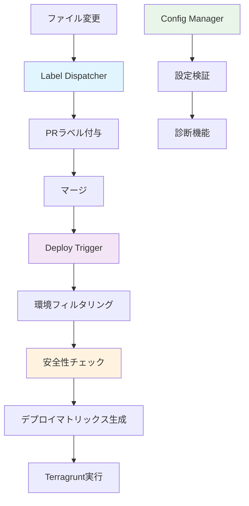
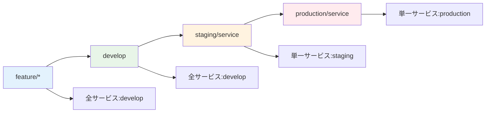
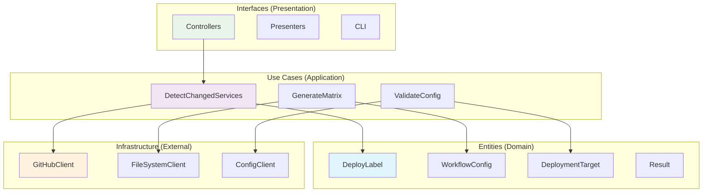

# ワークフロー自動化システム完全理解ガイド - 概要編

## 🎯 システム概要

Issue #107 の統一デプロイメント戦略に基づいて構築された、安全で効率的なワークフロー自動化システムです。

### 🏗️ システム構成



### 📋 主要機能

| 機能                 | 責務                                                            | 実行タイミング |
| -------------------- | --------------------------------------------------------------- | -------------- |
| **Label Dispatcher** | ファイル変更検知 → サービス発見 → `deploy:{service}` ラベル付与 | PR作成・更新時 |
| **Deploy Trigger**   | ブランチ → 環境判定 → サービス × 環境でデプロイ                 | ブランチpush時 |
| **Config Manager**   | 設定検証・診断・テンプレート生成                                | 手動実行       |

### 🔄 Issue #107 デプロイ戦略の実装



### 🛡️ 安全性メカニズム

- **マージPR必須**: 直接pushでのデプロイを防止
- **環境フィルタリング**: ブランチに応じた適切な環境のみデプロイ
- **設定検証**: デプロイ前の包括的な設定チェック
- **ディレクトリ検証**: 存在しないパスへのデプロイを防止

### 📁 ディレクトリ構造

```
.github/scripts/
├── shared/                     # 共通コンポーネント
│   ├── entities/              # ドメインエンティティ
│   ├── infrastructure/        # 外部システム連携
│   ├── interfaces/            # プレゼンター・インターフェース
│   ├── shared_loader.rb       # 共通読み込み
│   ├── workflow-config.yaml   # 統合設定ファイル
│   └── Gemfile               # 依存関係
├── label-dispatcher/          # ラベル管理機能
│   ├── use_cases/
│   ├── controllers/
│   ├── application.rb
│   └── bin/dispatcher
├── deploy-trigger/            # デプロイトリガー機能
│   ├── use_cases/
│   ├── controllers/
│   ├── application.rb
│   └── bin/trigger
└── config-manager/            # 設定管理機能
    ├── use_cases/
    ├── controllers/
    ├── application.rb
    └── bin/config-manager
```

### 🎪 Clean Architecture 実装



### 🚀 利用方法

#### GitHub Actions (自動実行)
```yaml
# Label Dispatcher - PR作成・更新時
on:
  pull_request:
    types: [opened, synchronize]

# Deploy Trigger - ブランチpush時
on:
  push:
    branches: [develop, main, 'staging/**', 'production/**']
```

#### CLI (手動実行)
```bash
# shared ディレクトリから実行（推奨）
cd .github/scripts/shared

# ラベル管理
bundle exec ruby ../label-dispatcher/bin/dispatcher dispatch 123

# デプロイトリガー
bundle exec ruby ../deploy-trigger/bin/trigger from_branch develop

# 設定管理
bundle exec ruby ../config-manager/bin/config-manager validate
```

### 📚 詳細ガイド

- [Label Dispatcher 完全ガイド](./label-dispatcher/README.md)
- [Deploy Trigger 完全ガイド](./deploy-trigger/README.md)
- [Config Manager 完全ガイド](./config-manager/README.md)
- [設定ファイル完全ガイド](./shared/README.md)

---

このシステムにより、Issue #107 で定義された統一デプロイメント戦略が完全に実現され、安全で効率的なmonorepo運用が可能になります。
