# GitHub Actions ワークフロー自動化システム

## 🎯 概要

このシステムは、monorepo 環境でのデプロイメント自動化を実現する統合ワークフローです。ファイル変更を検知し、適切なサービスにデプロイラベルを付与し、安全な自動デプロイメントを実行します。

## 🔄 システム全体像

```mermaid
sequenceDiagram
    participant Dev as 開発者
    participant PR as Pull Request
    participant LD as Label Dispatcher
    participant DT as Deploy Trigger
    participant TG as Terragrunt Executor
    participant K8s as Kubernetes Executor

    Dev->>PR: ファイル変更 & PR作成
    PR->>LD: Label Dispatcher 実行
    LD->>PR: deploy ラベル自動付与

    Dev->>PR: PR をマージ
    PR->>DT: Deploy Trigger 実行
    DT->>DT: 環境判定 & 安全性チェック

    par 並列デプロイメント実行
        DT->>TG: Terragrunt 実行（インフラ）
        DT->>K8s: Kubernetes 実行（アプリケーション）
    end

    TG->>PR: インフラデプロイ結果レポート
    K8s->>PR: アプリケーションデプロイ結果レポート
```



## 📁 ワークフロー構成

### 3つの主要ワークフロー

| ワークフロー             | 役割                               | トリガー                    | 実装場所                     |
| ------------------------ | ---------------------------------- | --------------------------- | ---------------------------- |
| **Label Dispatcher**     | ファイル変更検知 → ラベル付与      | PR作成・更新時              | `scripts/label-dispatcher/`  |
| **Deploy Trigger**       | ラベル → デプロイ実行              | ブランチpush時              | `scripts/deploy-trigger/`    |
| **Deployment Executors** | インフラ・アプリケーション変更適用 | Deploy Trigger から呼び出し | `workflows/reusable--*.yaml` |

### デプロイメント戦略

```mermaid
graph LR
    A[develop/main] --> B[全サービス → develop環境]
    C[staging/*] --> D[全サービス → staging環境]
    E[production/*] --> F[全サービス → production環境]

    style B fill:#e8f5e8
    style D fill:#fff3e0
    style F fill:#ffebee
```



## 🚀 使用方法

### 1. 通常の開発フロー

```bash
# 1. 機能開発
git checkout -b feature/new-feature
# ファイル変更...

# 2. PR作成
git push origin feature/new-feature
# → Label Dispatcher が自動でラベル付与

# 3. develop ブランチにマージ
# → Deploy Trigger が自動でdevelop環境にデプロイ
```

### 2. 環境別デプロイ

```bash
# staging環境への単一サービスデプロイ
git checkout -b staging/auth-service
git push origin staging/auth-service
# → auth-service のみ staging環境にデプロイ

# production環境への単一サービスデプロイ
git checkout -b production/auth-service
git push origin production/auth-service
# → auth-service のみ production環境にデプロイ
```

## 🏗️ システムアーキテクチャ

### Clean Architecture 実装


### ディレクトリ構造

```
.github/
├── workflows/                  # GitHub Actions ワークフロー
│   ├── auto-label--label-dispatcher.yaml
│   ├── auto-label--deploy-trigger.yaml
│   └── reusable--terragrunt-executor.yaml
└── scripts/                    # 自動化スクリプト
    ├── shared/                 # 共通コンポーネント
    │   ├── entities/          # ドメインエンティティ
    │   ├── infrastructure/    # 外部システム連携
    │   ├── interfaces/        # プレゼンター・インターフェース
    │   └── workflow-config.yaml # 統合設定ファイル
    ├── label-dispatcher/       # ラベル管理機能
    ├── deploy-trigger/         # デプロイトリガー機能
    └── config-manager/         # 設定管理機能
```

## 🔧 設定管理

### 統合設定ファイル
```yaml
# .github/scripts/shared/workflow-config.yaml
environments:
  - environment: develop
    aws_region: ap-northeast-1
    iam_role_plan: arn:aws:iam::123:role/plan-develop
    iam_role_apply: arn:aws:iam::123:role/apply-develop

directory_conventions:
  terragrunt: "{service}/terragrunt/envs/{environment}"
  kubernetes: "{service}/kubernetes/overlays/{environment}"

services:
  - name: claude-code-action
    directory_conventions:
      terragrunt: .github/actions/{service}/terragrunt/envs/{environment}
```

### 設定検証とテスト
```bash
# 開発環境セットアップ
cd .github/scripts
bundle install

# 設定ファイル検証
bundle exec ruby config-manager/bin/config-manager validate

# 特定サービステスト
bundle exec ruby config-manager/bin/config-manager test auth-service develop

# 包括的診断
bundle exec ruby config-manager/bin/config-manager diagnostics
```

## 🛡️ 安全性機能

### 必須要件
- **マージPR必須**: 直接pushでのデプロイを防止
- **ラベル検証**: 適切なラベルが付与されているかチェック
- **環境フィルタリング**: ブランチに応じた適切な環境のみデプロイ
- **ディレクトリ検証**: 存在しないパスへのデプロイを防止

### 権限管理
```yaml
# GitHub App による権限管理
permissions:
  id-token: write        # AWS OIDC用
  contents: read         # リポジトリ読み取り
  pull-requests: write   # PR操作
  packages: read         # パッケージ読み取り
```

### 安全性設定
```yaml
# workflow-config.yaml
safety_checks:
  require_merged_pr: true      # マージPR情報必須
  fail_on_missing_pr: true     # PR情報なしでデプロイ停止
  max_retry_attempts: 3        # API エラー時のリトライ回数
```

## 📊 実行例

### develop ブランチマージ時

**変更ファイル:**
```
auth-service/src/main.rs
api-gateway/config/routes.yaml
```

**自動生成されるラベル:**
```
deploy:auth-service
deploy:api-gateway
```

**実行されるデプロイ:**
- auth-service → develop環境（Terragrunt + Kubernetes）
- api-gateway → develop環境（Terragrunt + Kubernetes）

### staging ブランチマージ時

**ブランチ:** `staging/auth-service`
**PR ラベル:** `deploy:auth-service`, `deploy:api-gateway`

**実行されるデプロイ:**
- auth-service → staging環境（Terragrunt + Kubernetes）
- api-gateway → staging環境（Terragrunt + Kubernetes）

## 🧪 開発とテスト

### ローカル開発環境
```bash
# 環境変数設定
export GITHUB_TOKEN=ghp_xxxx
export GITHUB_REPOSITORY=owner/repo

# 依存関係インストール
cd .github/scripts
bundle install
```

### ローカルでのテスト
```bash
# ラベル検出テスト
bundle exec ruby label-dispatcher/bin/dispatcher test \
  --base-ref=main --head-ref=feature/test

# デプロイトリガーテスト
bundle exec ruby deploy-trigger/bin/trigger test develop

# デバッグモード実行
DEBUG=true bundle exec ruby deploy-trigger/bin/trigger debug staging/auth-service
```

### 機能別テスト

#### Label Dispatcher
```ruby
# 使用例
detector = UseCases::LabelManagement::DetectChangedServices.new(
  file_client: file_client,
  config_client: config_client
)

result = detector.execute(
  base_ref: 'main',
  head_ref: 'feature/auth'
)
```

#### Deploy Trigger
```ruby
# 使用例
trigger = UseCases::DeployTrigger::DetermineTargetEnvironment.new(
  config_client: config_client
)

result = trigger.execute(branch_name: 'staging/auth-service')
```

#### Config Manager
```ruby
# 使用例
validator = UseCases::ConfigManagement::ValidateConfig.new(
  config_client: config_client
)

result = validator.execute
```

## 🐛 トラブルシューティング

### よくあるエラー

1. **"No merged PR found"**
   - **原因**: 直接pushでPR経由でない
   - **解決**: PR経由でマージする

2. **"Working directory does not exist"**
   - **原因**: ディレクトリパスが間違っている
   - **解決**: `workflow-config.yaml` の設定確認

3. **"No deployment labels found"**
   - **原因**: ラベルが正しく付与されていない
   - **解決**: Label Dispatcher の実行ログ確認

### デバッグ手順
```bash
# ステップ1: 設定ファイル確認
bundle exec ruby config-manager/bin/config-manager check_file

# ステップ2: 設定検証
bundle exec ruby config-manager/bin/config-manager validate

# ステップ3: 包括診断
bundle exec ruby config-manager/bin/config-manager diagnostics

# ステップ4: 個別機能テスト
bundle exec ruby label-dispatcher/bin/dispatcher validate_env
bundle exec ruby deploy-trigger/bin/trigger validate_env
```

### GitHub Actions デバッグ
```yaml
# ワークフロー内でのデバッグ出力
- name: Debug environment
  run: |
    echo "Event: ${{ github.event_name }}"
    echo "Branch: ${{ github.ref_name }}"
    echo "PR Number: ${{ github.event.pull_request.number }}"
    env | grep GITHUB_ | sort
```

## 🔧 拡張とカスタマイズ

### 新しいユースケース追加
```ruby
# 1. Use Case クラス作成
class UseCases::NewFeature::DoSomething
  def execute(params)
    # 実装
  end
end

# 2. Controller に統合
class Controllers::NewFeatureController
  def initialize(do_something_use_case:)
    @do_something = do_something_use_case
  end
end

# 3. CLI コマンド追加
desc "new_command", "New command description"
def new_command
  controller.execute_new_feature
end
```

### 新しいインフラストラクチャ追加
```ruby
# 外部サービス連携
class Infrastructure::SlackClient
  def send_notification(message)
    # Slack API呼び出し
  end
end
```

### 設定のカスタマイズ
```yaml
# 複数AWS アカウント対応
environments:
  - environment: production
    aws_region: ap-northeast-1
    aws_account_id: "999999999999"  # 本番アカウント
    iam_role_plan: arn:aws:iam::999999999999:role/plan-production

# 地域別デプロイメント
  - environment: production-multi-region
    aws_region: ap-northeast-1
    secondary_regions: ["us-east-1", "eu-west-1"]
```

## 📊 パフォーマンスとモニタリング

### GitHub Actions 最適化
```yaml
# 依存関係キャッシュ
- name: Setup Ruby
  uses: ruby/setup-ruby@v1
  with:
    ruby-version: '3.4'
    bundler-cache: true
    working-directory: .github/scripts
```

### 並列実行制御
```yaml
# デプロイメントマトリックス
strategy:
  matrix:
    target: ${{ fromJson(needs.extract-deployment-targets.outputs.targets) }}
  fail-fast: false
```

### モニタリング
- GitHub Actions の実行ログ
- PR コメントでの結果レポート
- Slack 通知による状況共有

## 📚 詳細ドキュメント

| ガイド                                                 | 内容                       | 対象読者         |
| ------------------------------------------------------ | -------------------------- | ---------------- |
| [Label Dispatcher](label-dispatcher/README.md) | ラベル自動付与システム詳細 | 開発者・運用担当 |
| [Deploy Trigger](deploy-trigger/README.md)     | デプロイ実行制御詳細       | 開発者・運用担当 |
| [Config Manager](config-manager/README.md)     | 設定管理・検証詳細         | システム管理者   |
| [設定ファイル](shared/README.md)               | 統合設定リファレンス       | 全員             |

## 🔒 セキュリティ考慮事項

### 機密情報の取り扱い
- GitHub Token は環境変数から取得
- AWS認証情報はOIDCを使用
- ログに機密情報を出力しない

### 入力検証
```ruby
# 悪意のある入力への対策
def validate_branch_name(branch_name)
  raise "Invalid branch name" unless branch_name.match?(/\A[a-zA-Z0-9\-_\/]+\z/)
end
```

## 🔄 継続的改善

### パフォーマンス監視
- 実行時間の計測
- メモリ使用量の監視
- API呼び出し回数の追跡

### コード品質
- テストカバレッジ 90% 以上
- 循環的複雑度の管理
- 技術的負債の定期的な解消

### 依存関係管理
```bash
# 依存関係更新
bundle update

# セキュリティ監査
bundle audit

# 脆弱性スキャン
bundle exec ruby -e "puts 'Security check completed'"
```
