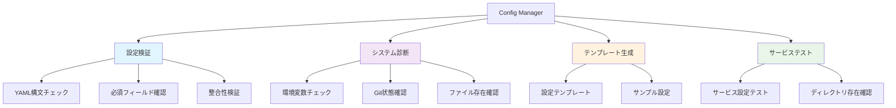
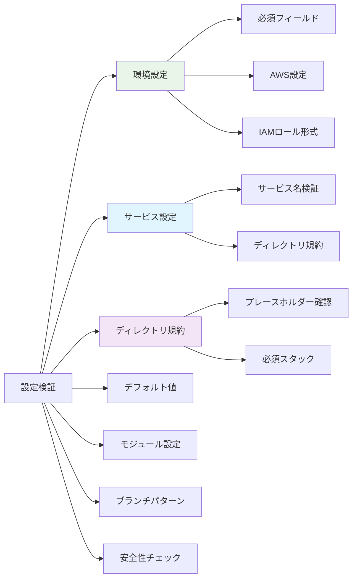
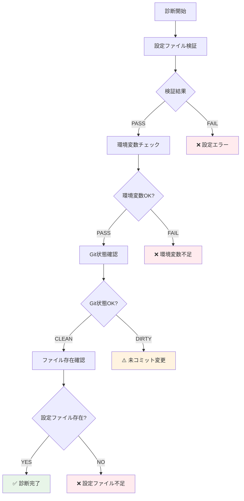
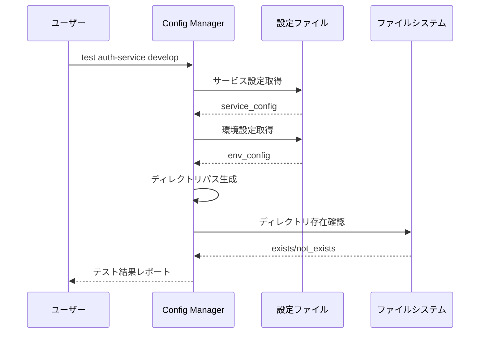

# Config Manager - 設定管理・検証システム

## 🎯 概要

Config Manager は、ワークフロー自動化システムの設定ファイル（`workflow-config.yaml`）を管理・検証・診断するツールです。設定の整合性チェック、環境診断、テンプレート生成など、システム運用に必要な管理機能を提供します。

## 🔧 主要機能



## 📋 設定検証の詳細

### 包括的検証項目


### 検証ルール詳細

#### 環境設定検証
```yaml
# 必須環境
required_environments: [develop, staging, production]

# 各環境の必須フィールド
required_fields:
  - aws_region
  - iam_role_plan
  - iam_role_apply

# フォーマット検証
aws_region: /^[a-z]{2}-[a-z]+-\d+$/
iam_role_arn: /^arn:aws:iam::/
```

#### ディレクトリ規約検証
```yaml
# 必須プレースホルダー
required_placeholders: ['{service}']

# 必須スタック
required_stacks: ['terragrunt']
```

#### サービス設定検証
```ruby
# サービス名の検証
def validate_service_name(service_name)
  errors = []

  if service_name.start_with?('.')
    errors << "Service name cannot start with dot: #{service_name}"
  end

  unless service_name.match?(/\A[a-zA-Z0-9\-_]+\z/)
    errors << "Service name contains invalid characters: #{service_name}"
  end

  errors
end
```

## 🏥 システム診断機能



### 診断チェック項目

#### 1. 設定ファイル検証
- YAML 構文の正確性
- 必須セクションの存在
- フィールド形式の妥当性
- 相互参照の整合性

#### 2. 環境変数チェック
```bash
# 必須環境変数
GITHUB_TOKEN    # GitHub API アクセス用
GITHUB_REPOSITORY # リポジトリ識別用
```

#### 3. Git 状態確認
- リポジトリの存在
- 未コミット変更の有無
- ブランチ状態
- リモート同期状況

#### 4. ファイル存在確認
- `shared/workflow-config.yaml` の存在
- 読み取り権限の確認
- 設定ファイルのサイズチェック

## 🎨 テンプレート生成機能

### 基本テンプレート
```yaml
# 最小構成テンプレート
environments:
  - environment: develop
    aws_region: ap-northeast-1
    iam_role_plan: arn:aws:iam::ACCOUNT_ID:role/plan-develop
    iam_role_apply: arn:aws:iam::ACCOUNT_ID:role/apply-develop

directory_conventions:
  terragrunt: "{service}/terragrunt/envs/{environment}"
  kubernetes: "{service}/kubernetes/overlays/{environment}"

defaults:
  aws_region: ap-northeast-1
  iam_role_plan: arn:aws:iam::ACCOUNT_ID:role/plan-default
  iam_role_apply: arn:aws:iam::ACCOUNT_ID:role/apply-default

modules:
  terraform_version: "1.12.1"
  terragrunt_version: "0.81.0"

branch_patterns:
  develop:
    target_environment: develop

safety_checks:
  require_merged_pr: true
  fail_on_missing_pr: true
```

### 完全構成テンプレート
```yaml
# 本番対応の完全テンプレート
environments:
  - environment: develop
    aws_region: ap-northeast-1
    iam_role_plan: arn:aws:iam::DEV_ACCOUNT:role/plan-develop
    iam_role_apply: arn:aws:iam::DEV_ACCOUNT:role/apply-develop
  - environment: staging
    aws_region: ap-northeast-1
    iam_role_plan: arn:aws:iam::STAGING_ACCOUNT:role/plan-staging
    iam_role_apply: arn:aws:iam::STAGING_ACCOUNT:role/apply-staging
  - environment: production
    aws_region: ap-northeast-1
    iam_role_plan: arn:aws:iam::PROD_ACCOUNT:role/plan-production
    iam_role_apply: arn:aws:iam::PROD_ACCOUNT:role/apply-production

services:
  - name: auth-service
    directory_conventions:
      terragrunt: "services/{service}/terragrunt/envs/{environment}"
      kubernetes: "services/{service}/kubernetes"
  - name: api-gateway
    directory_conventions:
      terragrunt: "services/{service}/infrastructure/envs/{environment}"

branch_patterns:
  develop: develop
  staging: staging
  production: production

safety_checks:
  require_merged_pr: true
  fail_on_missing_pr: true
  max_retry_attempts: 3
  allowed_direct_push_branches: []
```

## 🔬 サービステスト機能



### テスト項目詳細
```ruby
# サービステストの実装例
def test_service_configuration(service_name, environment)
  results = []

  # 1. サービス設定の存在確認
  results << test_service_exists(service_name)

  # 2. 環境設定の存在確認
  results << test_environment_exists(environment)

  # 3. ディレクトリパス生成テスト
  results << test_directory_path_generation(service_name, environment)

  # 4. 実際のディレクトリ存在確認
  results << test_working_directory_exists(service_name, environment)

  # 5. IAM ロール設定の妥当性
  results << test_iam_role_configuration(environment)

  # 6. AWS リージョン設定の確認
  results << test_aws_region_configuration(environment)

  results
end
```

## 🚀 CLI 使用方法

### 基本コマンド
```bash
# shared ディレクトリから実行（推奨）
cd .github/scripts

# 設定ファイル全体の検証
bundle exec ruby config-manager/bin/config-manager validate

# 設定内容の表示
bundle exec ruby config-manager/bin/config-manager show

# 包括的な診断実行
bundle exec ruby config-manager/bin/config-manager diagnostics

# 設定テンプレート生成
bundle exec ruby config-manager/bin/config-manager template
```

### 詳細コマンド
```bash
# 特定サービスのテスト
bundle exec ruby config-manager/bin/config-manager test auth-service develop

# 環境一覧表示
bundle exec ruby config-manager/bin/config-manager environments

# サービス一覧表示
bundle exec ruby config-manager/bin/config-manager services

# 安全性設定確認
bundle exec ruby config-manager/bin/config-manager safety_checks

# 設定ファイル存在確認
bundle exec ruby config-manager/bin/config-manager check_file

# config-manager ディレクトリから直接実行
cd .github/scripts/config-manager
ruby bin/config-manager validate
```

### 高度なコマンド
```bash
# 設定の相互参照チェック
bundle exec ruby config-manager/bin/config-manager cross_reference_check

# パフォーマンステスト
bundle exec ruby config-manager/bin/config-manager performance_test

# セキュリティ監査
bundle exec ruby config-manager/bin/config-manager security_audit
```

## 📊 出力例

### 検証成功時
```
✅ Configuration is valid
Summary:
  environments_count: 3
  services_count: 5
  directory_conventions_count: 2
  terraform_version: 1.12.1
  terragrunt_version: 0.81.0
  safety_checks_enabled: true

Environment Coverage:
  ✅ develop: 5 services configured
  ✅ staging: 5 services configured
  ✅ production: 5 services configured

Configuration Health: EXCELLENT
```

### 検証失敗時
```
❌ Configuration validation failed (3 errors found)

Critical Errors:
  - Environment 'develop' missing required field: iam_role_plan
  - Service 'auth-service' directory convention missing {service} placeholder
  - Branch pattern 'staging' references unknown environment: unknown_env

Warnings:
  - Default AWS region not specified, using ap-northeast-1
  - No custom services defined, using auto-discovery

Recommendations:
  1. Add missing IAM role configuration for develop environment
  2. Update auth-service directory conventions to include placeholders
  3. Fix branch pattern environment reference
```

### 診断結果
```
🏥 System Diagnostic Results

Configuration Validation:     ✅ PASS - Configuration is valid
Environment Variables:        ✅ PASS - All required variables present
Git Repository Status:        ⚠️  WARN - Repository has uncommitted changes
Configuration File Access:   ✅ PASS - File found and readable
Directory Structure:          ✅ PASS - All service directories exist
AWS Connectivity:            ✅ PASS - AWS credentials configured
GitHub API Access:           ✅ PASS - API token has required permissions

Overall Health: GOOD (1 warning)
```

### サービステスト結果
```
🔧 Service Configuration Test

Service: auth-service
Environment: develop

Configuration Test Results:
  ✅ Service exists in configuration
  ✅ Environment exists in configuration
  ✅ Directory path generation successful
  ✅ Working directory exists: auth-service/terragrunt
  ✅ IAM roles properly configured
  ✅ AWS region configured: ap-northeast-1

Generated Paths:
  Terragrunt: auth-service/terragrunt
  Kubernetes: auth-service/kubernetes

IAM Configuration:
  Plan Role: arn:aws:iam::123456789012:role/plan-develop
  Apply Role: arn:aws:iam::123456789012:role/apply-develop

Test Result: ✅ ALL CHECKS PASSED
```

## 🏗️ アーキテクチャ

### Use Cases
```ruby
module UseCases
  module ConfigManagement
    class ValidateConfig
      # 設定ファイルの包括的検証
      def execute
        # 1. YAML 構文チェック
        # 2. 必須セクション検証
        # 3. フィールド形式検証
        # 4. 相互参照整合性チェック
        # 5. セキュリティ設定検証
      end
    end

    class DiagnoseSystem
      # システム全体の診断
      def execute
        # 1. 設定ファイル検証
        # 2. 環境変数チェック
        # 3. Git状態確認
        # 4. 外部依存関係確認
      end
    end

    class TestServiceConfiguration
      # 特定サービスの設定テスト
      def execute(service_name:, environment:)
        # 1. サービス設定存在確認
        # 2. 環境設定存在確認
        # 3. ディレクトリパス生成・確認
        # 4. 実行可能性テスト
      end
    end

    class GenerateConfigTemplate
      # 設定テンプレート生成
      def execute(template_type: :basic)
        # 1. テンプレート種別判定
        # 2. 組織固有設定の反映
        # 3. ベストプラクティス適用
      end
    end
  end
end
```
