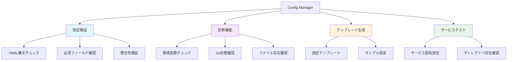
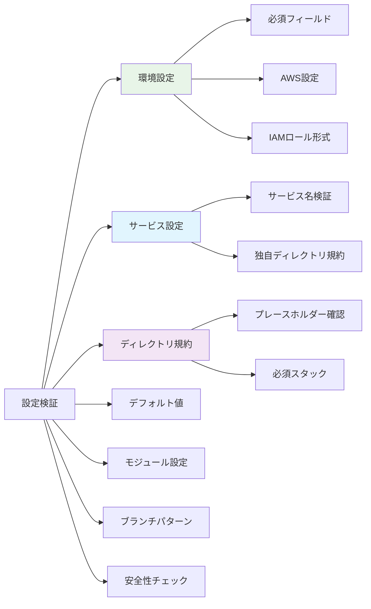
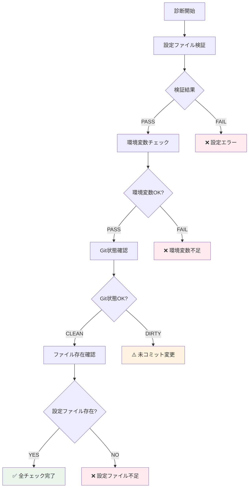
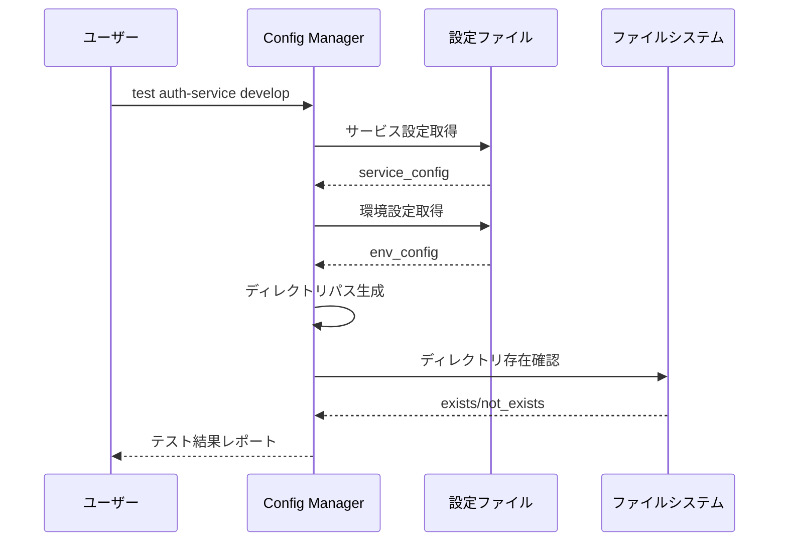

# Config Manager 完全理解ガイド

## 🎯 概要

Config Manager は、ワークフロー自動化システムの設定ファイルを管理・検証・診断するツールです。

## 🔧 主要機能



## 📋 設定検証の詳細

### 検証項目一覧


### 検証ルール

#### 環境設定検証
```yaml
# 必須環境
required_environments: [develop, staging, production]

# 各環境の必須フィールド
required_fields:
  - aws_region
  - iam_role_plan
  - iam_role_apply

# フォーマット検証
aws_region: /^[a-z]{2}-[a-z]+-\d+$/
iam_role_arn: /^arn:aws:iam::/
```

#### ディレクトリ規約検証
```yaml
# 必須プレースホルダー
required_placeholders: ['{service}', '{environment}']

# 必須スタック
required_stacks: ['terragrunt']
```

## 🏥 診断機能詳細



### 診断チェック項目

1. **設定ファイル検証**
   - YAML 構文の正確性
   - 必須セクションの存在
   - フィールド形式の妥当性

2. **環境変数チェック**
   ```bash
   GITHUB_TOKEN    # GitHub API アクセス用
   GITHUB_REPOSITORY # リポジトリ識別用
   ```

3. **Git 状態確認**
   - リポジトリの存在
   - 未コミット変更の有無
   - ブランチ状態

4. **ファイル存在確認**
   - `shared/workflow-config.yaml` の存在
   - 読み取り権限の確認

## 🎨 テンプレート生成機能

### 生成される設定テンプレート
```yaml
# 環境設定テンプレート
environments:
  - environment: develop
    aws_region: ap-northeast-1
    iam_role_plan: arn:aws:iam::ACCOUNT_ID:role/plan-develop
    iam_role_apply: arn:aws:iam::ACCOUNT_ID:role/apply-develop

# サービス設定テンプレート
services:
  - name: example-service
    directory_conventions:
      terragrunt: "services/{service}/terragrunt/envs/{environment}"

# 安全性設定テンプレート
safety_checks:
  require_merged_pr: true
  fail_on_missing_pr: true
```

## 🔬 サービステスト機能



### テスト項目
- サービス設定の存在確認
- 環境設定の存在確認
- 作業ディレクトリの存在確認
- IAM ロール設定の妥当性
- AWS リージョン設定の確認

## 🚀 CLI 使用方法

### 基本コマンド
```bash
# shared ディレクトリから実行（推奨）
cd .github/scripts/shared

# 設定ファイル全体の検証
bundle exec ruby ../config-manager/bin/config-manager validate

# 設定内容の表示
bundle exec ruby ../config-manager/bin/config-manager show

# 包括的な診断実行
bundle exec ruby ../config-manager/bin/config-manager diagnostics

# 設定テンプレート生成
bundle exec ruby ../config-manager/bin/config-manager template
```

### 詳細コマンド
```bash
# 特定サービスのテスト
bundle exec ruby ../config-manager/bin/config-manager test auth-service develop

# 環境一覧表示
bundle exec ruby ../config-manager/bin/config-manager environments

# サービス一覧表示
bundle exec ruby ../config-manager/bin/config-manager services

# 安全性設定確認
bundle exec ruby ../config-manager/bin/config-manager safety_checks

# 設定ファイル存在確認
bundle exec ruby ../config-manager/bin/config-manager check_file

# または config-manager ディレクトリから直接実行
cd .github/scripts/config-manager
ruby bin/config-manager validate
```

## 📊 出力例

### 検証成功時
```
✅ Configuration is valid
Summary:
  environments_count: 3
  services_count: 2
  terraform_version: 1.12.1
  terragrunt_version: 0.81.0
  safety_checks_enabled: true
```

### 検証失敗時
```
❌ Configuration validation failed
  - Environment 'develop' missing required field: iam_role_plan
  - Service 'auth-service' directory convention missing {environment} placeholder
  - Branch pattern 'staging' references unknown environment: unknown
```

### 診断結果
```
🏥 Diagnostic Results
PASS Configuration Validation: Configuration is valid
PASS Environment Variables: All required environment variables present
WARN Git Repository: Repository has uncommitted changes
PASS Configuration File: Configuration file found at shared/workflow-config.yaml
```

### サービステスト結果
```
🔧 Service Configuration Test
Service: auth-service
Environment: develop
Terragrunt Directory: auth-service/terragrunt/envs/develop
Kubernetes Directory: auth-service/kubernetes/overlays/develop
IAM Plan Role: arn:aws:iam::123:role/plan-develop
IAM Apply Role: arn:aws:iam::123:role/apply-develop
AWS Region: ap-northeast-1
```

## 🏗️ アーキテクチャ

### Use Case
```ruby
module UseCases
  module ConfigManagement
    class ValidateConfig
      # 設定ファイルの包括的検証
      def execute
        # 1. YAML 読み込み
        # 2. 構造検証
        # 3. 内容検証
        # 4. 整合性チェック
      end
    end
  end
end
```

### Controller
```ruby
module Interfaces
  module Controllers
    class ConfigManagerController
      # 各種設定管理機能の調整
      def validate_configuration
      def show_configuration
      def test_service_configuration
      def run_diagnostics
      def generate_config_template
    end
  end
end
```

## 🔧 カスタマイズ

### 独自検証ルール追加
```ruby
# ValidateConfig を拡張
def validate_custom_requirements(config)
  # 組織固有の要件チェック
  # 例: 特定の命名規則、セキュリティ要件等
end
```

### 診断項目追加
```ruby
# ConfigManagerController を拡張
def run_extended_diagnostics
  # カスタム診断項目
  # 例: AWS 接続確認、外部依存関係チェック等
end
```

## 🐛 トラブルシューティング

### よくある設定エラー

1. **YAML 構文エラー**
   ```
   # 解決: YAML バリデーターでチェック
   ruby bin/config-manager check_file
   ```

2. **必須フィールド不足**
   ```
   # 解決: テンプレートから再生成
   ruby bin/config-manager template > workflow-config.yaml
   ```

3. **IAM ロール形式エラー**
   ```
   # 正しい形式: arn:aws:iam::ACCOUNT_ID:role/ROLE_NAME
   iam_role_plan: arn:aws:iam::123456789012:role/github-actions-plan
   ```

### 設定確認フロー
```bash
# ステップ1: ファイル存在確認
ruby bin/config-manager check_file

# ステップ2: 構文確認
ruby bin/config-manager validate

# ステップ3: 包括診断
ruby bin/config-manager diagnostics

# ステップ4: 個別テスト
ruby bin/config-manager test SERVICE_NAME ENVIRONMENT
```

---

Config Manager により、複雑な設定ファイルも安全かつ確実に管理でき、システム全体の信頼性が大幅に向上します。
