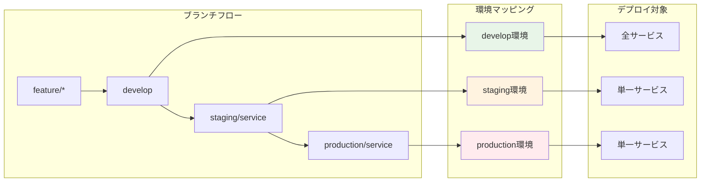
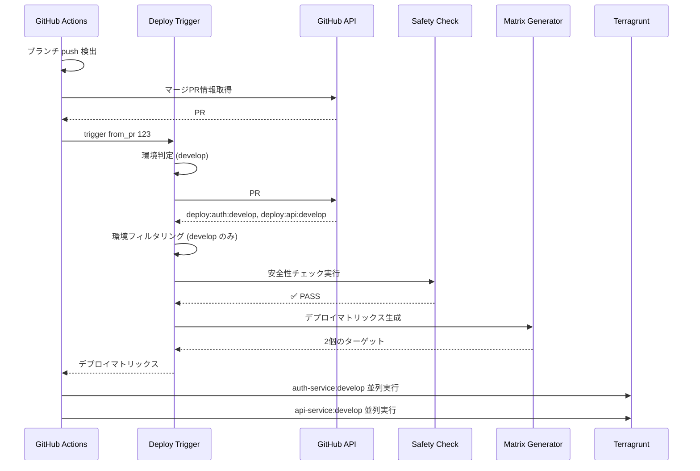
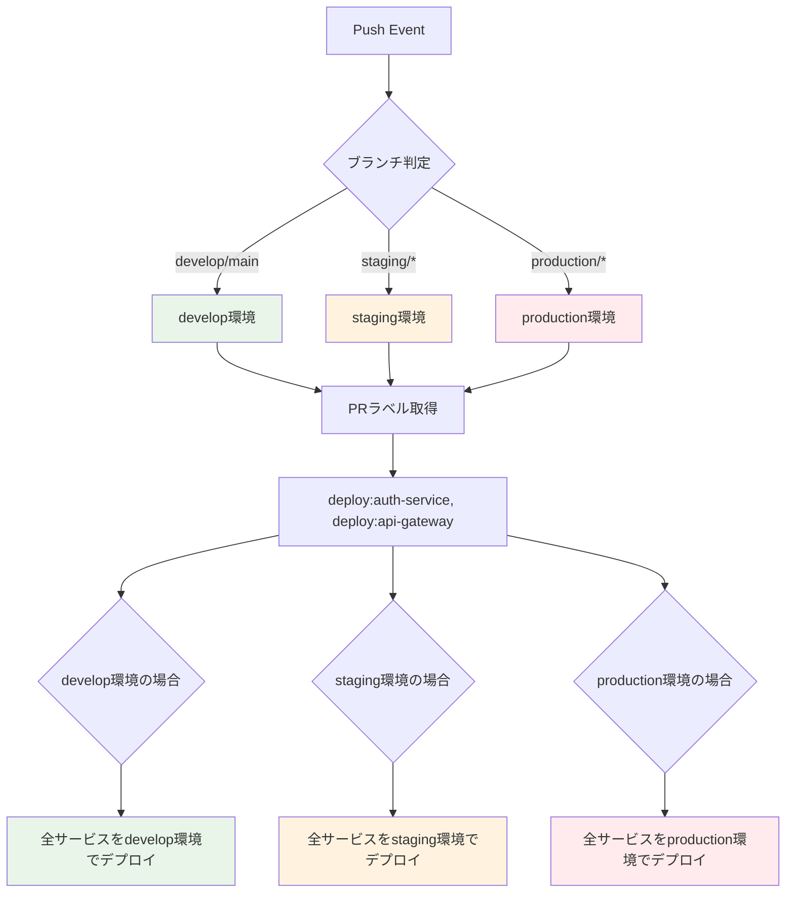
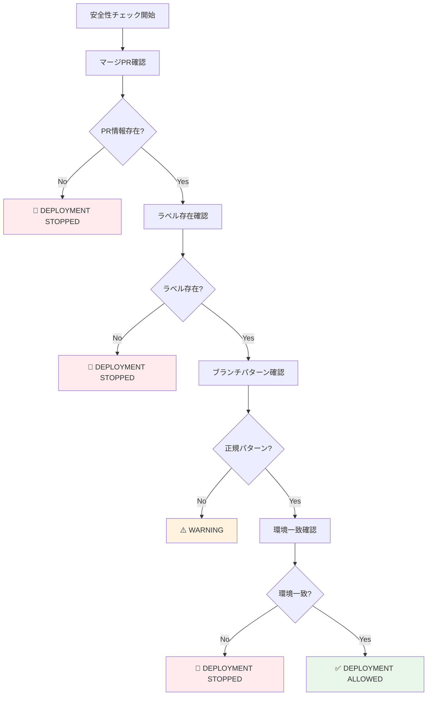

# Deploy Trigger 完全理解ガイド

## 🎯 概要

Deploy Trigger は、Issue #107 戦略に基づいてブランチの push イベントから適切なデプロイメントを実行するシステムです。

## 🔄 Issue #107 戦略の実装



## 🚀 処理フロー詳細



## 🎯 核心：環境判定とサービス組み合わせ



## 🛡️ 安全性チェック詳細



## 🏗️ アーキテクチャ

### 主要ユースケース
```ruby
module UseCases
  module DeployTrigger
    class DetermineTargetEnvironment
      # ブランチ名から対象環境を判定
    end

    class GetMergedPrLabels
      # GitHub Actions で取得されたPR番号からラベル取得
    end

    class ValidateDeploymentSafety
      # Issue #107 安全性要件のチェック
    end

    class GenerateMatrix
      # サービスラベル + 対象環境 → Terragrunt実行マトリックス生成
    end
  end
end
```

## 📋 設定ファイル連携

### ブランチパターン設定
```yaml
branch_patterns:
  develop:
    target_environment: develop
  main:
    target_environment: develop
  staging:
    pattern: "staging/*"
    target_environment: staging
  production:
    pattern: "production/*"
    target_environment: production
```

### 安全性チェック設定
```yaml
safety_checks:
  require_merged_pr: true      # マージPR情報必須
  fail_on_missing_pr: true     # PR情報なしでデプロイ停止
  max_retry_attempts: 3        # API エラー時のリトライ
```

## 🎪 GitHub Actions 統合

### GitHub Actions での実装
```yaml
- name: Get merged PR information
  id: get-merged-pr
  uses: actions-ecosystem/action-get-merged-pull-request@v1
  continue-on-error: true

- name: Setup Ruby
  uses: ruby/setup-ruby@v1
  with:
    ruby-version: '3.4'
    bundler-cache: true
    working-directory: .github/scripts/shared

- name: Deploy Trigger
  working-directory: .github/scripts/shared
  run: |
    if [ -n "${{ steps.get-merged-pr.outputs.number }}" ]; then
      bundle exec ruby ../deploy-trigger/bin/trigger from_pr ${{ steps.get-merged-pr.outputs.number }}
    else
      echo "::error::No merged PR found - deployment stopped"
      exit 1
    fi
```

### 重要なポイント
- **PR情報取得**: GitHub Actions の actions-ecosystem アクションを使用
- **Ruby 環境**: `shared` ディレクトリで Gemfile 管理
- **実行方式**: `bundle exec` で依存関係を正しく解決
- **安全性**: PR情報がない場合はデプロイ停止

### マトリックス出力
```yaml
strategy:
  matrix:
    target: ${{ fromJson(needs.extract-deployment-targets.outputs.targets) }}
```

## 🚀 CLI 使用方法

### 基本コマンド
```bash
# shared ディレクトリから実行（推奨）
cd .github/scripts/shared

# ブランチベースでトリガー
bundle exec ruby ../deploy-trigger/bin/trigger from_branch develop

# PR番号指定でトリガー
bundle exec ruby ../deploy-trigger/bin/trigger from_pr 123

# テスト実行
bundle exec ruby ../deploy-trigger/bin/trigger test develop

# GitHub Actions環境シミュレート
bundle exec ruby ../deploy-trigger/bin/trigger simulate develop
```

### 高度なコマンド
```bash
# デバッグモード
bundle exec ruby ../deploy-trigger/bin/trigger debug develop --commit-sha=abc123

# 環境変数検証
bundle exec ruby ../deploy-trigger/bin/trigger validate_env

# または deploy-trigger ディレクトリから直接実行
cd .github/scripts/deploy-trigger
ruby bin/trigger from_branch develop
```

## 📊 実行例

### develop ブランチの場合

**入力:**
```bash
# develop ブランチへ push
# マージPR #123 のラベル:
# - deploy:auth-service
# - deploy:api-gateway
```

**処理:**
```ruby
# 1. 環境判定: develop
# 2. ラベル取得: deploy:auth-service, deploy:api-gateway
# 3. マトリックス生成: 各サービス × develop環境
```

**出力:**
```json
{
  "targets": [
    {
      "service": "auth-service",
      "environment": "develop",
      "working_directory": "auth-service/terragrunt/envs/develop",
      "iam_role_plan": "arn:aws:iam::123:role/plan-develop",
      "iam_role_apply": "arn:aws:iam::123:role/apply-develop"
    },
    {
      "service": "api-gateway",
      "environment": "develop",
      "working_directory": "api-gateway/terragrunt/envs/develop",
      "iam_role_plan": "arn:aws:iam::123:role/plan-develop",
      "iam_role_apply": "arn:aws:iam::123:role/apply-develop"
    }
  ]
}
```

### staging/auth-service ブランチの場合

**入力:**
```bash
# staging/auth-service ブランチへ push
# マージPR #124 のラベル:
# - deploy:auth-service
# - deploy:api-gateway  # 他のサービスラベルも存在する可能性
```

**処理:**
```ruby
# 1. 環境判定: staging
# 2. ラベル取得: deploy:auth-service, deploy:api-gateway
# 3. マトリックス生成: 全ラベル × staging環境
# 注: ブランチ名は staging/auth-service だが、全ラベルがデプロイ対象
```

**出力:**
```json
{
  "targets": [
    {
      "service": "auth-service",
      "environment": "staging",
      "working_directory": "auth-service/terragrunt/envs/staging"
    },
    {
      "service": "api-gateway",
      "environment": "staging",
      "working_directory": "api-gateway/terragrunt/envs/staging"
    }
  ]
}
```

## 🐛 トラブルシューティング

### よくあるエラー

1. **No merged PR found**
   ```bash
   # 原因: 直接 push で PR 経由でない
   # 解決: PR 経由でマージする
   ```

2. **No deployment labels found**
   ```bash
   # 原因: PR にデプロイラベルがない
   # 解決: Label Dispatcher の動作確認
   ```

3. **Safety validation failed**
   ```bash
   # 原因: 安全性チェックに引っかかった
   # 解決: ブランチパターンや環境設定を確認
   ```

### デバッグ方法
```bash
# ステップバイステップデバッグ
ruby bin/trigger debug staging/auth-service

# 設定確認
ruby .github/scripts/config-manager/bin/config-manager validate

# GitHub API 接続確認
ruby bin/trigger validate_env
```

---

Deploy Trigger により、Issue #107 で定義された安全で確実なデプロイメント戦略が完全に自動化されます。
