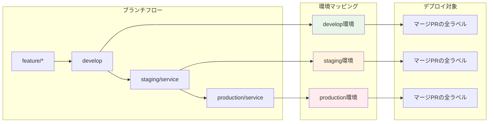
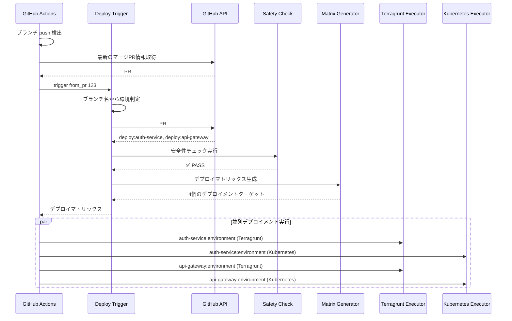
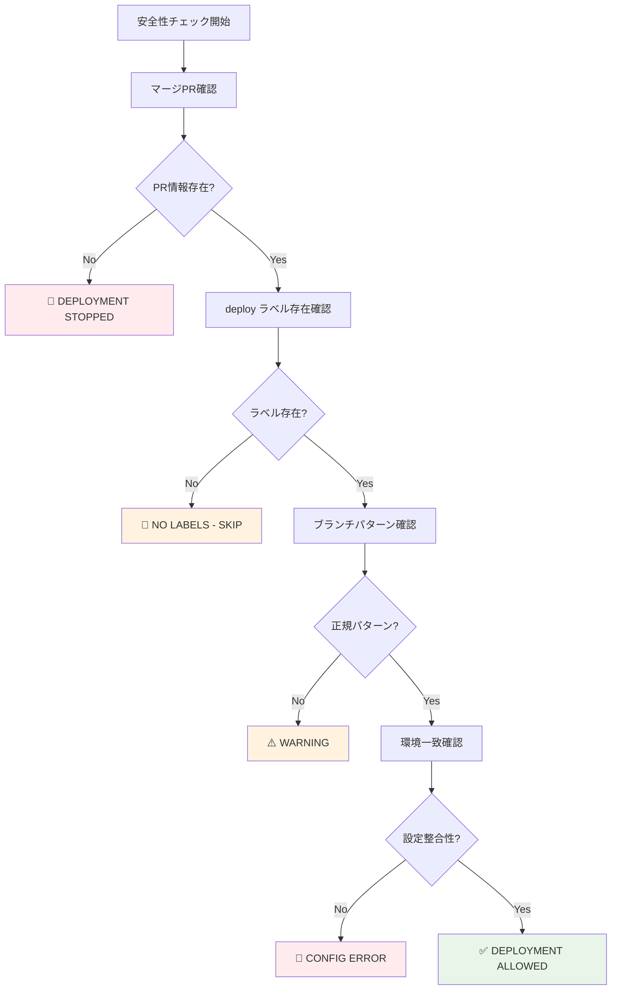

# Deploy Trigger - デプロイ実行制御システム

## 🎯 概要

Deploy Trigger は、ブランチの push イベントから適切なデプロイメントを実行するシステムです。マージされた PR のラベル情報と push されたブランチから環境を判定し、安全で確実なデプロイメントを自動実行します。

## 🔄 デプロイメント戦略の実装



## 🚀 処理フロー詳細



## 🎯 核心：環境判定とマージPR連携

### ブランチ → 環境マッピング
```yaml
# workflow-config.yaml
branch_patterns:
  develop:
    target_environment: develop
  main:
    target_environment: develop
  staging:
    pattern: "staging/*"
    target_environment: staging
  production:
    pattern: "production/*"
    target_environment: production
```

### 実際の動作例
```mermaid
graph TD
    A[Push Event] --> B{ブランチ判定}

    B -->|develop/main| C[develop環境]
    B -->|staging/*| D[staging環境]
    B -->|production/*| E[production環境]

    C --> F[マージPRラベル取得]
    D --> F
    E --> F

    F --> G[deploy:auth-service, deploy:api-gateway]

    G --> H[auth-service → develop環境 (Terragrunt)]
    G --> I[auth-service → develop環境 (Kubernetes)]
    G --> J[api-gateway → develop環境 (Terragrunt)]
    G --> K[api-gateway → develop環境 (Kubernetes)]
    G --> L[auth-service → staging環境 (Terragrunt)]
    G --> M[auth-service → staging環境 (Kubernetes)]
    G --> N[api-gateway → staging環境 (Terragrunt)]
    G --> O[api-gateway → staging環境 (Kubernetes)]
    G --> P[auth-service → production環境 (Terragrunt)]
    G --> Q[auth-service → production環境 (Kubernetes)]
    G --> R[api-gateway → production環境 (Terragrunt)]
    G --> S[api-gateway → production環境 (Kubernetes)]

    style C fill:#e8f5e8
    style D fill:#fff3e0
    style E fill:#ffebee
    style H fill:#e8f5e8
    style I fill:#e8f5e8
    style J fill:#fff3e0
    style K fill:#fff3e0
    style L fill:#ffebee
    style M fill:#ffebee
```

## 🛡️ 安全性チェック詳細



### 安全性チェック項目
1. **マージPR必須**: 直接 push ではなく、PR 経由のマージであることを確認
2. **ラベル存在確認**: `deploy:*` ラベルが存在することを確認
3. **ブランチパターン**: 設定された正規のブランチパターンに合致することを確認
4. **設定整合性**: 対象環境の設定が存在することを確認

## 🏗️ アーキテクチャ

### 主要ユースケース
```ruby
module UseCases
  module DeployTrigger
    class DetermineTargetEnvironment
      # ブランチ名から対象環境を判定
      def execute(branch_name:)
        # ブランチパターンマッチング
        # 設定ファイルから環境判定
      end
    end

    class GetMergedPrLabels
      # GitHub Actions で提供されるPR番号からラベル取得
      def execute(pr_number:)
        # GitHub API から deploy ラベル取得
        # DeployLabel エンティティに変換
      end
    end

    class ValidateDeploymentSafety
      # 安全性要件のチェック
      def execute(deploy_labels:, merged_pr_number:, branch_name:, commit_sha:)
        # マージPR確認
        # ラベル存在確認
        # ブランチパターン確認
      end
    end

    class GenerateMatrix
      # デプロイメント実行マトリックス生成
      def execute(deploy_labels:)
        # ラベル → DeploymentTarget 変換
        # GitHub Actions マトリックス形式で出力
      end
    end
  end
end
```

### Controllers
```ruby
module Interfaces
  module Controllers
    class DeployTriggerController
      # デプロイメントワークフロー全体の調整
      def trigger_from_pr_labels(pr_number:, target_environment:)
        # 1. 環境判定
        # 2. PR ラベル取得
        # 3. 安全性チェック
        # 4. マトリックス生成
        # 5. 結果出力
      end
    end
  end
end
```

## 🎪 GitHub Actions 統合

### ワークフロー設定
```yaml
name: 'Auto Label - Deploy Trigger'

on:
  push:
    branches:
      - develop
      - main
      - 'staging/**'
      - 'production/**'

jobs:
  extract-deployment-targets:
    steps:
      - name: Get merged PR information
        id: get-merged-pr
        uses: actions-ecosystem/action-get-merged-pull-request@v1
        continue-on-error: true

      - name: Determine target environment
        id: determine-env
        run: |
          case "${{ github.ref_name }}" in
            "develop"|"main")
              echo "environment=develop" >> $GITHUB_OUTPUT
              ;;
            staging/*)
              echo "environment=staging" >> $GITHUB_OUTPUT
              ;;
            production/*)
              echo "environment=production" >> $GITHUB_OUTPUT
              ;;
          esac

      - name: Deploy Trigger - Extract targets
        run: |
          if [ -n "${{ steps.get-merged-pr.outputs.number }}" ]; then
            bundle exec ruby ../deploy-trigger/bin/trigger from_pr ${{ steps.get-merged-pr.outputs.number }} --target-environment="${TARGET_ENV}"
          else
            echo "::error::No merged PR found - deployment stopped"
            exit 1
          fi
```

### 重要な実装ポイント
- **PR情報取得**: `actions-ecosystem/action-get-merged-pull-request` を使用
- **環境判定**: ブランチ名から対象環境を判定
- **安全性**: PR情報がない場合はデプロイ停止
- **マトリックス出力**: JSON形式でデプロイメントターゲットを出力

## 🚀 CLI 使用方法

### 基本コマンド
```bash
# shared ディレクトリから実行（推奨）
cd .github/scripts/shared

# PR番号からデプロイトリガー
bundle exec ruby ../deploy-trigger/bin/trigger from_pr 123

# 環境指定でデプロイトリガー
bundle exec ruby ../deploy-trigger/bin/trigger from_pr 123 --target-environment=staging

# ブランチ名からデプロイトリガー（テスト用）
bundle exec ruby ../deploy-trigger/bin/trigger from_branch develop

# テスト実行
bundle exec ruby ../deploy-trigger/bin/trigger test develop

# GitHub Actions環境シミュレート
bundle exec ruby ../deploy-trigger/bin/trigger simulate develop
```

### 高度なコマンド
```bash
# デバッグモード
bundle exec ruby ../deploy-trigger/bin/trigger debug staging/auth-service --commit-sha=abc123

# 環境変数検証
bundle exec ruby ../deploy-trigger/bin/trigger validate_env

# または deploy-trigger ディレクトリから直接実行
cd .github/scripts/deploy-trigger
ruby bin/trigger from_pr 123
```

## 📊 実行例

### develop ブランチへのマージ

**入力:**
```bash
# develop ブランチへ push
# 最新のマージPR: #123
# PR #123 のラベル:
# - deploy:auth-service
# - deploy:api-gateway
```

**処理:**
```ruby
# 1. 環境判定: develop
# 2. PR情報取得: PR #123
# 3. ラベル取得: deploy:auth-service, deploy:api-gateway
# 4. マトリックス生成: 各サービス × develop環境
```

**出力:**
```json
{
  "targets": [
    {
      "service": "auth-service",
      "environment": "develop",
      "stack": "terragrunt",
      "working_directory": "auth-service/terragrunt",
      "iam_role_plan": "arn:aws:iam::123:role/plan-develop",
      "iam_role_apply": "arn:aws:iam::123:role/apply-develop",
      "aws_region": "ap-northeast-1"
    },
    {
      "service": "auth-service",
      "environment": "develop",
      "stack": "kubernetes",
      "working_directory": "auth-service/kubernetes",
      "kubectl_version": "1.28.0",
      "kustomize_version": "5.0.0"
    },
    {
      "service": "api-gateway",
      "environment": "develop",
      "stack": "terragrunt",
      "working_directory": "api-gateway/terragrunt",
      "iam_role_plan": "arn:aws:iam::123:role/plan-develop",
      "iam_role_apply": "arn:aws:iam::123:role/apply-develop",
      "aws_region": "ap-northeast-1"
    },
    {
      "service": "api-gateway",
      "environment": "develop",
      "stack": "kubernetes",
      "working_directory": "api-gateway/kubernetes",
      "kubectl_version": "1.28.0",
      "kustomize_version": "5.0.0"
    }
  ]
}
```

### staging/auth-service ブランチへのマージ

**入力:**
```bash
# staging/auth-service ブランチへ push
# 最新のマージPR: #124
# PR #124 のラベル:
# - deploy:auth-service
# - deploy:api-gateway  # 他のサービスラベルも存在
```

**処理:**
```ruby
# 1. 環境判定: staging (ブランチパターン staging/* から)
# 2. PR情報取得: PR #124
# 3. ラベル取得: deploy:auth-service, deploy:api-gateway
# 4. マトリックス生成: 全ラベル × staging環境
# 注意: ブランチ名は staging/auth-service だが、全ラベルがデプロイ対象
```

**出力:**
```json
{
  "targets": [
    {
      "service": "auth-service",
      "environment": "staging",
      "stack": "terragrunt",
      "working_directory": "auth-service/terragrunt",
      "iam_role_plan": "arn:aws:iam::123:role/plan-staging",
      "iam_role_apply": "arn:aws:iam::123:role/apply-staging"
    },
    {
      "service": "auth-service",
      "environment": "staging",
      "stack": "kubernetes",
      "working_directory": "auth-service/kubernetes"
    },
    {
      "service": "api-gateway",
      "environment": "staging",
      "stack": "terragrunt",
      "working_directory": "api-gateway/terragrunt",
      "iam_role_plan": "arn:aws:iam::123:role/plan-staging",
      "iam_role_apply": "arn:aws:iam::123:role/apply-staging"
    },
    {
      "service": "api-gateway",
      "environment": "staging",
      "stack": "kubernetes",
      "working_directory": "api-gateway/kubernetes"
    }
  ]
}
```

## 🔧 設定ファイル連携

### ブランチパターン設定
```yaml
# workflow-config.yaml
branch_patterns:
  develop:
    target_environment: develop
  main:
    target_environment: develop
  staging:
    pattern: "staging/*"
    target_environment: staging
  production:
    pattern: "production/*"
    target_environment: production
  custom_deploy:
    pattern: "deploy/*/*"
    target_environment: custom  # ブランチ名から環境を抽出
```

### 安全性チェック設定
```yaml
# workflow-config.yaml
safety_checks:
  require_merged_pr: true      # マージPR情報必須
  fail_on_missing_pr: true     # PR情報なしでデプロイ停止
  max_retry_attempts: 3        # API エラー時のリトライ
  allowed_direct_push_branches: []  # 緊急時用直接push許可ブランチ
```

### 環境設定
```yaml
# workflow-config.yaml
environments:
  - environment: develop
    aws_region: ap-northeast-1
    iam_role_plan: arn:aws:iam::123:role/plan-develop
    iam_role_apply: arn:aws:iam::123:role/apply-develop
  - environment: staging
    aws_region: ap-northeast-1
    iam_role_plan: arn:aws:iam::123:role/plan-staging
    iam_role_apply: arn:aws:iam::123:role/apply-staging
```

## 🔬 デプロイメントマトリックス生成

### マトリックス生成ロジック
```ruby
# DeploymentTarget エンティティの生成
def generate_deployment_target(deploy_label, target_environment, config)
  service = deploy_label.service
  env_config = config.environment_config(target_environment)

  # ディレクトリ規約の解決
  working_dir = config.directory_convention_for(service, 'terragrunt')
    .gsub('{service}', service)
    .gsub('{environment}', target_environment)

  DeploymentTarget.new(
    service: service,
    environment: target_environment,
    working_directory: working_dir,
    iam_role_plan: env_config['iam_role_plan'],
    iam_role_apply: env_config['iam_role_apply'],
    aws_region: env_config['aws_region'],
    terraform_version: config.terraform_version,
    terragrunt_version: config.terragrunt_version
  )
end
```

### GitHub Actions マトリックス統合
```yaml
# GitHub Actions でのマルチスタック対応
strategy:
  matrix:
    target: ${{ fromJson(needs.extract-deployment-targets.outputs.targets) }}
  fail-fast: false

# Terragrunt の場合
- name: Execute Terragrunt
  if: matrix.target.stack == 'terragrunt'
  uses: ./.github/workflows/reusable--terragrunt-executor.yaml
  with:
    project-name: ${{ matrix.target.service }}
    environment: ${{ matrix.target.environment }}
    working-directory: ${{ matrix.target.working_directory }}
    iam-role-plan: ${{ matrix.target.iam_role_plan }}
    iam-role-apply: ${{ matrix.target.iam_role_apply }}

# Kubernetes の場合
- name: Execute Kubernetes Deployment
  if: matrix.target.stack == 'kubernetes'
  uses: ./.github/workflows/reusable--kubernetes-executor.yaml
  with:
    project-name: ${{ matrix.target.service }}
    environment: ${{ matrix.target.environment }}
    working-directory: ${{ matrix.target.working_directory }}
    kubectl-version: ${{ matrix.target.kubectl_version }}
    kustomize-version: ${{ matrix.target.kustomize_version }}
```

## 🐛 トラブルシューティング

### よくあるエラー

#### 1. "No merged PR found"
```bash
# 原因: 直接 push で PR 経由でない
# 解決方法:
# 1. PR 経由でマージする（推奨）
# 2. 緊急時は allowed_direct_push_branches に追加
```

#### 2. "No deployment labels found"
```bash
# 原因: PR にデプロイラベルがない
# 解決方法:
# 1. Label Dispatcher の動作確認
# 2. PR にラベルを手動追加
# 3. ファイル変更が正しく検知されているか確認
```

#### 3. "Safety validation failed"
```bash
# 原因: 安全性チェックに引っかかった
# 解決方法:
# 1. ブランチパターンの設定確認
# 2. 環境設定の確認
# 3. safety_checks 設定の見直し
```

#### 4. "Working directory does not exist"
```bash
# 原因: ディレクトリ規約の設定ミス
# 解決方法:
# 1. workflow-config.yaml の directory_conventions 確認
# 2. サービス固有の directory_conventions 確認
# 3. 実際のディレクトリ構造との整合性確認
```

### デバッグ手順
```bash
# ステップ1: 環境変数確認
bundle exec ruby ../deploy-trigger/bin/trigger validate_env

# ステップ2: 設定ファイル確認
bundle exec ruby ../config-manager/bin/config-manager validate

# ステップ3: ステップバイステップデバッグ
bundle exec ruby ../deploy-trigger/bin/trigger debug staging/auth-service

# ステップ4: GitHub API 接続確認
curl -H "Authorization: token $GITHUB_TOKEN" \
  https://api.github.com/repos/$GITHUB_REPOSITORY/pulls/123
```

### ログ分析
```bash
# 詳細ログ出力
export DEBUG=true
bundle exec ruby ../deploy-trigger/bin/trigger from_pr 123 2>&1 | tee debug.log

# 重要なログパターン
grep "Target environment" debug.log
grep "Deploy labels" debug.log
grep "Safety check" debug.log
grep "Matrix generation" debug.log
```

## 🔧 カスタマイズ

### 独自ブランチパターン追加
```yaml
# workflow-config.yaml
branch_patterns:
  hotfix:
    pattern: "hotfix/*"
    target_environment: production
    bypass_pr_check: true  # 緊急時のみ

  feature_env:
    pattern: "feature-env/*"
    target_environment: "feature"
    auto_cleanup: true
```

### 独自安全性チェック追加
```ruby
# ValidateDeploymentSafety を拡張
class ValidateDeploymentSafety
  private

  def validate_custom_requirements(deploy_labels, branch_name)
    # 組織固有の安全性要件
    if branch_name.include?('production') && deploy_labels.length > 3
      return {
        check: 'production_deploy_limit',
        passed: false,
        message: 'Production deploys limited to 3 services at once'
      }
    end

    {
      check: 'production_deploy_limit',
      passed: true,
      message: 'Production deploy limit check passed'
    }
  end
end
```

### 環境固有のカスタマイズ
```ruby
# GenerateMatrix を拡張
class GenerateMatrix
  private

  def customize_deployment_target(target, environment)
    case environment
    when 'production'
      # 本番環境では追加の設定
      target.deployment_strategy = 'blue_green'
      target.health_check_timeout = 300
    when 'staging'
      # ステージング環境では軽量設定
      target.resource_limits = { cpu: '500m', memory: '1Gi' }
    end

    target
  end
end
```

## 🔬 テスト

### 単体テスト
```ruby
# RSpec による単体テスト例
RSpec.describe UseCases::DeployTrigger::DetermineTargetEnvironment do
  let(:config_client) { instance_double(Infrastructure::ConfigClient) }
  let(:use_case) { described_class.new(config_client: config_client) }

  describe '#execute' do
    context 'with staging branch' do
      let(:branch_name) { 'staging/auth-service' }

      it 'determines staging environment' do
        allow(config_client).to receive(:load_workflow_config).and_return(config)

        result = use_case.execute(branch_name: branch_name)

        expect(result.success?).to be true
        expect(result.target_environment).to eq('staging')
      end
    end

    context 'with unknown branch pattern' do
      let(:branch_name) { 'unknown/branch' }

      it 'fails with error' do
        result = use_case.execute(branch_name: branch_name)

        expect(result.failure?).to be true
        expect(result.error_message).to include('No target environment determined')
      end
    end
  end
end
```

### 統合テスト
```bash
# GitHub API モックを使用した統合テスト
bundle exec rspec spec/integration/deploy_trigger_spec.rb

# VCR を使用したAPI呼び出しテスト
bundle exec rspec spec/integration/github_api_integration_spec.rb
```

### エンドツーエンドテスト
```bash
# 実際のワークフロー模擬
bundle exec rspec spec/e2e/deployment_workflow_spec.rb
```

## 📈 パフォーマンス考慮事項

### API呼び出し最適化
```ruby
# GitHub API の呼び出し回数削減
def get_pr_info_with_labels(pr_number)
  # 1回のAPI呼び出しで PR情報とラベルを取得
  pr_info = github_client.pull_request(repository, pr_number)
  labels = pr_info.labels.map(&:name)

  { pr_info: pr_info, labels: labels }
end
```

### 並列処理の最適化
```yaml
# GitHub Actions での並列実行制御
strategy:
  matrix:
    target: ${{ fromJson(needs.extract-deployment-targets.outputs.targets) }}
  fail-fast: false  # 一つのサービスが失敗しても他を継続
  max-parallel: 5   # 同時実行数制限
```

### キャッシュ活用
```yaml
# 依存関係キャッシュ
- name: Setup Ruby
  uses: ruby/setup-ruby@v1
  with:
    bundler-cache: true
    working-directory: .github/scripts/shared
```

## 🔄 継続的改善

### メトリクス収集
```ruby
# デプロイメント実行時間の記録
def execute_with_metrics(deploy_labels:)
  start_time = Time.now

  result = execute(deploy_labels: deploy_labels)

  execution_time = Time.now - start_time
  record_metric('deploy_trigger_execution_time', execution_time)

  result
end
```

### 品質管理
- デプロイ成功率のモニタリング
- 実行時間の追跡
- エラーパターンの分析

### 自動化レベルの向上
```ruby
# 自動ロールバック機能
def auto_rollback_on_failure(deployment_result)
  if deployment_result.failure? && production_environment?
    trigger_rollback(previous_successful_deployment)
  end
end
```

## 🛡️ セキュリティ考慮事項

### 権限の最小化
```yaml
# IAM ロールの権限を環境ごとに分離
permissions:
  id-token: write    # OIDC用のみ
  contents: read     # 読み取り専用
  pull-requests: write  # PR操作のみ
```

### 入力検証
```ruby
# 悪意のある入力への対策
def validate_inputs(pr_number, branch_name)
  raise "Invalid PR number" unless pr_number.is_a?(Integer) && pr_number > 0
  raise "Invalid branch name" unless branch_name.match?(/\A[a-zA-Z0-9\-_\/]+\z/)
end
```

### 監査ログ
```ruby
# 全デプロイメント操作をログ記録
def log_deployment_action(action, metadata)
  logger.info({
    action: action,
    timestamp: Time.now.iso8601,
    user: github_actor,
    branch: branch_name,
    pr_number: pr_number,
    target_environment: target_environment,
    metadata: metadata
  }.to_json)
end
```

---

Deploy Trigger により、安全で確実なデプロイメント戦略が完全に自動化されます。マージされた PR のラベル情報を基に、適切な環境への正確なデプロイメントを実現し、人的エラーを最小限に抑えます。

問題が発生した場合は、上記のトラブルシューティング手順に従って原因を特定し、適切な解決策を実施してください。
