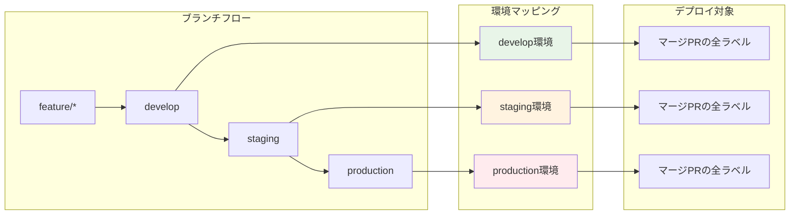
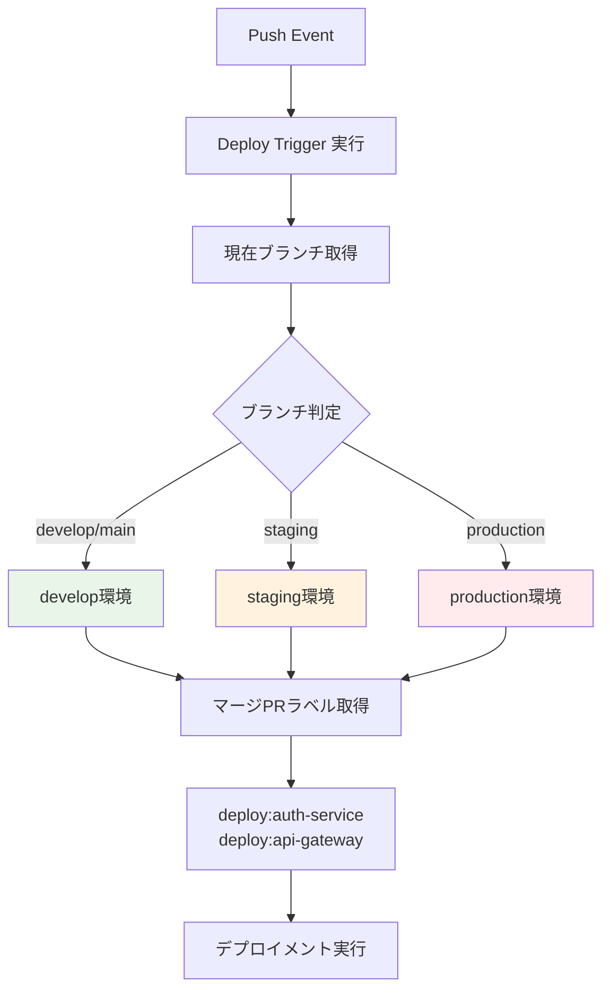
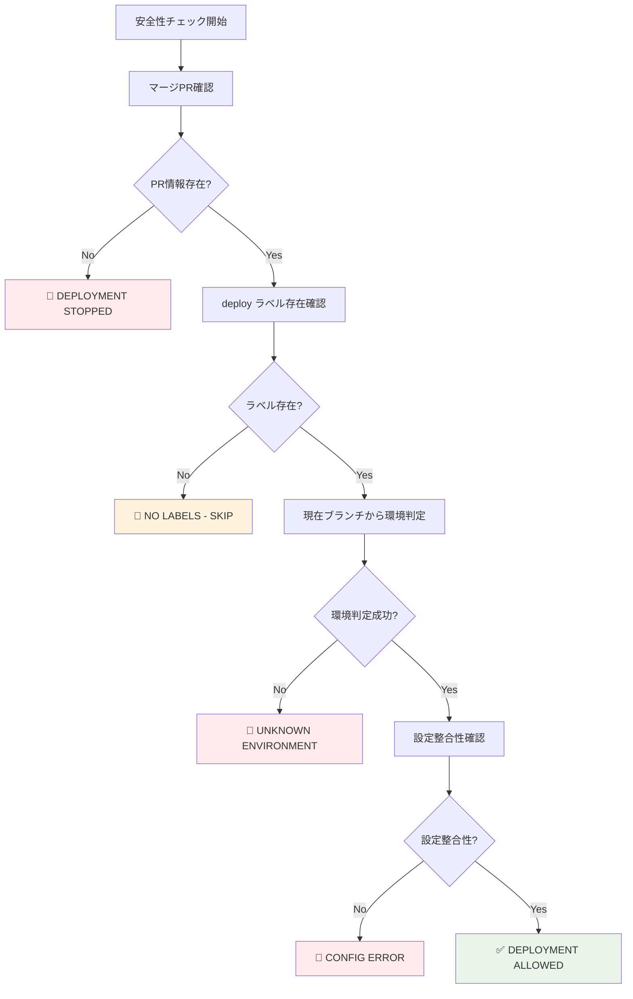

# Deploy Trigger - デプロイ実行制御システム

## 🎯 概要

Deploy Trigger は、ブランチの push イベントから適切なデプロイメントを実行するシステムです。マージされた PR のラベル情報と現在のブランチから環境を判定し、安全で確実なデプロイメントを自動実行します。

## 🔄 デプロイメント戦略



## 🚀 処理フロー


## 🎯 環境判定

### ブランチ → 環境マッピング
```yaml
# workflow-config.yaml
branch_patterns:
  develop: develop
  staging: staging
  production: production
```

### 動作例


## 🚀 CLI 使用方法

### 基本コマンド
```bash
# shared ディレクトリから実行（推奨）
cd .github/scripts

# PR番号からデプロイトリガー（環境は自動判定）
bundle exec ruby deploy-trigger/bin/trigger from_pr 123

# テスト実行
bundle exec ruby deploy-trigger/bin/trigger test develop

# GitHub Actions環境シミュレート
bundle exec ruby deploy-trigger/bin/trigger simulate develop
```

### 高度なコマンド
```bash
# デバッグモード
bundle exec ruby deploy-trigger/bin/trigger debug staging

# 環境変数検証
bundle exec ruby deploy-trigger/bin/trigger validate_env

# deploy-trigger ディレクトリから直接実行
cd .github/scripts/deploy-trigger
ruby bin/trigger from_pr 123
```

## 📊 実行例

### production ブランチへのマージ

**入力:**
```bash
# production ブランチへ push
# 最新のマージPR: #124
# PR #124 のラベル: deploy:auth-service, deploy:api-gateway
# 現在のブランチ: production
```

**出力:**
```json
{
  "targets": [
    {
      "service": "auth-service",
      "environment": "production",
      "stack": "terragrunt",
      "working_directory": "auth-service/terragrunt",
      "iam_role_plan": "arn:aws:iam::123:role/plan-production",
      "iam_role_apply": "arn:aws:iam::123:role/apply-production"
    },
    {
      "service": "auth-service",
      "environment": "production",
      "stack": "kubernetes",
      "working_directory": "auth-service/kubernetes"
    },
    {
      "service": "api-gateway",
      "environment": "production",
      "stack": "terragrunt",
      "working_directory": "api-gateway/terragrunt",
      "iam_role_plan": "arn:aws:iam::123:role/plan-production",
      "iam_role_apply": "arn:aws:iam::123:role/apply-production"
    },
    {
      "service": "api-gateway",
      "environment": "production",
      "stack": "kubernetes",
      "working_directory": "api-gateway/kubernetes"
    }
  ]
}
```

## 🛡️ 安全性チェック



### 安全性チェック項目
1. **マージPR必須**: 直接 push ではなく、PR 経由のマージであることを確認
2. **ラベル存在確認**: `deploy:*` ラベルが存在することを確認
3. **ブランチパターン**: 設定された正規のブランチパターンに合致することを確認
4. **設定整合性**: 対象環境の設定が存在することを確認

## 🏗️ アーキテクチャ

### 主要ユースケース
```ruby
module UseCases
  module DeployTrigger
    class DetermineTargetEnvironment
      # 現在のブランチ名から対象環境を判定
      def execute(branch_name:)
        # GitHub Actions の GITHUB_REF_NAME または git コマンドから取得
        # workflow-config.yaml の branch_patterns とマッチング
      end
    end

    class GetMergedPrLabels
      # PR番号からラベル取得
      def execute(pr_number:)
        # GitHub API から deploy ラベル取得
      end
    end

    class ValidateDeploymentSafety
      # 安全性要件のチェック
      def execute(deploy_labels:, merged_pr_number:, branch_name:)
        # マージPR確認
        # ラベル存在確認
        # 環境整合性確認
      end
    end

    class GenerateMatrix
      # デプロイメント実行マトリックス生成（マルチスタック対応）
      def execute(deploy_labels:, target_environment:)
        # ラベル → DeploymentTarget 変換
        # Terragrunt と Kubernetes の両スタックを生成
        # GitHub Actions マトリックス形式で出力
      end
    end
  end
end
```

### Controllers
```ruby
module Interfaces
  module Controllers
    class DeployTriggerController
      # 環境判定の自動化
      def trigger_from_pr_labels(pr_number:)
        # 1. 現在ブランチ名を取得
        current_branch = get_current_branch_name

        # 2. ブランチ名から環境を自動判定
        env_result = @determine_target_environment.execute(branch_name: current_branch)
        target_environment = env_result.target_environment

        # 3. 以降の処理を実行
      end

      private

      # GitHub Actions 環境での現在ブランチ取得
      def get_current_branch_name
        ENV['GITHUB_REF_NAME'] || `git branch --show-current`.strip
      end
    end
  end
end
```

## 🎪 GitHub Actions 統合

### ワークフロー設定
```yaml
- name: Deploy Trigger
  run: |
    # 環境判定はRuby側で自動実行
    bundle exec ruby deploy-trigger/bin/trigger from_pr 123
```

### マルチスタック対応
```yaml
# Terragrunt スタック
deploy-terragrunt:
  strategy:
    matrix:
      target: ${{ fromJson(needs.extract-deployment-targets.outputs.targets) }}
  steps:
    - name: Check target stack
      run: |
        if [ "${{ matrix.target.stack }}" == "terragrunt" ]; then
          echo "execute=true" >> $GITHUB_OUTPUT
        else
          echo "execute=false" >> $GITHUB_OUTPUT
        fi
    - name: Execute Terragrunt
      if: steps.check.outputs.execute == 'true'
      uses: ./.github/workflows/reusable--terragrunt-executor.yaml

# Kubernetes スタック
deploy-kubernetes:
  strategy:
    matrix:
      target: ${{ fromJson(needs.extract-deployment-targets.outputs.targets) }}
  steps:
    - name: Check target stack
      run: |
        if [ "${{ matrix.target.stack }}" == "kubernetes" ]; then
          echo "execute=true" >> $GITHUB_OUTPUT
        else
          echo "execute=false" >> $GITHUB_OUTPUT
        fi
    - name: Execute Kubernetes
      if: steps.check.outputs.execute == 'true'
      run: echo "Kubernetes deployment for ${{ matrix.target.service }}"
```

## 🔧 設定ファイル連携

### ブランチパターン設定
```yaml
# workflow-config.yaml
branch_patterns:
  develop: develop
  staging: staging
  production: production
```

### 安全性チェック設定
```yaml
# workflow-config.yaml
safety_checks:
  require_merged_pr: true      # マージPR情報必須
  fail_on_missing_pr: true     # PR情報なしでデプロイ停止
  max_retry_attempts: 3        # API エラー時のリトライ
  allowed_direct_push_branches: []  # 緊急時用直接push許可ブランチ
```

### 環境設定
```yaml
# workflow-config.yaml
environments:
  - environment: develop
    aws_region: ap-northeast-1
    iam_role_plan: arn:aws:iam::123:role/plan-develop
    iam_role_apply: arn:aws:iam::123:role/apply-develop
  - environment: staging
    aws_region: ap-northeast-1
    iam_role_plan: arn:aws:iam::123:role/plan-staging
    iam_role_apply: arn:aws:iam::123:role/apply-staging
```

## 🔬 デプロイメントマトリックス生成

### マトリックス生成ロジック
```ruby
# DeploymentTarget エンティティの生成
def generate_deployment_target(deploy_label, target_environment, config)
  service = deploy_label.service
  env_config = config.environment_config(target_environment)

  # ディレクトリ規約の解決
  working_dir = config.directory_convention_for(service, 'terragrunt')
    .gsub('{service}', service)

  DeploymentTarget.new(
    service: service,
    environment: target_environment,
    working_directory: working_dir,
    iam_role_plan: env_config['iam_role_plan'],
    iam_role_apply: env_config['iam_role_apply'],
    aws_region: env_config['aws_region'],
    terraform_version: config.terraform_version,
    terragrunt_version: config.terragrunt_version
  )
end
```

### GitHub Actions マトリックス統合
```yaml
# GitHub Actions でのマルチスタック対応
strategy:
  matrix:
    target: ${{ fromJson(needs.extract-deployment-targets.outputs.targets) }}
  fail-fast: false

# Terragrunt の場合
- name: Execute Terragrunt
  if: matrix.target.stack == 'terragrunt'
  uses: ./.github/workflows/reusable--terragrunt-executor.yaml
  with:
    project-name: ${{ matrix.target.service }}
    environment: ${{ matrix.target.environment }}
    working-directory: ${{ matrix.target.working_directory }}
    iam-role-plan: ${{ matrix.target.iam_role_plan }}
    iam-role-apply: ${{ matrix.target.iam_role_apply }}

# Kubernetes の場合
- name: Execute Kubernetes Deployment
  if: matrix.target.stack == 'kubernetes'
  run: |
    echo "Kubernetes deployment for ${{ matrix.target.service }}:${{ matrix.target.environment }}"
    echo "Working directory: ${{ matrix.target.working_directory }}"
```

## 🐛 トラブルシューティング

### よくあるエラー

#### 1. "No merged PR found"
```bash
# 原因: 直接 push で PR 経由でない
# 解決方法: PR 経由でマージする
```

#### 2. "No target environment determined"
```bash
# 原因: ブランチパターンが設定と一致しない
# 解決方法:
# 1. workflow-config.yaml の branch_patterns 確認
# 2. 現在のブランチ名が正しいパターンか確認
# 3. GitHub Actions の GITHUB_REF_NAME 環境変数確認
```

#### 3. "No deployment labels found"
```bash
# 原因: PR にデプロイラベルがない
# 解決方法:
# 1. Label Dispatcher の動作確認
# 2. PR にラベルを手動追加
```

#### 4. "Environment configuration not found"
```bash
# 原因: 判定された環境が workflow-config.yaml に未定義
# 解決方法:
# 1. 環境設定の追加
# 2. ブランチパターンの見直し
```

### デバッグ手順
```bash
# ステップ1: 現在ブランチの確認
echo $GITHUB_REF_NAME  # GitHub Actions 環境
git branch --show-current  # ローカル環境

# ステップ2: 環境判定のテスト
bundle exec ruby deploy-trigger/bin/trigger debug $CURRENT_BRANCH

# ステップ3: 設定ファイル確認
bundle exec ruby config-manager/bin/config-manager validate

# ステップ4: ステップバイステップテスト
bundle exec ruby deploy-trigger/bin/trigger test $CURRENT_BRANCH
```

## 📈 パフォーマンス考慮事項

### API呼び出し最適化
```ruby
# GitHub API の効率的な使用
def get_pr_info_with_labels(pr_number)
  # 1回のAPI呼び出しで PR情報とラベルを取得
  pr_info = github_client.pull_request(repository, pr_number)
  labels = pr_info.labels.map(&:name)
  { pr_info: pr_info, labels: labels }
end
```

### 並列処理の最適化
```yaml
# GitHub Actions での並列実行制御
strategy:
  matrix:
    target: ${{ fromJson(needs.extract-deployment-targets.outputs.targets) }}
  fail-fast: false  # 一つのサービスが失敗しても他を継続
  max-parallel: 5   # 同時実行数制限
```

### キャッシュ活用
```yaml
# 依存関係キャッシュ
- name: Setup Ruby
  uses: ruby/setup-ruby@v1
  with:
    bundler-cache: true
    working-directory: .github/scripts
```

## 🔄 継続的改善

### メトリクス収集
```ruby
# デプロイメント実行時間の記録
def execute_with_metrics(deploy_labels:)
  start_time = Time.now
  result = execute(deploy_labels: deploy_labels)
  execution_time = Time.now - start_time
  record_metric('deploy_trigger_execution_time', execution_time)
  result
end
```

### 品質管理
- デプロイ成功率のモニタリング
- 実行時間の追跡
- エラーパターンの分析

### 自動化レベルの向上
```ruby
# 自動ロールバック機能
def auto_rollback_on_failure(deployment_result)
  if deployment_result.failure? && production_environment?
    trigger_rollback(previous_successful_deployment)
  end
end
```

## 🛡️ セキュリティ考慮事項

### 権限の最小化
```yaml
# IAM ロールの権限を環境ごとに分離
permissions:
  id-token: write    # OIDC用のみ
  contents: read     # 読み取り専用
  pull-requests: write  # PR操作のみ
```

### 入力検証
```ruby
# 悪意のある入力への対策
def validate_inputs(pr_number, branch_name)
  raise "Invalid PR number" unless pr_number.is_a?(Integer) && pr_number > 0
  raise "Invalid branch name" unless branch_name.match?(/\A[a-zA-Z0-9\-_\/]+\z/)
end
```

### 監査ログ
```ruby
# 全デプロイメント操作をログ記録
def log_deployment_action(action, metadata)
  logger.info({
    action: action,
    timestamp: Time.now.iso8601,
    user: github_actor,
    branch: branch_name,
    pr_number: pr_number,
    target_environment: target_environment,
    metadata: metadata
  }.to_json)
end
```

## 🔬 テスト

### 単体テスト
```ruby
# RSpec による単体テスト例
RSpec.describe UseCases::DeployTrigger::DetermineTargetEnvironment do
  let(:config_client) { instance_double(Infrastructure::ConfigClient) }
  let(:use_case) { described_class.new(config_client: config_client) }

  describe '#execute' do
    context 'with staging branch' do
      let(:branch_name) { 'staging' }

      it 'determines staging environment' do
        allow(config_client).to receive(:load_workflow_config).and_return(config)

        result = use_case.execute(branch_name: branch_name)

        expect(result.success?).to be true
        expect(result.target_environment).to eq('staging')
      end
    end

    context 'with unknown branch pattern' do
      let(:branch_name) { 'unknown/branch' }

      it 'fails with error' do
        result = use_case.execute(branch_name: branch_name)

        expect(result.failure?).to be true
        expect(result.error_message).to include('No target environment determined')
      end
    end
  end
end
```

### 統合テスト
```bash
# GitHub API モックを使用した統合テスト
bundle exec rspec spec/integration/deploy_trigger_spec.rb

# VCR を使用したAPI呼び出しテスト
bundle exec rspec spec/integration/github_api_integration_spec.rb
```

### エンドツーエンドテスト
```bash
# 実際のワークフロー模擬
bundle exec rspec spec/e2e/deployment_workflow_spec.rb
```
