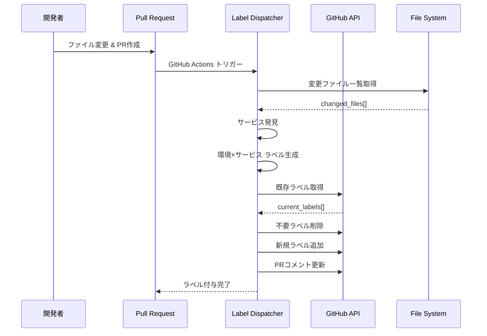

# Label Dispatcher 完全理解ガイド

## 🎯 概要

Label Dispatcher は、PR のファイル変更を検知して適切なデプロイラベルを自動付与するシステムです。

## 🔄 処理フロー



## 🔍 サービス発見ロジック

### 1. 明示的設定からの発見
```yaml
# workflow-config.yaml
services:
  - name: auth-service
  - name: api-gateway
```

### 2. ディレクトリパターンからの発見
```ruby
# デフォルトパターン: {service}/terragrunt/envs/{environment}
# 変更ファイル: auth-service/src/main.rs
# → サービス名: auth-service
```

### 3. ファイルシステムからの発見
```bash
# 既存ディレクトリ構造をスキャン
*/terragrunt/envs/develop
# → 各ディレクトリの最初の部分がサービス名
```

## 📊 ラベル生成ロジック

```mermaid
graph TD
    A[変更ファイル検出] --> B[サービス発見]
    B --> C{サービス毎}
    C --> D[auth-service]
    C --> E[api-gateway]
    C --> F[github-repository]

    D --> G[全環境ラベル生成]
    E --> H[全環境ラベル生成]
    F --> I[全環境ラベル生成]

    G --> J[deploy:auth-service:develop]
    G --> K[deploy:auth-service:staging]
    G --> L[deploy:auth-service:production]

    H --> M[deploy:api-gateway:develop]
    H --> N[deploy:api-gateway:staging]
    H --> O[deploy:api-gateway:production]

    style J fill:#e8f5e8
    style K fill:#fff3e0
    style L fill:#ffebee
    style M fill:#e8f5e8
    style N fill:#fff3e0
    style O fill:#ffebee
```

### 重要な原則
- **Label Dispatcher は環境を区別しない**
- **サービスが変更されたら全環境のラベルを付与**
- **Deploy Trigger が環境フィルタリングを担当**

## 🏗️ アーキテクチャ

### Use Cases
```ruby
module UseCases
  module LabelManagement
    class DetectChangedServices
      # ファイル変更からサービスを検知
      def execute(base_ref:, head_ref:)
        # 1. git diff でファイル一覧取得
        # 2. サービス発見ロジック実行
        # 3. ラベル生成
      end
    end

    class ManageLabels
      # PRラベルの追加・削除管理
      def execute(pr_number:, required_labels:)
        # 1. 現在のラベル取得
        # 2. 差分計算
        # 3. ラベル操作実行
      end
    end
  end
end
```

## 📝 設定例

### ディレクトリ規約
```yaml
directory_conventions:
  terragrunt: "{service}/terragrunt/envs/{environment}"
  kubernetes: "{service}/kubernetes/overlays/{environment}"

services:
  - name: special-service
    directory_conventions:
      terragrunt: "custom/{service}/infra/{environment}"
```

### 実際の変更例
```bash
# 変更ファイル例
auth-service/src/api/auth.rs                    # アプリケーションコード
auth-service/terragrunt/envs/develop/main.tf    # develop環境のインフラ
api-gateway/kubernetes/base/deployment.yaml     # 共通Kubernetes設定

# Label Dispatcher の判定:
# auth-service に何らかの変更 → 全環境ラベル生成
# api-gateway に何らかの変更 → 全環境ラベル生成

# 生成されるラベル（常に全環境）:
deploy:auth-service:develop
deploy:auth-service:staging
deploy:auth-service:production
deploy:api-gateway:develop
deploy:api-gateway:staging
deploy:api-gateway:production
```

### パターンマッチングロジック
```ruby
# サービス発見のパターンマッチング
def files_changed_in_service?(changed_files, service_name)
  # パターン: {service}/* の任意のファイル
  changed_files.any? { |file| file.start_with?("#{service_name}/") }
end

# 環境固有パスは使用しない
# ❌ 間違い: "#{service_name}/terragrunt/envs/#{environment}"
# ✅ 正しい: "#{service_name}/" で始まる任意のファイル
```

## 🎪 GitHub Actions 統合

```yaml
name: 'Auto Label - Label Dispatcher'
on:
  pull_request:
    types: [opened, synchronize]

jobs:
  dispatch-labels:
    steps:
      - name: Setup Ruby
        uses: ruby/setup-ruby@v1
        with:
          ruby-version: '3.4'
          bundler-cache: true
          working-directory: .github/scripts/shared

      - name: Dispatch labels
        working-directory: .github/scripts/shared
        run: |
          bundle exec ruby ../label-dispatcher/bin/dispatcher dispatch ${{ github.event.pull_request.number }} \
            --base-ref=${{ github.event.pull_request.base.sha }} \
            --head-ref=${{ github.event.pull_request.head.sha }}
```

### 重要なポイント
- **Ruby セットアップ**: `shared` ディレクトリで Gemfile を読み込み
- **実行**: `shared` ディレクトリから `bundle exec` で実行
- **スクリプトパス**: 相対パス `../label-dispatcher/bin/dispatcher` で指定

## 🚀 CLI 使用方法

### 基本コマンド
```bash
# shared ディレクトリから実行（推奨）
cd .github/scripts/shared
bundle exec ruby ../label-dispatcher/bin/dispatcher dispatch 123

# または label-dispatcher ディレクトリから実行
cd .github/scripts/label-dispatcher
ruby bin/dispatcher dispatch 123

# テスト実行（PRへの操作なし）
bundle exec ruby ../label-dispatcher/bin/dispatcher test --base-ref=main --head-ref=feature/auth

# GitHub Actions環境シミュレート
bundle exec ruby ../label-dispatcher/bin/dispatcher simulate 123

# 環境変数検証
bundle exec ruby ../label-dispatcher/bin/dispatcher validate_env
```

### オプション
```bash
--base-ref=COMMIT_SHA    # 比較元コミット（デフォルト: PR base）
--head-ref=COMMIT_SHA    # 比較先コミット（デフォルト: PR head）
```

### 依存関係管理
```bash
# 初回セットアップ
cd .github/scripts/shared
bundle install

# 依存関係更新
bundle update

# Gemfile.lock 確認
bundle list
```

## 🔧 カスタマイズ

### 独自サービス発見ロジック
```ruby
# DetectChangedServices を拡張
def discover_custom_services(changed_files, config)
  # カスタムパターンマッチング
  # 例: モノレポの特殊構造対応
end
```

### ラベル命名規則変更
```ruby
# DeployLabel エンティティを拡張
def to_s
  # カスタム命名規則
  "custom:#{service}:#{environment}:#{timestamp}"
end
```

## 🛡️ 安全性機能

- **重複ラベル防止**: 既存ラベルとの差分管理
- **ラベル検証**: 不正なラベル形式の検出
- **権限チェック**: GitHub token の権限確認
- **エラー復旧**: API エラー時の適切なハンドリング

## 📊 出力形式

### GitHub Actions 出力
```bash
DEPLOY_LABELS=["deploy:auth-service", "deploy:api-gateway"]
LABELS_ADDED=["deploy:auth-service"]
LABELS_REMOVED=["deploy:old-service"]
HAS_CHANGES=true
SERVICES_DETECTED=["auth-service", "api-gateway"]
```

### コンソール出力
```
🏷️  Label Dispatch Results
Deploy Labels: deploy:auth-service, deploy:api-gateway
Labels Added: deploy:auth-service
Labels Removed: deploy:old-service
Changed Files: 15 files
```

## 🐛 トラブルシューティング

### よくある問題

1. **サービスが検出されない**
   ```bash
   # 診断: ディレクトリ構造確認
   ruby bin/dispatcher test --base-ref=main
   ```

2. **ラベルが付与されない**
   ```bash
   # 診断: 権限確認
   ruby bin/dispatcher validate_env
   ```

3. **間違ったラベルが付与される**
   ```bash
   # 設定確認
   ruby .github/scripts/config-manager/bin/config-manager validate
   ```

---

Label Dispatcher により、開発者は手動でのラベル管理から解放され、常に正確なデプロイ対象が自動的に特定されます。
