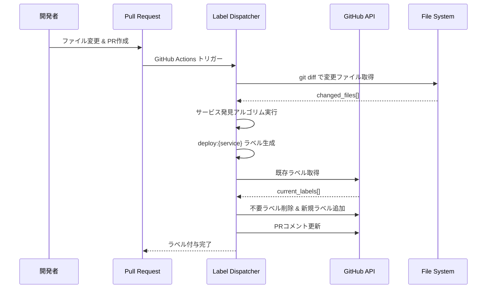
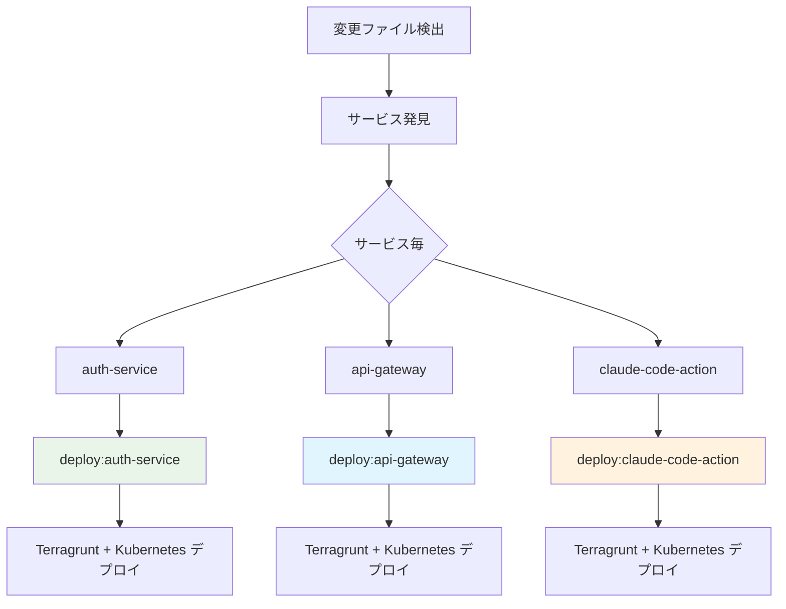

# Label Dispatcher - ラベル自動付与システム

## 🎯 概要

Label Dispatcher は、Pull Request のファイル変更を検知して適切なデプロイラベルを自動付与するシステムです。変更されたサービスを自動検出し、`deploy:{service}` 形式のラベルを PR に付与します。

## 🔄 処理フロー



## 🔍 サービス発見ロジック

### 1. 設定ファイルからの明示的発見
```yaml
# workflow-config.yaml
services:
  - name: auth-service
  - name: api-gateway
  - name: claude-code-action
```

### 2. ディレクトリパターンからの発見
```ruby
# デフォルトパターン: {service}/terragrunt
# 変更ファイル: auth-service/src/main.rs
# → サービス名: auth-service
```

### 3. ファイルシステム構造からの発見
```bash
# 既存ディレクトリ構造をスキャン
find . -name "terragrunt.hcl" -path "*/terragrunt/envs/*"
# → 各ディレクトリの最初の部分がサービス名
```

## 📊 ラベル生成の原則



### ⚠️ 重要な設計原則
- **Label Dispatcher は環境やスタックを区別しない**
- **サービスが変更されたら `deploy:{service}` ラベルのみ付与**
- **スタック判定（Terragrunt/Kubernetes）とデプロイ実行は後続プロセスが担当**

## 🏗️ アーキテクチャ

### Use Cases
```ruby
module UseCases
  module LabelManagement
    class DetectChangedServices
      # ファイル変更からサービスを検知
      def execute(base_ref:, head_ref:)
        # 1. git diff でファイル一覧取得
        # 2. サービス発見ロジック実行
        # 3. deploy:{service} ラベル生成
      end
    end

    class ManageLabels
      # PRラベルの追加・削除管理
      def execute(pr_number:, required_labels:)
        # 1. 現在のラベル取得
        # 2. 差分計算
        # 3. ラベル操作実行
      end
    end
  end
end
```

### Controllers
```ruby
module Interfaces
  module Controllers
    class LabelDispatcherController
      # ラベル管理の全体調整
      def dispatch_labels(pr_number:, base_ref:, head_ref:)
        # 1. サービス検知
        # 2. ラベル管理
        # 3. コメント更新
      end
    end
  end
end
```

## 🎪 GitHub Actions 統合

### ワークフロー設定
```yaml
name: 'Auto Label - Label Dispatcher'

on:
  pull_request:
    types: [opened, synchronize]
    branches: ['**']

jobs:
  dispatch-labels:
    steps:
      - name: Setup Ruby
        uses: ruby/setup-ruby@v1
        with:
          ruby-version: '3.4'
          bundler-cache: true
          working-directory: .github/scripts/shared

      - name: Dispatch labels
        working-directory: .github/scripts/shared
        run: |
          bundle exec ruby label-dispatcher/bin/dispatcher dispatch ${{ github.event.pull_request.number }} \
            --base-ref=${{ github.event.pull_request.base.sha }} \
            --head-ref=${{ github.event.pull_request.head.sha }}
```

### 重要な実装ポイント
- **Ruby セットアップ**: `shared` ディレクトリで Gemfile を管理
- **実行場所**: `shared` ディレクトリから `bundle exec` で実行
- **スクリプトパス**: 相対パス `../label-dispatcher/bin/dispatcher` で指定
- **権限**: `pull-requests: write` でラベル操作権限を確保

## 🚀 CLI 使用方法

### 基本コマンド
```bash
# shared ディレクトリから実行（推奨）
cd .github/scripts

# PR番号指定でラベル付与
bundle exec ruby label-dispatcher/bin/dispatcher dispatch 123

# Git参照指定でラベル付与
bundle exec ruby label-dispatcher/bin/dispatcher dispatch 123 \
  --base-ref=main --head-ref=feature/auth

# テスト実行（PRへの操作なし）
bundle exec ruby label-dispatcher/bin/dispatcher test \
  --base-ref=main --head-ref=feature/auth

# GitHub Actions環境シミュレート
bundle exec ruby label-dispatcher/bin/dispatcher simulate 123

# 環境変数検証
bundle exec ruby label-dispatcher/bin/dispatcher validate_env
```

### label-dispatcher ディレクトリから直接実行
```bash
cd .github/scripts/label-dispatcher
ruby bin/dispatcher dispatch 123
```

### 依存関係管理
```bash
# 初回セットアップ
cd .github/scripts
bundle install

# 依存関係更新
bundle update

# 依存関係確認
bundle list
```

## 📝 実際の動作例

### 変更ファイル例
```bash
# 以下のファイルが変更された場合
auth-service/src/api/auth.rs                    # アプリケーションコード
auth-service/terragrunt/envs/develop/main.tf    # インフラ設定
api-gateway/kubernetes/base/deployment.yaml     # Kubernetes設定
```

### Label Dispatcher の判定
```ruby
# 検出されるサービス
services = ["auth-service", "api-gateway"]

# 生成されるラベル
labels = ["deploy:auth-service", "deploy:api-gateway"]
```

### PR上での表示（マルチスタック対応）
```
🏷️ Labels:
- deploy:auth-service
- deploy:api-gateway

📋 Detected Deployment Targets:
- auth-service: Terragrunt + Kubernetes
- api-gateway: Terragrunt + Kubernetes

🎯 Deployment Stacks:
- Infrastructure: Terragrunt (auth-service/terragrunt, api-gateway/terragrunt)
- Applications: Kubernetes (auth-service/kubernetes, api-gateway/kubernetes)
```

## 🔧 設定例

### サービス固有のディレクトリ規約
```yaml
# workflow-config.yaml
services:
  - name: claude-code-action
    directory_conventions:
      terragrunt: .github/actions/{service}/terragrunt/envs/{environment}
      kubernetes: .github/actions/{service}/kubernetes/overlays/{environment}

  - name: legacy-service
    directory_conventions:
      terragrunt: legacy/{service}/infra/envs/{environment}
```

### パターンマッチングロジック
```ruby
# サービス発見のコア実装
def files_changed_in_service?(changed_files, service_name)
  # パターン: {service}/* の任意のファイル
  changed_files.any? { |file| file.start_with?("#{service_name}/") }
end

# 環境固有パスは使用しない（重要）
# ❌ 間違い: "#{service_name}/terragrunt"
# ✅ 正しい: "#{service_name}/" で始まる任意のファイル
```

## 🛡️ 安全性機能

### 重複ラベル防止
```ruby
# 既存ラベルとの差分管理
current_deploy_labels = github_client.get_deploy_labels(pr_number)
labels_to_add = required_labels - current_deploy_labels
labels_to_remove = current_deploy_labels - required_labels
```

### ラベル検証
```ruby
# 不正なラベル形式の検出
class DeployLabel
  def valid?
    !service.nil? && service.match?(/\A[a-zA-Z0-9\-_]+\z/)
  end
end
```

### 権限チェック
```ruby
# GitHub token の権限確認
def validate_github_permissions
  required_vars = %w[GITHUB_TOKEN GITHUB_REPOSITORY]
  missing_vars = required_vars.reject { |var| ENV[var] }

  raise "Missing: #{missing_vars.join(', ')}" if missing_vars.any?
end
```

## 📊 出力形式

### GitHub Actions 出力
```bash
# 環境変数として設定
DEPLOY_LABELS=["deploy:auth-service", "deploy:api-gateway"]
LABELS_ADDED=["deploy:auth-service"]
LABELS_REMOVED=["deploy:old-service"]
HAS_CHANGES=true
SERVICES_DETECTED=["auth-service", "api-gateway"]
```

### コンソール出力
```
🏷️  Label Dispatch Results
Deploy Labels: deploy:auth-service, deploy:api-gateway
Labels Added: deploy:auth-service
Labels Removed: deploy:old-service
Changed Files: 15 files
  - auth-service/src/main.rs
  - auth-service/terragrunt/main.tf
  - api-gateway/config/routes.yaml
  ... (showing first 10 files)
  ... and 5 more files
```

### PR コメント更新（マルチスタック対応）
```markdown
## 🚀 Auto-Deployment Information

### Detected Deployment Targets
- **auth-service**: `develop`, `staging`, `production`
  - Infrastructure: Terragrunt
  - Application: Kubernetes (Kustomize)
- **api-gateway**: `develop`, `staging`, `production`
  - Infrastructure: Terragrunt
  - Application: Kubernetes (Kustomize)

### Deployment Labels Applied
- `deploy:auth-service`
- `deploy:api-gateway`

### Deployment Stacks Detected
- **Terragrunt**: Infrastructure management
- **Kubernetes**: Application deployment (Kustomize manifests)
- **Future**: ArgoCD GitOps integration planned

### Changed Files (15)
- `auth-service/src/main.rs` → Application changes
- `auth-service/terragrunt/main.tf` → Infrastructure changes
- `auth-service/kubernetes/deployment.yaml` → Kubernetes changes
- `api-gateway/config/routes.yaml` → Application changes
...

---
*This comment is automatically updated when the PR changes.*
```

## 🔧 カスタマイズ

### 独自サービス発見ロジック
```ruby
# DetectChangedServices を拡張
class DetectChangedServices
  private

  def discover_custom_services(changed_files, config)
    # カスタムパターンマッチング
    # 例: モノレポの特殊構造対応
    services = Set.new

    changed_files.each do |file|
      case file
      when /^packages\/([^\/]+)\//
        services << "package-#{$1}"
      when /^libs\/([^\/]+)\//
        services << "lib-#{$1}"
      end
    end

    services.to_a
  end
end
```

### ラベル命名規則変更
```ruby
# DeployLabel エンティティを拡張
class DeployLabel
  def to_s
    # カスタム命名規則
    case @service
    when /^package-/
      "deploy:pkg:#{@service.sub('package-', '')}"
    when /^lib-/
      "deploy:lib:#{@service.sub('lib-', '')}"
    else
      "deploy:#{@service}"
    end
  end
end
```

### フィルタリングルール追加
```ruby
# 特定ファイルの除外
def should_ignore_file?(file_path)
  ignored_patterns = [
    /\.md$/,           # ドキュメントファイル
    /\.txt$/,          # テキストファイル
    /^docs\//,         # ドキュメントディレクトリ
    /\.github\/.*\.md$/  # GitHub関連ドキュメント
  ]

  ignored_patterns.any? { |pattern| file_path.match?(pattern) }
end
```

## 🐛 トラブルシューティング

### よくある問題

#### 1. サービスが検出されない
```bash
# 診断: ディレクトリ構造確認
find . -name "*.tf" -path "*/terragrunt/*" | head -10

# 診断: 設定ファイル確認
bundle exec ruby config-manager/bin/config-manager show

# 診断: テスト実行
bundle exec ruby label-dispatcher/bin/dispatcher test \
  --base-ref=main --head-ref=current-branch
```

#### 2. ラベルが付与されない
```bash
# 権限確認
bundle exec ruby label-dispatcher/bin/dispatcher validate_env

# GitHub API 接続テスト
curl -H "Authorization: token $GITHUB_TOKEN" \
  https://api.github.com/repos/$GITHUB_REPOSITORY/labels
```

#### 3. 間違ったラベルが付与される
```bash
# 設定検証
bundle exec ruby config-manager/bin/config-manager validate

# サービス発見のデバッグ
DEBUG=true bundle exec ruby label-dispatcher/bin/dispatcher test
```

### デバッグ手順
```bash
# ステップ1: 環境確認
bundle exec ruby label-dispatcher/bin/dispatcher validate_env

# ステップ2: 設定確認
bundle exec ruby config-manager/bin/config-manager diagnostics

# ステップ3: ローカルテスト
bundle exec ruby label-dispatcher/bin/dispatcher test \
  --base-ref=main --head-ref=$(git branch --show-current)

# ステップ4: GitHub Actions シミュレート
bundle exec ruby label-dispatcher/bin/dispatcher simulate PR_NUMBER
```

### ログ分析
```bash
# 詳細ログ出力
export DEBUG=true
bundle exec ruby label-dispatcher/bin/dispatcher dispatch 123 2>&1 | tee debug.log

# ログフィルタリング
grep "Service discovered" debug.log
grep "Label operation" debug.log
```

## 🔬 テスト

### 単体テスト
```ruby
# RSpec による単体テスト例
RSpec.describe UseCases::LabelManagement::DetectChangedServices do
  let(:file_client) { instance_double(Infrastructure::FileSystemClient) }
  let(:config_client) { instance_double(Infrastructure::ConfigClient) }
  let(:use_case) { described_class.new(file_client: file_client, config_client: config_client) }

  describe '#execute' do
    context 'when auth-service files are changed' do
      let(:changed_files) { ['auth-service/src/main.rs', 'auth-service/Dockerfile'] }

      it 'detects auth-service' do
        allow(file_client).to receive(:get_changed_files).and_return(changed_files)
        allow(config_client).to receive(:load_workflow_config).and_return(config)

        result = use_case.execute

        expect(result.success?).to be true
        expect(result.deploy_labels.map(&:service)).to include('auth-service')
      end
    end
  end
end
```

### 統合テスト
```bash
# 実際のリポジトリでのテスト
bundle exec rspec spec/integration/label_dispatcher_spec.rb

# VCR を使用したAPI呼び出しテスト
bundle exec rspec spec/integration/github_api_spec.rb
```

## 📈 パフォーマンス考慮事項

### ファイル数最適化
```ruby
# 大量ファイル変更時の処理最適化
def process_changed_files_efficiently(changed_files)
  return [] if changed_files.length > 1000  # 大量変更時は処理をスキップ

  # バッチ処理でサービス検出
  services = changed_files
    .group_by { |file| file.split('/').first }
    .keys
    .select { |service| valid_service?(service) }

  services
end
```

### GitHub API 呼び出し最適化
```ruby
# API呼び出し回数の削減
def batch_label_operations(pr_number, labels_to_add, labels_to_remove)
  # 1回のAPI呼び出しで複数ラベル操作
  if labels_to_add.any?
    github_client.add_labels_to_an_issue(repository, pr_number, labels_to_add)
  end

  # 削除は個別に実行（GitHub API の制限）
  labels_to_remove.each do |label|
    github_client.remove_label(repository, pr_number, label)
  end
end
```

## 🔄 継続的改善

### メトリクス収集
```ruby
# 処理時間の計測
def execute_with_metrics(base_ref:, head_ref:)
  start_time = Time.now

  result = execute(base_ref: base_ref, head_ref: head_ref)

  execution_time = Time.now - start_time
  puts "Label detection completed in #{execution_time.round(2)}s"

  result
end
```

### 品質管理
- テストカバレッジ 95% 以上維持
- Rubocop による静的解析
- 定期的な依存関係更新
