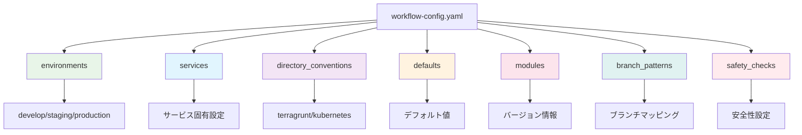
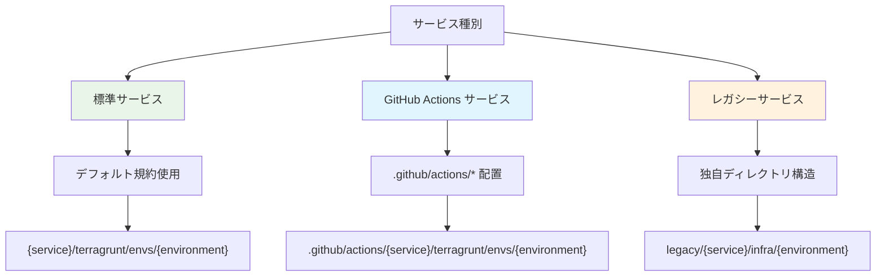
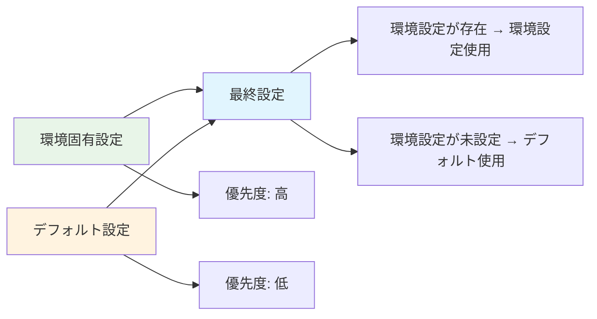
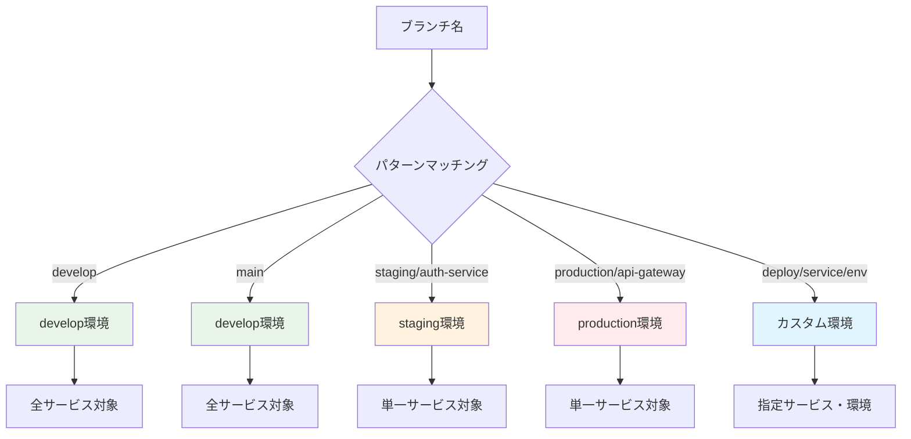

# 設定ファイル完全理解ガイド

## 🎯 概要

`shared/workflow-config.yaml` は、ワークフロー自動化システム全体の動作を制御する統合設定ファイルです。

## 📁 設定ファイル構造



## 🌍 環境設定 (environments)

### 基本構造
```yaml
environments:
  - environment: develop
    aws_region: ap-northeast-1
    iam_role_plan: arn:aws:iam::559744160976:role/github-oidc-auth-develop-plan
    iam_role_apply: arn:aws:iam::559744160976:role/github-oidc-auth-develop-apply

  - environment: staging
    aws_region: ap-northeast-1
    iam_role_plan: arn:aws:iam::123456789012:role/terragrunt-plan-staging-role
    iam_role_apply: arn:aws:iam::123456789012:role/terragrunt-apply-staging-role

  - environment: production
    aws_region: ap-northeast-1
    iam_role_plan: arn:aws:iam::123456789012:role/terragrunt-plan-production-role
    iam_role_apply: arn:aws:iam::123456789012:role/terragrunt-apply-production-role
```

### フィールド説明

| フィールド       | 必須 | 説明                          | 例                                 |
| ---------------- | ---- | ----------------------------- | ---------------------------------- |
| `environment`    | ✅    | 環境名                        | `develop`, `staging`, `production` |
| `aws_region`     | ✅    | AWS リージョン                | `ap-northeast-1`                   |
| `iam_role_plan`  | ✅    | Terraform Plan 用 IAM ロール  | `arn:aws:iam::123:role/plan-role`  |
| `iam_role_apply` | ✅    | Terraform Apply 用 IAM ロール | `arn:aws:iam::123:role/apply-role` |

## 🏢 サービス設定 (services)

### 基本サービス設定
```yaml
services:
  - name: claude-code-action
    directory_conventions:
      terragrunt: .github/actions/{service}/terragrunt/envs/{environment}
      kubernetes: .github/actions/{service}/kubernetes/overlays/{environment}

  - name: auth-service
    directory_conventions:
      terragrunt: services/{service}/terragrunt/envs/{environment}
      kubernetes: services/{service}/kubernetes/overlays/{environment}
```

### サービス設定の使い分け



## 📂 ディレクトリ規約 (directory_conventions)

### デフォルト規約
```yaml
directory_conventions:
  terragrunt: "{service}/terragrunt/envs/{environment}"
  kubernetes: "{service}/kubernetes/overlays/{environment}"
```

### プレースホルダー

| プレースホルダー | 説明       | 例                                 |
| ---------------- | ---------- | ---------------------------------- |
| `{service}`      | サービス名 | `auth-service`                     |
| `{environment}`  | 環境名     | `develop`, `staging`, `production` |

### 実際の解決例
```yaml
# サービス: auth-service, 環境: develop の場合
terragrunt: "auth-service/terragrunt/envs/develop"
kubernetes: "auth-service/kubernetes/overlays/develop"

# サービス: claude-code-action, 環境: staging の場合
terragrunt: ".github/actions/claude-code-action/terragrunt/envs/staging"
```

## ⚙️ デフォルト設定 (defaults)

### デフォルト値の役割
```yaml
defaults:
  aws_region: ap-northeast-1
  iam_role_plan: arn:aws:iam::559744160976:role/github-oidc-auth-default-plan
  iam_role_apply: arn:aws:iam::559744160976:role/github-oidc-auth-default-apply
```

### マージロジック


## 🔧 モジュール設定 (modules)

### バージョン管理
```yaml
modules:
  terraform_version: "1.12.1"
  terragrunt_version: "0.81.0"
  kubectl_version: "1.28.0"
  kustomize_version: "5.0.0"
```

### バージョン指定の重要性
- **再現性**: 同じバージョンでの実行保証
- **互換性**: ツール間の互換性確保
- **セキュリティ**: 脆弱性対応バージョンの使用

## 🌿 ブランチパターン (branch_patterns)

### Issue #107 戦略の実装
```yaml
branch_patterns:
  develop:
    target_environment: develop
  main:
    target_environment: develop
  staging:
    pattern: "staging/*"
    target_environment: staging
  production:
    pattern: "production/*"
    target_environment: production
  custom_deploy:
    pattern: "deploy/*/*/*"
    target_environment: custom
```

### パターンマッチング


## 🛡️ 安全性チェック (safety_checks)

### 安全性設定
```yaml
safety_checks:
  require_merged_pr: true           # マージPR情報必須
  fail_on_missing_pr: true          # PR情報なしでデプロイ停止
  max_retry_attempts: 3             # API エラー時のリトライ回数
  allowed_direct_push_branches: []  # 直接push許可ブランチ（緊急時用）
```

### 安全性レベル

| 設定                                         | 効果               | 推奨環境     |
| -------------------------------------------- | ------------------ | ------------ |
| `require_merged_pr: true`                    | PR経由デプロイ強制 | 本番環境     |
| `fail_on_missing_pr: true`                   | 厳格モード         | 本番環境     |
| `max_retry_attempts: 3`                      | API障害対応        | 全環境       |
| `allowed_direct_push_branches: ["hotfix/*"]` | 緊急時例外         | 必要に応じて |

## 🔄 設定の優先順位

```mermaid
graph TD
    A[設定解決順序] --> B[1. サービス固有設定]
    B --> C[2. 環境固有設定]
    C --> D[3. デフォルト設定]

    B --> E[services[].directory_conventions]
    C --> F[environments[].aws_region]
    D --> G[defaults.aws_region]

    E --> H[最高優先度]
    F --> I[中優先度]
    G --> J[最低優先度]

    style B fill:#ffebee
    style C fill:#fff3e0
    style D fill:#e8f5e8
```

## 📋 設定例テンプレート

### 最小構成
```yaml
environments:
  - environment: develop
    aws_region: ap-northeast-1
    iam_role_plan: arn:aws:iam::123:role/plan-develop
    iam_role_apply: arn:aws:iam::123:role/apply-develop

directory_conventions:
  terragrunt: "{service}/terragrunt"
  kubernetes: "{service}/kubernetes"

defaults:
  aws_region: ap-northeast-1
  iam_role_plan: arn:aws:iam::123:role/plan-default
  iam_role_apply: arn:aws:iam::123:role/apply-default

modules:
  terraform_version: "1.12.1"
  terragrunt_version: "0.81.0"

branch_patterns:
  develop:
    target_environment: develop

safety_checks:
  require_merged_pr: true
  fail_on_missing_pr: true
```

### 完全構成
```yaml
# 3環境 + 複数サービス + 安全性設定
environments:
  - environment: develop
    aws_region: ap-northeast-1
    iam_role_plan: arn:aws:iam::559744160976:role/plan-develop
    iam_role_apply: arn:aws:iam::559744160976:role/apply-develop
  - environment: staging
    aws_region: ap-northeast-1
    iam_role_plan: arn:aws:iam::123456789012:role/plan-staging
    iam_role_apply: arn:aws:iam::123456789012:role/apply-staging
  - environment: production
    aws_region: ap-northeast-1
    iam_role_plan: arn:aws:iam::123456789012:role/plan-production
    iam_role_apply: arn:aws:iam::123456789012:role/apply-production

directory_conventions:
  terragrunt: "{service}/terragrunt/envs/{environment}"
  kubernetes: "{service}/kubernetes/overlays/{environment}"

services:
  - name: claude-code-action
    directory_conventions:
      terragrunt: .github/actions/{service}/terragrunt/envs/{environment}
      kubernetes: .github/actions/{service}/kubernetes/overlays/{environment}
  - name: legacy-service
    directory_conventions:
      terragrunt: legacy/{service}/infra/{environment}

defaults:
  aws_region: ap-northeast-1
  iam_role_plan: arn:aws:iam::559744160976:role/plan-default
  iam_role_apply: arn:aws:iam::559744160976:role/apply-default

modules:
  terraform_version: "1.12.1"
  terragrunt_version: "0.81.0"
  kubectl_version: "1.28.0"
  kustomize_version: "5.0.0"

branch_patterns:
  develop:
    target_environment: develop
  main:
    target_environment: develop
  staging:
    pattern: "staging/*"
    target_environment: staging
  production:
    pattern: "production/*"
    target_environment: production

safety_checks:
  require_merged_pr: true
  fail_on_missing_pr: true
  max_retry_attempts: 3
  allowed_direct_push_branches: []
```

## ✅ 設定検証

### 必須チェック項目
```bash
# 設定ファイル検証
ruby .github/scripts/config-manager/bin/config-manager validate

# 特定サービステスト
ruby .github/scripts/config-manager/bin/config-manager test auth-service develop

# 包括診断
ruby .github/scripts/config-manager/bin/config-manager diagnostics
```

### よくある設定ミス

1. **IAM ロール ARN の形式エラー**
   ```yaml
   # ❌ 間違い
   iam_role_plan: github-actions-role

   # ✅ 正しい
   iam_role_plan: arn:aws:iam::123456789012:role/github-actions-role
   ```

2. **プレースホルダーの欠如**
   ```yaml
   # ❌ 間違い（固定パス）
   terragrunt: "auth-service/terragrunt"

   # ✅ 正しい（プレースホルダー使用）
   terragrunt: "{service}/terragrunt"
   ```

3. **必須環境の不足**
   ```yaml
   # ❌ develop のみ（staging, production が不足）
   environments:
     - environment: develop

   # ✅ 3環境すべて定義
   environments:
     - environment: develop
     - environment: staging
     - environment: production
   ```

---

この統合設定ファイルにより、複雑なmonorepo環境でも一貫性のある安全なデプロイメント管理が実現されます。

## 🔧 設定カスタマイズ例

### 組織固有の要件対応

#### 複数 AWS アカウント構成
```yaml
environments:
  - environment: develop
    aws_region: ap-northeast-1
    aws_account_id: "111111111111"  # 開発アカウント
    iam_role_plan: arn:aws:iam::111111111111:role/terragrunt-plan-develop
    iam_role_apply: arn:aws:iam::111111111111:role/terragrunt-apply-develop

  - environment: production
    aws_region: ap-northeast-1
    aws_account_id: "999999999999"  # 本番アカウント
    iam_role_plan: arn:aws:iam::999999999999:role/terragrunt-plan-production
    iam_role_apply: arn:aws:iam::999999999999:role/terragrunt-apply-production
```

#### 地域別デプロイメント
```yaml
environments:
  - environment: develop-tokyo
    aws_region: ap-northeast-1
    iam_role_plan: arn:aws:iam::123:role/plan-tokyo-develop

  - environment: develop-virginia
    aws_region: us-east-1
    iam_role_plan: arn:aws:iam::123:role/plan-virginia-develop

  - environment: production-multi-region
    aws_region: ap-northeast-1
    secondary_regions: ["us-east-1", "eu-west-1"]
    iam_role_plan: arn:aws:iam::123:role/plan-multi-region
```

#### マイクロサービス特化構成
```yaml
services:
  # API ゲートウェイサービス
  - name: api-gateway
    directory_conventions:
      terragrunt: "services/gateway/{service}/infra/{environment}"
      kubernetes: "services/gateway/{service}/k8s/{environment}"

  # データベースサービス
  - name: user-db
    directory_conventions:
      terragrunt: "data/{service}/terragrunt/{environment}"
      # データベースは Kubernetes デプロイなし

  # フロントエンドサービス
  - name: web-frontend
    directory_conventions:
      # インフラは共通、フロントエンドは CDN のみ
      terragrunt: "frontend/shared-infra/{environment}"
      kubernetes: "frontend/{service}/k8s/{environment}"
```

### 高度なブランチパターン

#### フィーチャーブランチ対応
```yaml
branch_patterns:
  # 通常のフロー
  develop:
    target_environment: develop
  staging:
    pattern: "staging/*"
    target_environment: staging
  production:
    pattern: "production/*"
    target_environment: production

  # フィーチャーブランチ専用環境
  feature:
    pattern: "feature/*"
    target_environment: feature
    auto_cleanup: true  # 24時間後に自動削除

  # ホットフィックス緊急対応
  hotfix:
    pattern: "hotfix/*"
    target_environment: production
    bypass_pr_check: true  # 緊急時のみ PR チェック回避

  # リリースカナリア
  canary:
    pattern: "canary/*"
    target_environment: production
    deployment_strategy: "canary"
    traffic_split: 10  # 10% のトラフィックのみ
```

#### 環境固有ブランチ制御
```yaml
branch_patterns:
  # 開発者個人環境
  personal:
    pattern: "dev/*"
    target_environment: "dev-${BRANCH_SUFFIX}"  # dev-john, dev-alice など
    resource_limits:
      cpu: "500m"
      memory: "1Gi"

  # QA 環境
  qa:
    pattern: "qa/*"
    target_environment: qa
    test_suite: "full"
    notification_slack: "#qa-team"
```

### 安全性とコンプライアンス強化

#### 段階的デプロイ制御
```yaml
safety_checks:
  require_merged_pr: true
  fail_on_missing_pr: true

  # 環境別の追加制御
  environment_specific:
    production:
      require_approval_count: 2      # 2人以上の承認必須
      require_security_scan: true    # セキュリティスキャン必須
      require_load_test: true        # 負荷テスト必須
      deployment_window:             # デプロイ時間制限
        - "09:00-17:00 JST on weekdays"

    staging:
      require_approval_count: 1
      auto_rollback_on_failure: true

  # コンプライアンス設定
  compliance:
    audit_logging: true              # 全操作をログ記録
    change_approval_required: true   # 変更承認プロセス必須
    security_baseline_check: true    # セキュリティベースライン確認
```

#### アクセス制御統合
```yaml
safety_checks:
  # RBAC (Role-Based Access Control) 設定
  rbac:
    production_deployers:
      - "team:sre"
      - "user:john.doe"
      - "user:alice.smith"

    staging_deployers:
      - "team:developers"
      - "team:qa"

  # 時間ベースアクセス制御
  time_based_access:
    production:
      allowed_hours: "09:00-18:00 JST"
      allowed_days: ["Monday", "Tuesday", "Wednesday", "Thursday", "Friday"]
      emergency_override: true  # 緊急時のオーバーライド許可
```

## 📊 設定パフォーマンス最適化

### リソース効率化
```yaml
# 環境別リソース設定
environments:
  - environment: develop
    aws_region: ap-northeast-1
    instance_types: ["t3.micro", "t3.small"]  # 開発環境は小さめ
    auto_scaling:
      min: 1
      max: 3

  - environment: production
    aws_region: ap-northeast-1
    instance_types: ["m5.large", "m5.xlarge"]  # 本番環境は高性能
    auto_scaling:
      min: 3
      max: 50

# キャッシュ設定
cache_settings:
  terraform_plan:
    ttl: "24h"
    storage: "s3://terraform-cache-bucket"
  dependency_cache:
    ttl: "7d"
    compression: true
```

### 並列実行最適化
```yaml
# 並列実行制御
execution_control:
  max_parallel_deployments: 5      # 同時実行数制限
  deployment_strategy: "rolling"   # ローリングデプロイ

  # サービス依存関係
  service_dependencies:
    api-gateway:
      depends_on: ["user-service", "auth-service"]
      deployment_order: 10

    user-service:
      depends_on: ["database"]
      deployment_order: 5

    database:
      deployment_order: 1  # 最初にデプロイ
```

## 🔍 設定検証とテスト

### 継続的設定検証
```yaml
# CI/CD での設定検証
validation_pipeline:
  pre_commit:
    - yaml_syntax_check
    - schema_validation
    - security_scan

  pre_deployment:
    - configuration_dry_run
    - dependency_check
    - resource_quota_check

  post_deployment:
    - health_check
    - performance_baseline
    - rollback_test
```

### 設定テスト例
```bash
# 設定ファイル全体の整合性テスト
ruby bin/config-manager validate --strict

# 特定環境の動作テスト
ruby bin/config-manager test auth-service production --dry-run

# セキュリティ設定の検証
ruby bin/config-manager security-audit

# パフォーマンステスト
ruby bin/config-manager performance-test --environment=staging
```

## 🚨 トラブルシューティングガイド

### 設定関連の一般的な問題

#### 1. 環境変数展開エラー
```yaml
# ❌ 問題のある設定
iam_role_plan: "arn:aws:iam::${AWS_ACCOUNT_ID}:role/plan-${ENVIRONMENT}"

# ✅ 解決策
iam_role_plan: "arn:aws:iam::123456789012:role/plan-develop"
# または環境変数は GitHub Actions 側で解決
```

#### 2. サービス発見の失敗
```bash
# 診断コマンド
ruby bin/config-manager test auth-service develop

# ディレクトリ構造確認
find . -name "terragrunt.hcl" | grep auth-service

# 設定パターン確認
ruby bin/config-manager show | grep directory_conventions
```

#### 3. 権限エラー
```bash
# IAM ロール設定確認
aws sts get-caller-identity

# ロール assumption テスト
aws sts assume-role --role-arn "arn:aws:iam::123:role/plan-develop" --role-session-name test

# GitHub Actions 権限確認
ruby bin/config-manager validate_env
```

### 設定移行ガイド

#### レガシー設定からの移行
```bash
# 1. 現在の設定をバックアップ
cp workflow-config.yaml workflow-config.yaml.backup

# 2. 新しいテンプレート生成
ruby bin/config-manager template > workflow-config-new.yaml

# 3. 設定をマージ（手動）
# 既存の環境設定を新しいテンプレートに移植

# 4. 検証実行
ruby bin/config-manager validate

# 5. 段階的適用
git checkout -b update-workflow-config
git add workflow-config.yaml
git commit -m "Update workflow configuration"
```

#### バージョンアップ対応
```yaml
# 設定ファイルバージョン管理
metadata:
  config_version: "2.0"
  last_updated: "2024-01-15"
  migration_notes: |
    - Added branch_patterns support
    - Enhanced safety_checks configuration
    - Deprecated legacy_settings section
```

---

この包括的な設定ガイドにより、組織の要件に応じた柔軟で安全なワークフロー自動化システムを構築できます。設定の変更は必ず段階的に行い、適切なテストを実施してから本番環境に適用することを強く推奨します。
