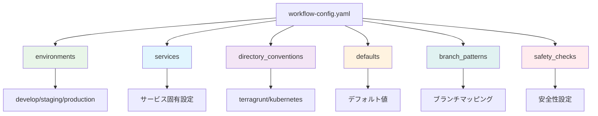
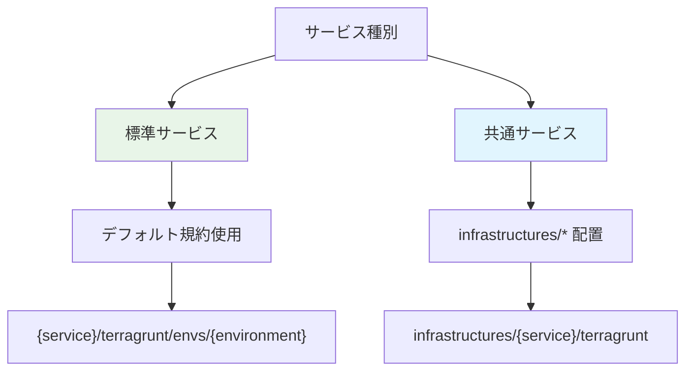
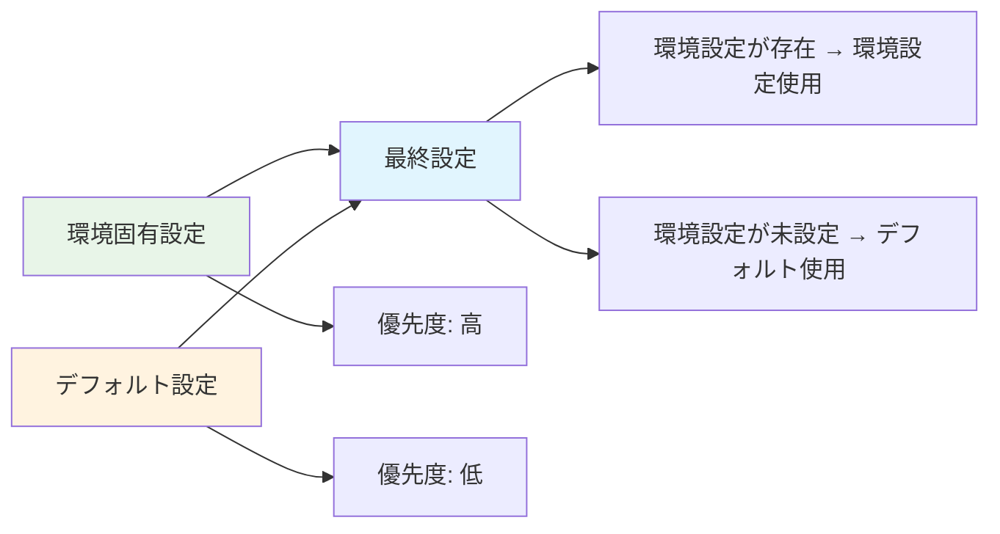
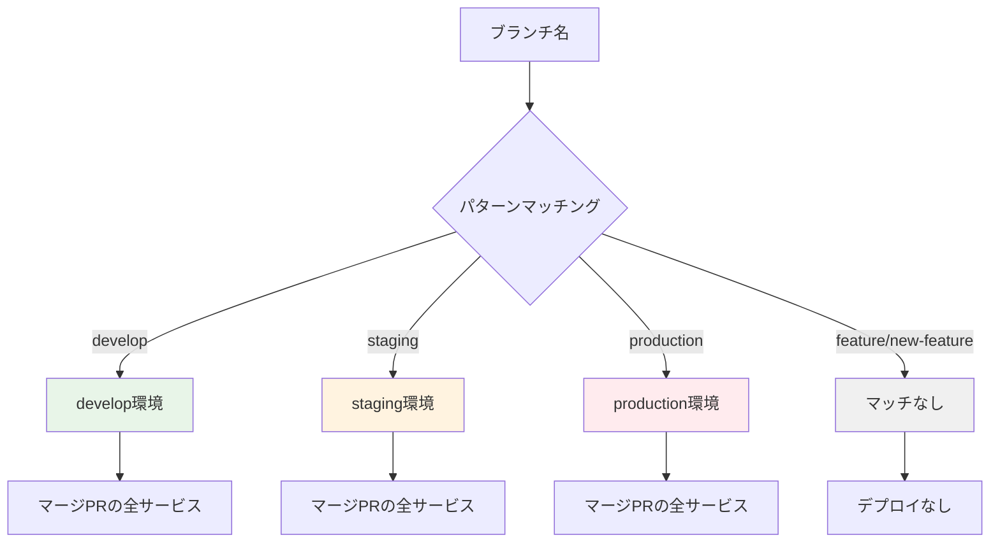
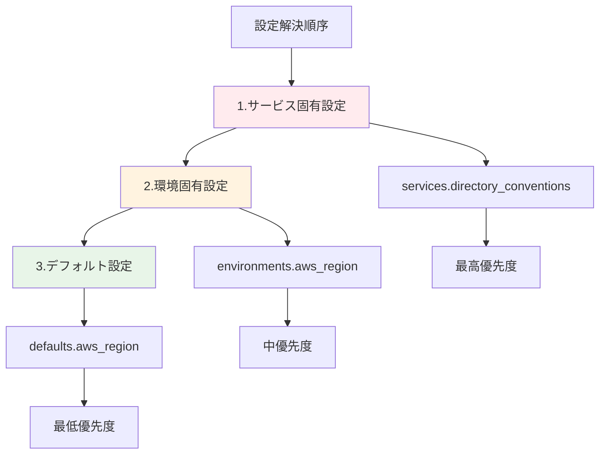

# 設定ファイル完全ガイド - workflow-config.yaml

## 🎯 概要

`shared/workflow-config.yaml` は、ワークフロー自動化システム全体の動作を制御する統合設定ファイルです。環境設定、サービス設定、ディレクトリ規約、安全性チェックなど、システムの全設定を一元管理します。

## 📁 設定ファイル構造



## 🌍 環境設定 (environments)

### 基本構造
```yaml
environments:
  - environment: develop
    aws_region: ap-northeast-1
    iam_role_plan: arn:aws:iam::559744160976:role/github-oidc-auth-develop-github-actions-role
    iam_role_apply: arn:aws:iam::559744160976:role/github-oidc-auth-develop-github-actions-role

  - environment: staging
    aws_region: ap-northeast-1
    iam_role_plan: arn:aws:iam::123456789012:role/terragrunt-plan-staging-role
    iam_role_apply: arn:aws:iam::123456789012:role/terragrunt-apply-staging-role

  - environment: production
    aws_region: ap-northeast-1
    iam_role_plan: arn:aws:iam::123456789012:role/terragrunt-plan-production-role
    iam_role_apply: arn:aws:iam::123456789012:role/terragrunt-apply-production-role
```

### フィールド説明

| フィールド       | 必須 | 説明                          | 例                                 |
| ---------------- | ---- | ----------------------------- | ---------------------------------- |
| `environment`    | ✅    | 環境名（システム全体で一意）  | `develop`, `staging`, `production` |
| `aws_region`     | ✅    | AWS リージョン                | `ap-northeast-1`, `us-east-1`      |
| `iam_role_plan`  | ✅    | Terraform Plan 用 IAM ロール  | `arn:aws:iam::123:role/plan-role`  |
| `iam_role_apply` | ✅    | Terraform Apply 用 IAM ロール | `arn:aws:iam::123:role/apply-role` |

## 🏢 サービス設定 (services)

### 基本サービス設定
```yaml
services:
  - name: claude-code-action
    directory_conventions:
      terragrunt: infrastructures/{service}/terragrunt
      kubernetes: infrastructures/{service}/kubernetes

  - name: auth-service
    directory_conventions:
      terragrunt: services/{service}/terragrunt
      kubernetes: services/{service}/kubernetes

  - name: legacy-service
    directory_conventions:
      terragrunt: legacy/{service}/infrastructure
      # kubernetes 設定なし（レガシーサービス）
```

### サービス設定の使い分け



## 📂 ディレクトリ規約 (directory_conventions)

### デフォルト規約
```yaml
directory_conventions:
  terragrunt: "{service}/terragrunt/envs/{environment}"
  kubernetes: "{service}/kubernetes/overlays/{environment}"
```

### プレースホルダー解決

| プレースホルダー | 説明       | 例                            |
| ---------------- | ---------- | ----------------------------- |
| `{service}`      | サービス名 | `auth-service`, `api-gateway` |

### 実際の解決例
```yaml
# サービス: auth-service の場合
# 設定: terragrunt: "{service}/terragrunt/envs/{environment}"
# 結果: "auth-service/terragrunt"

# 設定: kubernetes: "{service}/kubernetes/overlays/{environment}"
# 結果: "auth-service/kubernetes"

# サービス: claude-code-action の場合
# 設定: terragrunt: "infrastructures/{service}/terragrunt"
# 結果: "infrastructures/claude-code-action/terragrunt"

# 設定: kubernetes: "infrastructures/{service}/kubernetes"
# 結果: "infrastructures/claude-code-action/kubernetes"
```

### デプロイメントスタックの判定
各サービス・環境の組み合わせで、以下のスタックが自動的に判定されます：

1. **Terragrunt**: ディレクトリが存在する場合、インフラ管理を実行
2. **Kubernetes**: ディレクトリが存在する場合、Kustomize build/apply を実行

## ⚙️ デフォルト設定 (defaults)

### デフォルト値の役割
```yaml
defaults:
  aws_region: ap-northeast-1
  iam_role_plan: arn:aws:iam::559744160976:role/github-oidc-auth-default-plan
  iam_role_apply: arn:aws:iam::559744160976:role/github-oidc-auth-default-apply
```

### 設定マージロジック


### 実際のマージ例
```yaml
# デフォルト設定
defaults:
  aws_region: ap-northeast-1
  iam_role_plan: arn:aws:iam::123:role/default-plan

# 環境設定
environments:
  - environment: develop
    aws_region: us-east-1  # デフォルトを上書き
    iam_role_plan: arn:aws:iam::456:role/develop-plan  # デフォルトを上書き

# 最終的な develop 環境設定
# aws_region: us-east-1
# iam_role_plan: arn:aws:iam::456:role/develop-plan
```

## 🌿 ブランチパターン (branch_patterns)

### デプロイメント戦略の実装
```yaml
branch_patterns:
  develop: develop
  staging: staging
  production: production
```

### パターンマッチング詳細


## 🔄 設定の優先順位



### 実際の設定解決例
```yaml
# 1. デフォルト設定
defaults:
  aws_region: ap-northeast-1
  iam_role_plan: arn:aws:iam::123:role/default-plan

# 2. 環境設定
environments:
  - environment: develop
    aws_region: us-east-1  # デフォルトを上書き

# 3. サービス設定
services:
  - name: special-service
    aws_region: eu-west-1  # 環境設定とデフォルトを上書き

# 最終的な special-service の develop 環境設定:
# aws_region: eu-west-1 (サービス設定が最優先)
# iam_role_plan: arn:aws:iam::123:role/default-plan (デフォルトから)
```

## ✅ 設定検証とテスト

### 基本検証コマンド
```bash
# 設定ファイル検証
cd .github/scripts/shared
bundle exec ruby config-manager/bin/config-manager validate

# 特定サービステスト
bundle exec ruby config-manager/bin/config-manager test auth-service develop

# 包括診断
bundle exec ruby config-manager/bin/config-manager diagnostics

# 設定内容表示
bundle exec ruby config-manager/bin/config-manager show
```

### 段階的検証プロセス
```bash
# ステップ1: ファイル存在・構文確認
bundle exec ruby config-manager/bin/config-manager check_file

# ステップ2: 基本構造検証
bundle exec ruby config-manager/bin/config-manager validate

# ステップ3: 環境別設定確認
bundle exec ruby config-manager/bin/config-manager environments
bundle exec ruby config-manager/bin/config-manager services

# ステップ4: 安全性設定確認
bundle exec ruby config-manager/bin/config-manager safety_checks

# ステップ5: 実際の動作テスト
bundle exec ruby label-dispatcher/bin/dispatcher test
bundle exec ruby deploy-trigger/bin/trigger test develop
```
