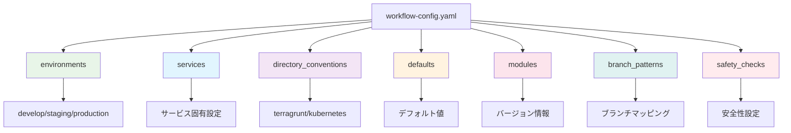
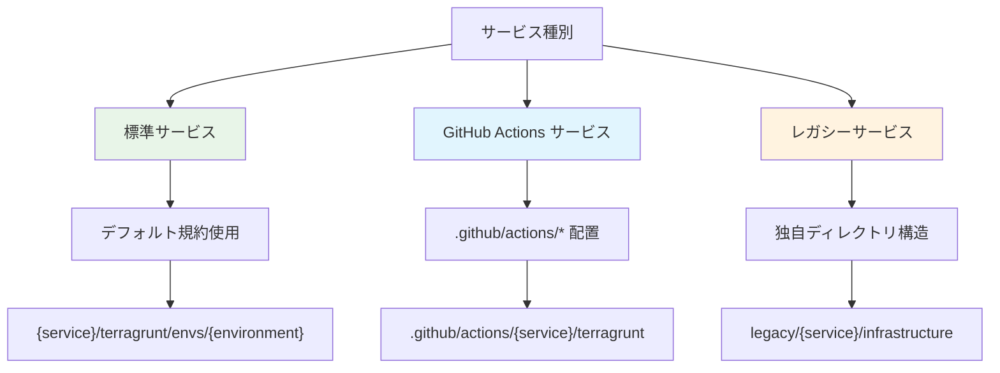
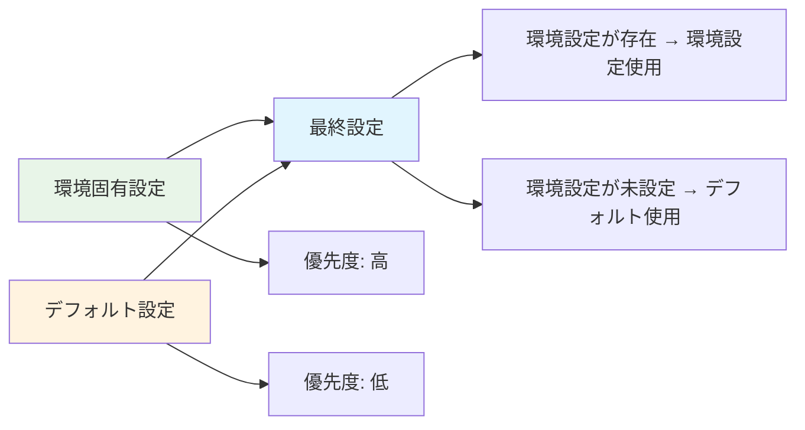
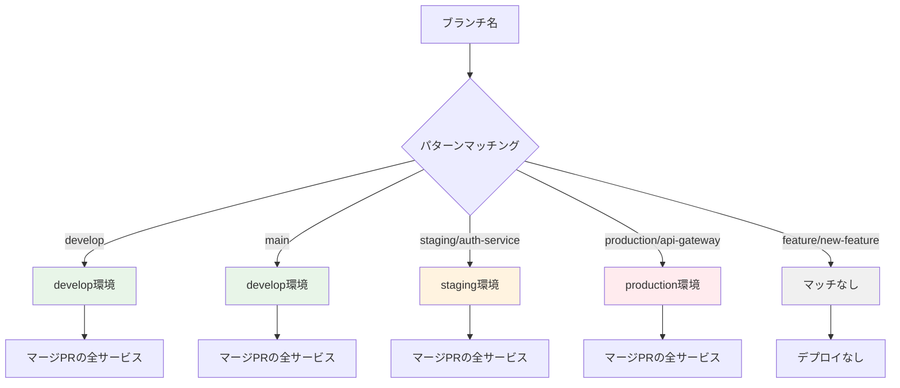

# 設定ファイル完全ガイド - workflow-config.yaml

## 🎯 概要

`shared/workflow-config.yaml` は、ワークフロー自動化システム全体の動作を制御する統合設定ファイルです。環境設定、サービス設定、ディレクトリ規約、安全性チェックなど、システムの全設定を一元管理します。

## 📁 設定ファイル構造



## 🌍 環境設定 (environments)

### 基本構造
```yaml
environments:
  - environment: develop
    aws_region: ap-northeast-1
    iam_role_plan: arn:aws:iam::559744160976:role/github-oidc-auth-develop-github-actions-role
    iam_role_apply: arn:aws:iam::559744160976:role/github-oidc-auth-develop-github-actions-role

  - environment: staging
    aws_region: ap-northeast-1
    iam_role_plan: arn:aws:iam::123456789012:role/terragrunt-plan-staging-role
    iam_role_apply: arn:aws:iam::123456789012:role/terragrunt-apply-staging-role

  - environment: production
    aws_region: ap-northeast-1
    iam_role_plan: arn:aws:iam::123456789012:role/terragrunt-plan-production-role
    iam_role_apply: arn:aws:iam::123456789012:role/terragrunt-apply-production-role
```

### フィールド説明

| フィールド       | 必須 | 説明                          | 例                                 |
| ---------------- | ---- | ----------------------------- | ---------------------------------- |
| `environment`    | ✅    | 環境名（システム全体で一意）  | `develop`, `staging`, `production` |
| `aws_region`     | ✅    | AWS リージョン                | `ap-northeast-1`, `us-east-1`      |
| `iam_role_plan`  | ✅    | Terraform Plan 用 IAM ロール  | `arn:aws:iam::123:role/plan-role`  |
| `iam_role_apply` | ✅    | Terraform Apply 用 IAM ロール | `arn:aws:iam::123:role/apply-role` |

### 環境固有の拡張フィールド
```yaml
environments:
  - environment: production
    aws_region: ap-northeast-1
    iam_role_plan: arn:aws:iam::123:role/plan-production
    iam_role_apply: arn:aws:iam::123:role/apply-production
    # 本番環境固有の設定
    backup_enabled: true
    monitoring_level: "enhanced"
    cost_center: "operations"
    compliance_tags:
      Environment: "Production"
      CostCenter: "Operations"
      DataClassification: "Confidential"
```

## 🏢 サービス設定 (services)

### 基本サービス設定
```yaml
services:
  - name: claude-code-action
    directory_conventions:
      terragrunt: .github/actions/{service}/terragrunt
      kubernetes: .github/actions/{service}/kubernetes

  - name: auth-service
    directory_conventions:
      terragrunt: services/{service}/terragrunt
      kubernetes: services/{service}/kubernetes

  - name: legacy-service
    directory_conventions:
      terragrunt: legacy/{service}/infrastructure
      # kubernetes 設定なし（レガシーサービス）
```

### サービス設定の使い分け



### サービス固有の拡張設定
```yaml
services:
  - name: high-traffic-service
    directory_conventions:
      terragrunt: services/{service}/terragrunt
      kubernetes: services/{service}/kubernetes
      helm: services/{service}/helm
    # サービス固有の設定
    scaling:
      min_replicas: 3
      max_replicas: 100
      target_cpu_utilization: 70
    monitoring:
      alert_threshold: 95
      sla_target: 99.9
    deployment:
      # スタック別デプロイ戦略
      terragrunt_strategy: "rolling"
      kubernetes_strategy: "blue_green"
      health_check_timeout: 300
```

## 📂 ディレクトリ規約 (directory_conventions)

### デフォルト規約
```yaml
directory_conventions:
  terragrunt: "{service}/terragrunt/envs/{environment}"
  kubernetes: "{service}/kubernetes/overlays/{environment}"
```

### プレースホルダー解決

| プレースホルダー | 説明       | 例                            |
| ---------------- | ---------- | ----------------------------- |
| `{service}`      | サービス名 | `auth-service`, `api-gateway` |

### 実際の解決例
```yaml
# サービス: auth-service, 環境: develop の場合
# 設定: terragrunt: "{service}/terragrunt/envs/{environment}"
# 結果: "auth-service/terragrunt"

# 設定: kubernetes: "{service}/kubernetes/overlays/{environment}"
# 結果: "auth-service/kubernetes"

# サービス: claude-code-action, 環境: staging の場合
# 設定: terragrunt: ".github/actions/{service}/terragrunt"
# 結果: ".github/actions/claude-code-action/terragrunt"

# 設定: kubernetes: ".github/actions/{service}/kubernetes"
# 結果: ".github/actions/claude-code-action/kubernetes"
```

### デプロイメントスタックの判定
各サービス・環境の組み合わせで、以下のスタックが自動的に判定されます：

1. **Terragrunt**: ディレクトリが存在する場合、インフラ管理を実行
2. **Kubernetes**: ディレクトリが存在する場合、Kustomize build/apply を実行
3. **将来対応**: ArgoCD での GitOps デプロイメント

### 高度なディレクトリパターン
```yaml
directory_conventions:
  terragrunt: "{service}/terragrunt/envs/{environment}"
  kubernetes: "{service}/kubernetes/overlays/{environment}"
  # 追加のデプロイメントスタック
  helm: "{service}/helm/charts"
  ansible: "ansible/playbooks/{service}"
  docker: "{service}/docker"
  argocd: "{service}/argocd"
```

### スタック別設定例
```yaml
# マルチスタック対応の設定例
directory_conventions:
  # インフラストラクチャ管理
  terragrunt: "{service}/terragrunt/envs/{environment}"

  # アプリケーションデプロイメント
  kubernetes: "{service}/kubernetes/overlays/{environment}"

  # 将来対応予定
  helm: "{service}/helm"
  argocd: "{service}/argocd"
  flux: "{service}/flux"
```

## ⚙️ デフォルト設定 (defaults)

### デフォルト値の役割
```yaml
defaults:
  aws_region: ap-northeast-1
  iam_role_plan: arn:aws:iam::559744160976:role/github-oidc-auth-default-plan
  iam_role_apply: arn:aws:iam::559744160976:role/github-oidc-auth-default-apply
  # 追加のデフォルト値
  terraform_version: "1.12.1"
  terragrunt_version: "0.81.0"
  kubectl_version: "1.28.0"
```

### 設定マージロジック


### 実際のマージ例
```yaml
# デフォルト設定
defaults:
  aws_region: ap-northeast-1
  iam_role_plan: arn:aws:iam::123:role/default-plan
  terraform_version: "1.12.1"

# 環境設定
environments:
  - environment: develop
    aws_region: us-east-1  # デフォルトを上書き
    iam_role_plan: arn:aws:iam::456:role/develop-plan  # デフォルトを上書き
    # terraform_version は未設定 → デフォルト値を使用

# 最終的な develop 環境設定
# aws_region: us-east-1
# iam_role_plan: arn:aws:iam::456:role/develop-plan
# terraform_version: "1.12.1" (デフォルトから)
```

## 🔧 モジュール設定 (modules)

### バージョン管理
```yaml
modules:
  terraform_version: "1.12.1"
  terragrunt_version: "0.81.0"
  kubectl_version: "1.28.0"
  kustomize_version: "5.0.0"
  # 追加ツール
  helm_version: "3.12.0"
  aws_cli_version: "2.13.0"
```

### バージョン指定の重要性
- **再現性**: 同じバージョンでの実行保証
- **互換性**: ツール間の互換性確保
- **セキュリティ**: 脆弱性対応バージョンの使用
- **チーム統一**: 開発者間での実行環境統一

### 環境別バージョン管理
```yaml
modules:
  terraform_version: "1.12.1"
  terragrunt_version: "0.81.0"

  # 環境別のバージョン上書き
  environment_overrides:
    develop:
      terraform_version: "1.13.0"  # 開発環境で新バージョンテスト
    production:
      terraform_version: "1.11.5"  # 本番環境では安定版を使用
```

## 🌿 ブランチパターン (branch_patterns)

### デプロイメント戦略の実装
```yaml
branch_patterns:
  develop:
    target_environment: develop
  main:
    target_environment: develop
  staging:
    pattern: "staging/*"
    target_environment: staging
  production:
    pattern: "production/*"
    target_environment: production
```

### パターンマッチング詳細


### 高度なブランチパターン
```yaml
branch_patterns:
  # 基本パターン
  develop:
    target_environment: develop
  main:
    target_environment: develop
  staging:
    pattern: "staging/*"
    target_environment: staging
  production:
    pattern: "production/*"
    target_environment: production

  # 高度なパターン
  hotfix:
    pattern: "hotfix/*"
    target_environment: production
    bypass_pr_check: true
    notification_channels: ["#alerts", "#ops-team"]

  feature_env:
    pattern: "feature-env/*"
    target_environment: "feature"
    auto_cleanup: true
    cleanup_after: "24h"

  canary:
    pattern: "canary/*"
    target_environment: production
    deployment_strategy: "canary"
    traffic_percentage: 10
```

### 正規表現パターン
```yaml
branch_patterns:
  release:
    pattern: "release/v[0-9]+\\.[0-9]+\\.[0-9]+.*"
    target_environment: staging

  user_env:
    pattern: "user/[a-zA-Z0-9_-]+/.*"
    target_environment: "user"
    dynamic_environment: true

  experiment:
    pattern: "experiment/[a-z]+-[0-9]+"
    target_environment: "experiment"
    resource_limits:
      cpu: "500m"
      memory: "1Gi"
```

## 🛡️ 安全性チェック (safety_checks)

### 基本安全性設定
```yaml
safety_checks:
  require_merged_pr: true      # マージPR情報必須
  fail_on_missing_pr: true     # PR情報なしでデプロイ停止
  max_retry_attempts: 3        # API エラー時のリトライ回数
  allowed_direct_push_branches: []  # 直接push許可ブランチ（緊急時用）
```

### 安全性レベル別設定

#### 開発環境（緩い制約）
```yaml
safety_checks:
  require_merged_pr: false     # 開発環境では柔軟性を重視
  fail_on_missing_pr: false
  max_retry_attempts: 5
  allowed_direct_push_branches: ["develop", "feature/*"]
```

#### 本番環境（厳格な制約）
```yaml
safety_checks:
  require_merged_pr: true
  fail_on_missing_pr: true
  max_retry_attempts: 1        # 本番では少ないリトライ
  allowed_direct_push_branches: []

  # 本番環境固有の追加チェック
  environment_specific:
    production:
      require_approval_count: 2
      require_security_scan: true
      require_load_test: true
      deployment_window:
        - "09:00-17:00 JST on weekdays"
      change_freeze_periods:
        - "2024-12-25 to 2024-12-26"  # 年末年始
        - "2024-12-31 to 2025-01-03"
```

### 高度な安全性機能
```yaml
safety_checks:
  require_merged_pr: true
  fail_on_missing_pr: true

  # 時間ベースの制約
  deployment_windows:
    production:
      allowed_hours: "09:00-18:00"
      allowed_days: ["Monday", "Tuesday", "Wednesday", "Thursday", "Friday"]
      timezone: "Asia/Tokyo"
    staging:
      allowed_hours: "00:00-23:59"  # 24時間対応

  # 同時デプロイ制限
  concurrency_limits:
    max_parallel_deployments: 3
    max_deployments_per_hour: 10
    cooldown_period: "5m"

  # 自動ロールバック
  auto_rollback:
    enabled: true
    health_check_timeout: 300
    success_threshold: 95
```

## 🔄 設定の優先順位

```mermaid
graph TD
    A[設定解決順序] --> B[1. サービス固有設定]
    B --> C[2. 環境固有設定]
    C --> D[3. デフォルト設定]

    B --> E[services[].directory_conventions]
    C --> F[environments[].aws_region]
    D --> G[defaults.aws_region]

    E --> H[最高優先度]
    F --> I[中優先度]
    G --> J[最低優先度]

    style B fill:#ffebee
    style C fill:#fff3e0
    style D fill:#e8f5e8
```

### 実際の設定解決例
```yaml
# 1. デフォルト設定
defaults:
  aws_region: ap-northeast-1
  iam_role_plan: arn:aws:iam::123:role/default-plan

# 2. 環境設定
environments:
  - environment: develop
    aws_region: us-east-1  # デフォルトを上書き

# 3. サービス設定
services:
  - name: special-service
    aws_region: eu-west-1  # 環境設定とデフォルトを上書き

# 最終的な special-service の develop 環境設定:
# aws_region: eu-west-1 (サービス設定が最優先)
# iam_role_plan: arn:aws:iam::123:role/default-plan (デフォルトから)
```

## 📋 設定例テンプレート

### 最小構成（スタートアップ向け）
```yaml
# 最小限の設定でシステムを動作させる
environments:
  - environment: develop
    aws_region: ap-northeast-1
    iam_role_plan: arn:aws:iam::123456789012:role/github-actions-plan
    iam_role_apply: arn:aws:iam::123456789012:role/github-actions-apply

directory_conventions:
  terragrunt: "{service}/terragrunt/envs/{environment}"

defaults:
  aws_region: ap-northeast-1
  iam_role_plan: arn:aws:iam::123456789012:role/github-actions-plan
  iam_role_apply: arn:aws:iam::123456789012:role/github-actions-apply

modules:
  terraform_version: "1.12.1"
  terragrunt_version: "0.81.0"

branch_patterns:
  develop:
    target_environment: develop

safety_checks:
  require_merged_pr: true
  fail_on_missing_pr: true
```

### 中規模構成（成長企業向け）
```yaml
# 3環境 + マルチスタックでの運用
environments:
  - environment: develop
    aws_region: ap-northeast-1
    iam_role_plan: arn:aws:iam::111111111111:role/github-actions-plan-develop
    iam_role_apply: arn:aws:iam::111111111111:role/github-actions-apply-develop

  - environment: staging
    aws_region: ap-northeast-1
    iam_role_plan: arn:aws:iam::222222222222:role/github-actions-plan-staging
    iam_role_apply: arn:aws:iam::222222222222:role/github-actions-apply-staging

  - environment: production
    aws_region: ap-northeast-1
    iam_role_plan: arn:aws:iam::333333333333:role/github-actions-plan-production
    iam_role_apply: arn:aws:iam::333333333333:role/github-actions-apply-production

directory_conventions:
  # インフラストラクチャ管理
  terragrunt: "{service}/terragrunt/envs/{environment}"

  # アプリケーションデプロイメント
  kubernetes: "{service}/kubernetes/overlays/{environment}"

  # 追加スタック
  helm: "{service}/helm"

services:
  - name: api-gateway
    directory_conventions:
      terragrunt: "services/{service}/infrastructure"
      kubernetes: "services/{service}/k8s"

  - name: legacy-system
    directory_conventions:
      terragrunt: "legacy/{service}/terraform"
      # Kubernetes なし（レガシーシステムのため）

defaults:
  aws_region: ap-northeast-1
  iam_role_plan: arn:aws:iam::111111111111:role/github-actions-plan-default
  iam_role_apply: arn:aws:iam::111111111111:role/github-actions-apply-default

modules:
  # インフラストラクチャツール
  terraform_version: "1.12.1"
  terragrunt_version: "0.81.0"

  # Kubernetes ツール
  kubectl_version: "1.28.0"
  kustomize_version: "5.0.0"
  helm_version: "3.12.0"

branch_patterns:
  develop:
    target_environment: develop
  main:
    target_environment: develop
  staging:
    pattern: "staging/*"
    target_environment: staging
  production:
    pattern: "production/*"
    target_environment: production

safety_checks:
  require_merged_pr: true
  fail_on_missing_pr: true
  max_retry_attempts: 3
  allowed_direct_push_branches: []
```actions-plan-staging
    iam_role_apply: arn:aws:iam::222222222222:role/github-actions-apply-staging

  - environment: production
    aws_region: ap-northeast-1
    iam_role_plan: arn:aws:iam::333333333333:role/github-actions-plan-production
    iam_role_apply: arn:aws:iam::333333333333:role/github-actions-apply-production

directory_conventions:
  terragrunt: "{service}/terragrunt/envs/{environment}"
  kubernetes: "{service}/kubernetes/overlays/{environment}"

services:
  - name: api-gateway
    directory_conventions:
      terragrunt: "services/{service}/infrastructure"

  - name: legacy-system
    directory_conventions:
      terragrunt: "legacy/{service}/terraform"

defaults:
  aws_region: ap-northeast-1
  iam_role_plan: arn:aws:iam::111111111111:role/github-actions-plan-default
  iam_role_apply: arn:aws:iam::111111111111:role/github-actions-apply-default

modules:
  terraform_version: "1.12.1"
  terragrunt_version: "0.81.0"
  kubectl_version: "1.28.0"
  kustomize_version: "5.0.0"

branch_patterns:
  develop:
    target_environment: develop
  main:
    target_environment: develop
  staging:
    pattern: "staging/*"
    target_environment: staging
  production:
    pattern: "production/*"
    target_environment: production

safety_checks:
  require_merged_pr: true
  fail_on_missing_pr: true
  max_retry_attempts: 3
  allowed_direct_push_branches: []
```

### 大規模構成（エンタープライズ向け）
```yaml
# 複数リージョン・複数アカウント・高セキュリティ要件
metadata:
  version: "2.0"
  organization: "enterprise-corp"
  compliance_level: "high"
  last_updated: "2024-12-01"

environments:
  # 開発環境
  - environment: develop
    aws_region: ap-northeast-1
    aws_account_id: "111111111111"
    iam_role_plan: arn:aws:iam::111111111111:role/github-oidc-develop-plan-role
    iam_role_apply: arn:aws:iam::111111111111:role/github-oidc-develop-apply-role
    cost_center: "engineering"

  # ステージング環境（マルチリージョン）
  - environment: staging
    aws_region: ap-northeast-1
    aws_account_id: "222222222222"
    iam_role_plan: arn:aws:iam::222222222222:role/github-oidc-staging-plan-role
    iam_role_apply: arn:aws:iam::222222222222:role/github-oidc-staging-apply-role
    secondary_regions: ["us-east-1", "eu-west-1"]
    cost_center: "engineering"

  # 本番環境（高可用性・セキュリティ強化）
  - environment: production
    aws_region: ap-northeast-1
    aws_account_id: "333333333333"
    iam_role_plan: arn:aws:iam::333333333333:role/github-oidc-production-plan-role
    iam_role_apply: arn:aws:iam::333333333333:role/github-oidc-production-apply-role
    secondary_regions: ["us-east-1", "eu-west-1", "eu-central-1"]
    cost_center: "operations"
    backup_enabled: true
    monitoring_level: "enhanced"
    compliance_tags:
      Environment: "Production"
      CostCenter: "Operations"
      DataClassification: "Confidential"
      ComplianceScope: "SOX"

# 災害復旧環境
  - environment: dr
    aws_region: us-east-1
    aws_account_id: "444444444444"
    iam_role_plan: arn:aws:iam::444444444444:role/github-oidc-dr-plan-role
    iam_role_apply: arn:aws:iam::444444444444:role/github-oidc-dr-apply-role
    cost_center: "operations"

directory_conventions:
  # インフラストラクチャ管理
  terragrunt: "{service}/terragrunt/envs/{environment}"

  # アプリケーションデプロイメント
  kubernetes: "{service}/kubernetes/overlays/{environment}"

  # 追加デプロイメント手法
  helm: "{service}/helm/charts"
  ansible: "ansible/playbooks/{service}"
  argocd: "{service}/argocd/applications"

services:
  # 標準マイクロサービス（フルスタック）
  - name: user-service
    directory_conventions:
      terragrunt: "services/{service}/terragrunt"
      kubernetes: "services/{service}/kubernetes"
      helm: "services/{service}/helm"
    scaling:
      min_replicas: 2
      max_replicas: 50

  # 高トラフィックサービス（最適化設定）
  - name: payment-service
    directory_conventions:
      terragrunt: "services/{service}/terragrunt"
      kubernetes: "services/{service}/kubernetes"
      helm: "services/{service}/helm"
    scaling:
      min_replicas: 5
      max_replicas: 200
      target_cpu_utilization: 60
    monitoring:
      alert_threshold: 95
      sla_target: 99.99

  # レガシーシステム（インフラのみ）
  - name: legacy-billing
    directory_conventions:
      terragrunt: "legacy/{service}/infrastructure/develop"
      # Kubernetes/Helm なし
    deployment:
      strategy: "rolling"
      max_unavailable: 1

  # 内部ツール（軽量設定）
  - name: admin-dashboard
    directory_conventions:
      terragrunt: "internal/{service}/terragrunt/develop"
      kubernetes: "internal/{service}/kubernetes/develop"
      # Helm なし（シンプルな構成）

defaults:
  aws_region: ap-northeast-1
  iam_role_plan: arn:aws:iam::111111111111:role/github-oidc-default-plan-role
  iam_role_apply: arn:aws:iam::111111111111:role/github-oidc-default-apply-role

modules:
  # インフラストラクチャツール
  terraform_version: "1.12.1"
  terragrunt_version: "0.81.0"

  # Kubernetes ツール
  kubectl_version: "1.28.0"
  kustomize_version: "5.0.0"
  helm_version: "3.12.0"

  # AWS ツール
  aws_cli_version: "2.13.0"

  # セキュリティツール
  checkov_version: "2.4.0"
  tfsec_version: "1.28.0"

branch_patterns:
  develop:
    target_environment: develop
  main:
    target_environment: develop
  staging:
    pattern: "staging/*"
    target_environment: staging
  production:
    pattern: "production/*"
    target_environment: production
  hotfix:
    pattern: "hotfix/*"
    target_environment: production
    bypass_pr_check: true
    notification_channels: ["#critical-alerts", "#ops-team"]
  release:
    pattern: "release/v*"
    target_environment: staging
  dr_test:
    pattern: "dr-test/*"
    target_environment: dr

safety_checks:
  require_merged_pr: true
  fail_on_missing_pr: true
  max_retry_attempts: 2
  allowed_direct_push_branches: []

  # 環境別セキュリティ要件
  environment_specific:
    staging:
      require_approval_count: 1
      require_security_scan: true
    production:
      require_approval_count: 2
      require_security_scan: true
      require_load_test: true
      deployment_window:
        - "09:00-17:00 JST on weekdays"
      change_freeze_periods:
        - "2024-12-25 to 2024-12-26"
        - "2024-12-31 to 2025-01-03"

  # コンプライアンス要件
  compliance:
    audit_logging: true
    change_approval_required: true
    security_baseline_check: true
    data_residency_check: true

  # 通知設定
  notifications:
    slack:
      webhook_url: "${SLACK_WEBHOOK_URL}"
      channels:
        deployments: "#deployments"
        failures: "#deployment-failures"
        security_alerts: "#security-alerts"
    email:
      smtp_server: "smtp.company.com"
      recipients:
        production_deployments: ["ops-team@company.com", "security@company.com"]
        failures: ["devops-alerts@company.com"]

  # 自動ロールバック
  auto_rollback:
    enabled: true
    health_check_timeout: 300
    success_threshold: 95
    rollback_strategy: "previous_version"
```

## ✅ 設定検証とテスト

### 基本検証コマンド
```bash
# 設定ファイル検証
cd .github/scripts/shared
bundle exec ruby config-manager/bin/config-manager validate

# 特定サービステスト
bundle exec ruby config-manager/bin/config-manager test auth-service develop

# 包括診断
bundle exec ruby config-manager/bin/config-manager diagnostics

# 設定内容表示
bundle exec ruby config-manager/bin/config-manager show
```

### 段階的検証プロセス
```bash
# ステップ1: ファイル存在・構文確認
bundle exec ruby config-manager/bin/config-manager check_file

# ステップ2: 基本構造検証
bundle exec ruby config-manager/bin/config-manager validate

# ステップ3: 環境別設定確認
bundle exec ruby config-manager/bin/config-manager environments
bundle exec ruby config-manager/bin/config-manager services

# ステップ4: 安全性設定確認
bundle exec ruby config-manager/bin/config-manager safety_checks

# ステップ5: 実際の動作テスト
bundle exec ruby label-dispatcher/bin/dispatcher test
bundle exec ruby deploy-trigger/bin/trigger test develop
```

## 🔧 よくある設定パターン

### 1. シンプルなmonorepo設定
```yaml
# 単一リポジトリ・複数サービス・3環境
environments:
  - environment: develop
    aws_region: ap-northeast-1
    iam_role_plan: arn:aws:iam::123:role/plan-develop
    iam_role_apply: arn:aws:iam::123:role/apply-develop
  - environment: staging
    aws_region: ap-northeast-1
    iam_role_plan: arn:aws:iam::123:role/plan-staging
    iam_role_apply: arn:aws:iam::123:role/apply-staging
  - environment: production
    aws_region: ap-northeast-1
    iam_role_plan: arn:aws:iam::123:role/plan-production
    iam_role_apply: arn:aws:iam::123:role/apply-production

directory_conventions:
  terragrunt: "{service}/terragrunt/envs/{environment}"
  kubernetes: "{service}/kubernetes/overlays/{environment}"

branch_patterns:
  develop: { target_environment: develop }
  main: { target_environment: develop }
  staging: { pattern: "staging/*", target_environment: staging }
  production: { pattern: "production/*", target_environment: production }

safety_checks:
  require_merged_pr: true
  fail_on_missing_pr: true
```

### 2. マルチアカウント設定
```yaml
# AWS アカウント分離戦略
environments:
  - environment: develop
    aws_region: ap-northeast-1
    aws_account_id: "111111111111"  # 開発アカウント
    iam_role_plan: arn:aws:iam::111111111111:role/github-actions-plan
    iam_role_apply: arn:aws:iam::111111111111:role/github-actions-apply

  - environment: production
    aws_region: ap-northeast-1
    aws_account_id: "999999999999"  # 本番アカウント
    iam_role_plan: arn:aws:iam::999999999999:role/github-actions-plan
    iam_role_apply: arn:aws:iam::999999999999:role/github-actions-apply

  # クロスアカウントロール設定
  cross_account_roles:
    audit_role: arn:aws:iam::555555555555:role/audit-readonly
    backup_role: arn:aws:iam::666666666666:role/backup-service
```

### 3. 地域別デプロイ設定
```yaml
# 地域別デプロイメント戦略
environments:
  - environment: asia-pacific-develop
    aws_region: ap-northeast-1
    iam_role_plan: arn:aws:iam::123:role/plan-apac-develop
    iam_role_apply: arn:aws:iam::123:role/apply-apac-develop
    region_code: "apac"

  - environment: us-east-develop
    aws_region: us-east-1
    iam_role_plan: arn:aws:iam::123:role/plan-us-develop
    iam_role_apply: arn:aws:iam::123:role/apply-us-develop
    region_code: "us"

  - environment: europe-develop
    aws_region: eu-west-1
    iam_role_plan: arn:aws:iam::123:role/plan-eu-develop
    iam_role_apply: arn:aws:iam::123:role/apply-eu-develop
    region_code: "eu"

branch_patterns:
  develop-apac: { target_environment: asia-pacific-develop }
  develop-us: { target_environment: us-east-develop }
  develop-eu: { target_environment: europe-develop }
```

### 4. フィーチャー環境設定
```yaml
# 動的フィーチャー環境
environments:
  - environment: feature
    aws_region: ap-northeast-1
    iam_role_plan: arn:aws:iam::123:role/plan-feature
    iam_role_apply: arn:aws:iam::123:role/apply-feature
    # フィーチャー環境固有設定
    auto_cleanup: true
    cleanup_after: "7d"
    resource_limits:
      cpu: "2"
      memory: "4Gi"
      storage: "10Gi"

branch_patterns:
  feature_env:
    pattern: "feature-env/*"
    target_environment: feature
    dynamic_naming: true  # ブランチ名から環境名を動的生成

safety_checks:
  # フィーチャー環境では緩い制約
  require_merged_pr: false
  fail_on_missing_pr: false
  allowed_direct_push_branches: ["feature-env/*"]
```

## 🐛 トラブルシューティング

### よくある設定エラー

#### 1. YAML 構文エラー
```yaml
# ❌ 間違い: インデントが不正
environments:
- environment: develop
  aws_region: ap-northeast-1
 iam_role_plan: arn:aws:iam::123:role/plan  # インデントずれ

# ✅ 正しい: 適切なインデント
environments:
  - environment: develop
    aws_region: ap-northeast-1
    iam_role_plan: arn:aws:iam::123:role/plan
```

#### 2. 必須フィールド不足
```yaml
# ❌ 間違い: iam_role_apply が不足
environments:
  - environment: develop
    aws_region: ap-northeast-1
    iam_role_plan: arn:aws:iam::123:role/plan
    # iam_role_apply が不足

# ✅ 正しい: 全必須フィールドが存在
environments:
  - environment: develop
    aws_region: ap-northeast-1
    iam_role_plan: arn:aws:iam::123:role/plan
    iam_role_apply: arn:aws:iam::123:role/apply
```

#### 3. プレースホルダー不足
```yaml
# ❌ 間違い: プレースホルダーがない
directory_conventions:
  terragrunt: "infrastructure/terraform"

# ✅ 正しい: 適切なプレースホルダー
directory_conventions:
  terragrunt: "{service}/terragrunt/envs/{environment}"
```

#### 4. IAM ARN 形式エラー
```yaml
# ❌ 間違い: ARN 形式でない
iam_role_plan: github-actions-role

# ✅ 正しい: 完全なARN形式
iam_role_plan: arn:aws:iam::123456789012:role/github-actions-role
```

#### 5. 環境参照エラー
```yaml
# ❌ 間違い: 存在しない環境を参照
branch_patterns:
  staging:
    pattern: "staging/*"
    target_environment: unknown_env  # 定義されていない環境

# ✅ 正しい: 定義済み環境を参照
branch_patterns:
  staging:
    pattern: "staging/*"
    target_environment: staging  # environments に定義済み
```

### 設定確認チェックリスト

#### 基本構造チェック
- [ ] YAML 構文が正しい
- [ ] 必須セクション（environments, directory_conventions, defaults）が存在
- [ ] 各環境に必須フィールド（environment, aws_region, iam_role_plan, iam_role_apply）が存在
- [ ] IAM ロール ARN の形式が正しい（`arn:aws:iam::` で始まる）

#### プレースホルダーチェック
- [ ] directory_conventions に `{service}` プレースホルダーが含まれている
- [ ] サービス固有の directory_conventions も同様のプレースホルダーを使用

#### 参照整合性チェック
- [ ] branch_patterns の target_environment が environments に定義されている
- [ ] サービス名にドット（`.`）で始まるものがない
- [ ] AWS リージョン名の形式が正しい（例：`ap-northeast-1`）

#### 安全性設定チェック
- [ ] 本番環境では `require_merged_pr: true` が設定されている
- [ ] `allowed_direct_push_branches` が必要最小限に制限されている
- [ ] `max_retry_attempts` が適切な値（1-5）に設定されている

### デバッグコマンド
```bash
# 構文チェック
python3 -c "import yaml; yaml.safe_load(open('shared/workflow-config.yaml'))"

# 詳細検証
bundle exec ruby config-manager/bin/config-manager validate

# 設定内容確認
bundle exec ruby config-manager/bin/config-manager show | less

# 特定フィールドの確認
bundle exec ruby -ryaml -e "
config = YAML.load_file('shared/workflow-config.yaml')
puts 'Environments:'
config['environments'].each { |env| puts '  ' + env['environment'] }
puts 'Services:'
(config['services'] || []).each { |svc| puts '  ' + svc['name'] }
"
```

## 📈 ベストプラクティス

### 1. セキュリティ
```yaml
# セキュリティを重視した設定
safety_checks:
  require_merged_pr: true
  fail_on_missing_pr: true
  max_retry_attempts: 2  # 攻撃リスクを下げるため少なめ
  allowed_direct_push_branches: []  # 緊急時以外は空

# 本番環境の強化
environments:
  - environment: production
    # 本番専用の厳格な設定
    iam_role_plan: arn:aws:iam::PROD_ACCOUNT:role/readonly-plan-role
    iam_role_apply: arn:aws:iam::PROD_ACCOUNT:role/limited-apply-role
    monitoring_enabled: true
    backup_enabled: true
```

### 2. 保守性
```yaml
# 保守しやすい設定構造
defaults:
  # 共通設定をデフォルトに集約
  aws_region: ap-northeast-1
  terraform_version: "1.12.1"
  terragrunt_version: "0.81.0"

# 環境固有の差分のみ明記
environments:
  - environment: develop
    iam_role_plan: arn:aws:iam::DEV_ACCOUNT:role/plan
    iam_role_apply: arn:aws:iam::DEV_ACCOUNT:role/apply
    # aws_region はデフォルトを使用
    # バージョン情報もデフォルトを使用
```

### 4. パフォーマンス
```yaml
# スケーラブルな設定パターン
directory_conventions:
  # インフラストラクチャ
  terragrunt: "{service}/terragrunt/envs/{environment}"

  # アプリケーション（複数手法対応）
  kubernetes: "{service}/kubernetes/overlays/{environment}"
  helm: "{service}/helm"
  argocd: "{service}/argocd"

  # 新しいスタックも同様のパターンで追加可能
  flux: "{service}/flux"
  crossplane: "{service}/crossplane"

# 環境追加時のパターン
environments:
  # 本番環境のレプリケーションパターン
  - &production_base
    environment: production
    aws_region: ap-northeast-1
    iam_role_plan: arn:aws:iam::PROD:role/plan
    iam_role_apply: arn:aws:iam::PROD:role/apply

  # DR環境（本番設定を継承）
  - <<: *production_base
    environment: dr
    aws_region: us-east-1
    iam_role_plan: arn:aws:iam::DR:role/plan
    iam_role_apply: arn:aws:iam::DR:role/apply
```

### 4. 可観測性
```yaml
# 監視・ログ設定（マルチスタック対応）
modules:
  # インフラストラクチャツール
  terraform_version: "1.12.1"
  terragrunt_version: "0.81.0"

  # Kubernetes ツール
  kubectl_version: "1.28.0"
  kustomize_version: "5.0.0"
  helm_version: "3.12.0"

  # 監視ツール
  datadog_agent_version: "7.48.0"
  prometheus_version: "2.45.0"
  grafana_version: "10.0.0"

# 環境別監視設定
environments:
  - environment: production
    monitoring:
      enabled: true
      alert_manager: "alerts@company.com"
      log_level: "INFO"
      metrics_retention: "90d"
      # スタック別設定
      terragrunt_monitoring: true
      kubernetes_monitoring: true
      helm_monitoring: true

  - environment: develop
    monitoring:
      enabled: true
      log_level: "DEBUG"
      metrics_retention: "7d"
      # 開発環境では軽量監視
      terragrunt_monitoring: false
      kubernetes_monitoring: true
      helm_monitoring: false
```
