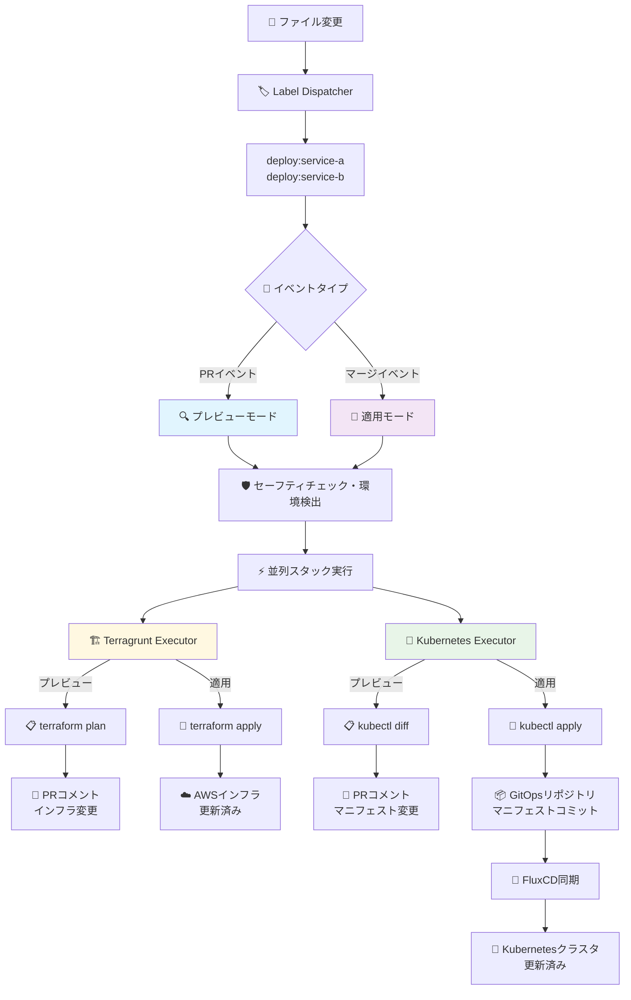

# Monorepo

[🇺🇸 English](README.md) | **日本語**

このリポジトリは、マイクロサービスとモジュラーフロントエンドアプリケーションを管理するためのモノレポです。GitHub Actionsを活用した自動化されたCI/CDパイプラインにより、インフラストラクチャ（Terragrunt）とアプリケーション（Kubernetes）の両方のデプロイメントをサポートし、クラウドネイティブアプリケーションの統合管理を提供します。

## 概要

- **アーキテクチャ**: モジュラーフロントエンドコンポーネントを持つマイクロサービス
- **インフラ管理**: Terragrunt + TerraformによるInfrastructure as Code
- **CI/CD**: ラベル駆動型選択デプロイメントによる自動化デプロイメントパイプライン
- **環境**: 3層環境構造（develop / staging / production）
- **デプロイメント戦略**: インフラストラクチャとアプリケーションデプロイメントの並列実行
- **対象ユーザー**: 開発者、DevOpsエンジニア、システム管理者

## 主要コンポーネント

- **マイクロサービス**: 独立してデプロイ可能なバックエンドサービス
- **モジュラーフロントエンド**: 独立したデプロイメント機能を持つコンポーネントベースのフロントエンドアプリケーション
- **自動化システム**: 並列実行によるラベル駆動型デプロイメント
- **設定管理**: 環境間での統一された設定とポリシー管理

このモノレポは、チーム間のコラボレーションを促進しながら、スケーラブルで保守可能なシステム開発をサポートすることを目的としています。

## 📁 サービス構造

各サービスは、複数のデプロイメントスタックをサポートする標準化されたディレクトリ構造に従います：

```
.
├── terragrunt/                       # インフラストラクチャスタック
│   └── envs/{environment}/           # 環境固有の設定
├── kubernetes/                       # アプリケーションスタック（必要に応じて）
│   └── overlays/{environment}/       # 環境固有のオーバーレイ
├── src/(Application code)            # 実装
└── docker                            # Dockerfile
```

- **スタックベースアーキテクチャ**: サービスは複数のデプロイメントスタック（terragrunt、kubernetes、その他）をサポート
- **環境分離**: 各環境（develop/staging/production）用の個別設定
- **拡張可能設計**: 必要に応じて、任意のサービスに追加のスタックを簡単に追加可能

## 🔄 開発ワークフロー

### ブランチ戦略

このリポジトリは環境ベースのブランチ戦略を採用しています：

```
┌─────────────┐     ┌─────────────┐      ┌─────────────┐     ┌──────────────┐
│  feature/*  │────▶│   develop   │─────▶│   staging   │────▶│  production  │
│   branch    │     │   branch    │      │   branch    │     │  branch      │
└─────────────┘     └─────────────┘      └─────────────┘     └──────────────┘
       │                   │                   │                   │
    PR作成              PR作成              PR作成              PR作成
       │                   │                   │                   │
   自動ラベル           自動ラベル           自動ラベル           自動ラベル
       │                   │                   │                   │
 ┌───────────┐      ┌───────────────┐    ┌─────────────┐    ┌────────────────┐
 │  develop  │      │  develop/svc  │    │staging/svc  │    │production/svc  │
 │  deploy   │      │  deploy       │    │deploy       │    │deploy          │
 └───────────┘      └───────────────┘    └─────────────┘    └────────────────┘
```

#### ブランチ設定
- **`develop`**: 変更されたサービスを開発環境にデプロイ
- **`staging`**: 変更されたサービスをステージング環境にデプロイ
- **`production`**: 変更されたサービスを本番環境にデプロイ

### プルリクエストフロー

1. **機能開発**: `feature/*` ブランチで開発
2. **PR作成**: `develop` ブランチへのPRを作成
3. **自動ラベル**: 変更されたサービスに自動的に `deploy:{service}` ラベルが付与
4. **レビュー・マージ**: コードレビュー後にマージ
5. **自動デプロイメント**: マージ後、関連サービスが適切な環境に自動デプロイ

### 環境プロモーション

```
develop環境 → staging環境 → production環境
(サービス固有)   (サービス固有)   (サービス固有)
```

## 🤖 CI/CDシステム

### ワークフローアーキテクチャ



**実行例**:
```bash
# ファイル変更検出
apps/web/user-portal/src/* → deploy:user-portal
services/api-gateway/src/*  → deploy:api-gateway

# developブランチでのPR作成時
🔍 terragrunt plan + kubectl diff → 📝 PRコメントで変更内容を表示

# developブランチでのマージ時
🚀 terragrunt apply → ☁️ AWS / kubectl apply → 📦 GitOps → 🔄 FluxCD → 🎯 K8s
```

### 主要ワークフロー

#### 1. Label Dispatcher (`auto-label--label-dispatcher.yaml`)
- **機能**: ファイル変更を検出し、変更されたサービスに自動的に `deploy:{service}` ラベルを割り当て
- **トリガー**: PR作成・更新
- **利点**: 手動ラベル作業を排除し、デプロイメント対象を明確化

#### 2. Deploy Trigger (`auto-label--deploy-trigger.yaml`)
- **機能**: PRラベルとイベントタイプに基づいてデプロイメント操作を実行
- **プレビューモード**: PR作成・更新時 - インフラプランとマニフェスト差分を実行
- **適用モード**: PRマージ時 - 実際のインフラストラクチャとアプリケーションデプロイメントを実行
- **マルチスタックサポート**: 複数のデプロイメントスタック（terragrunt、kubernetes、その他）を並列サポート
- **トリガー**: PRイベントとブランチプッシュイベント
- **安全性**: PRベースマージが必要、直接プッシュからのデプロイメントを防止

#### 3. Terragrunt Executor (`reusable--terragrunt-executor.yaml`)
- **機能**: Terragrunt + Terraformを使用したインフラストラクチャデプロイメント
- **プランモード**: PRイベント時 - インフラストラクチャ変更を生成・表示
- **適用モード**: マージイベント時 - 実際のインフラストラクチャデプロイメントを実行
- **AWS統合**: 環境固有のIAMロールでOIDC認証

#### 4. Kubernetes Executor (`reusable--kubernetes-executor.yaml`)
- **機能**: Kubernetesマニフェストを使用したアプリケーションデプロイメント
- **差分モード**: PRイベント時 - マニフェスト変更を生成・PRコメントで表示
- **適用モード**: マージイベント時 - マニフェストをGitOpsリポジトリにコミット
- **GitOps**: マニフェスト管理のための別GitOpsリポジトリとの統合

### デプロイメント戦略

#### 環境固有設定
デプロイメントシステムは `workflow-config.yaml` を使用して以下を定義：

```yaml
environments:
  - environment: develop
    aws_region: ap-northeast-1
    iam_role_plan: arn:aws:iam::559744160976:role/github-oidc-auth-develop-github-actions-role
    iam_role_apply: arn:aws:iam::559744160976:role/github-oidc-auth-develop-github-actions-role

directory_conventions:
  - root: "apps/web/{service}"
    stacks:
      - name: terragrunt
        directory: "terragrunt/envs/{environment}"
      - name: kubernetes
        directory: "kubernetes/overlays/{environment}"

  - root: "services/{service}"
    stacks:
      - name: terragrunt
        directory: "terragrunt/envs/{environment}"
      - name: kubernetes
        directory: "kubernetes/overlays/{environment}"
```

### 効率性機能

- **選択的デプロイメント**: 変更されたサービスのみデプロイメント実行
- **並列処理**: 複数サービスとデプロイメントスタックの同時デプロイメント
- **マルチスタックサポート**: terragrunt、kubernetes、追加デプロイメントスタックへの柔軟なサポート
- **リソース最適化**: 全スタックタイプで不要な実行を排除
- **GitOps統合**: 別リポジトリでのKubernetesマニフェスト管理
- **プレビュー機能**: PR上でのインフラプランとマニフェスト差分

### 安全性機能

- **PR必須**: 直接プッシュからのデプロイメントを防止
- **環境分離**: 環境固有のIAMロールアクセス制御
- **デプロイメント停止**: 不確実な状況での自動停止
- **OIDC認証**: 長期認証情報を使用しないキーレス認証
- **監査ログ**: 全デプロイメント操作の記録

## 🏗️ インフラストラクチャ概要

### 技術スタック

- **Terragrunt + Terraform**: Infrastructure as Code
- **Kubernetes**: コンテナオーケストレーションとアプリケーションデプロイメント
- **AWS**: クラウドプラットフォーム
- **GitHub Actions**: CI/CDパイプラインとOIDC認証

### サービスアーキテクチャ

各サービスは一貫した構造に従います：
- **マイクロサービス**: 独自の技術スタックを持つ独立したバックエンドサービス
- **フロントエンドモジュール**: 独立したデプロイメント機能を持つコンポーネントベースのフロントエンドアプリケーション
- **マルチスタックデプロイメント**: サービスは必要に応じて複数のデプロイメントスタックを使用可能：
  - **Terragrunt**: インフラストラクチャのプロビジョニングと管理
  - **Kubernetes**: コンテナオーケストレーションとアプリケーションデプロイメント
  - **追加スタック**: 他のデプロイメント方法（サーバーレス、静的サイトなど）をサポートするよう拡張可能

---

> このリポジトリは、包括的なCI/CD自動化を備えたスケーラブルなマイクロサービスとモジュラーフロントエンド開発の基盤を提供します。