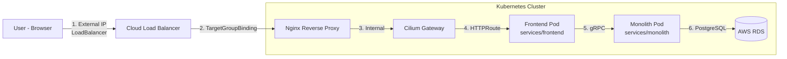
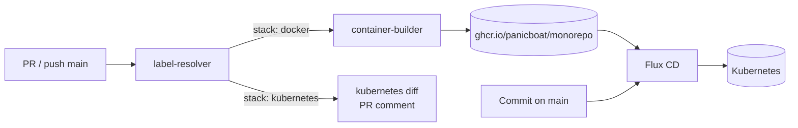

# Monorepo

[🇺🇸 English](README.md) | **日本語**

## 📖 Overview

panicboat プラットフォームを構成する各サービスのアプリケーションコード・Kubernetes マニフェスト・必要に応じた IaC を 1 つの PR でまとめて変更できるよう、本リポジトリに集約している。production は Flux CD による GitOps 構成で、リポジトリの `main` ブランチをクラスタの正とする。

## 📂 Structure

```
.
├── .github/workflows/   # CI ワークフロー（auto-label / deploy trigger / reusable builders）
├── clusters/            # 環境ごとの Flux CD ソース（Kustomization / ImagePolicy）
├── docs/                # アーキテクチャ・アクセスポリシー
├── proto/               # サービス間で共有する gRPC コントラクト
└── services/            # サービス単位のディレクトリ
    └── {service}/
        ├── workspace/   # アプリケーションソース
        ├── kubernetes/  # Kustomize base / overlays
        └── README.md    # サービス固有のドキュメント
```

## 🛠 Prerequisites

クラスタの bootstrap、共通プラットフォームコンポーネント、CI が assume する OIDC IAM は [panicboat/platform](https://github.com/panicboat/platform/tree/main/kubernetes) で構成する。本リポジトリからクラスタを操作する前に platform 側を立ち上げておく。

## 🏗 Architecture


```mermaid
graph LR
  User[User - Browser] -- "1. External IP<br>LoadBalancer" --> NginxLB[Cloud Load Balancer]
  NginxLB -- "2. TargetGroupBinding" --> NginxPod[Nginx Reverse Proxy]

  subgraph "Kubernetes Cluster"
    NginxPod -- "3. Internal" --> CiliumGw[Cilium Gateway]
    CiliumGw -- "4. HTTPRoute" --> FrontendPod[Frontend Pod<br>services/frontend]
    FrontendPod -- "5. gRPC" --> MonolithPod[Monolith Pod<br>services/monolith]
    MonolithPod -- "6. PostgreSQL" --> RDS[(AWS RDS)]
  end
```

サービス内部のアーキテクチャは各 `services/<service>/README.md` および `docs/ARCHITECTURE.md` を参照する。

## 🚢 Deployment

PR ラベルおよび `main` への push を起点とした CI が GHCR にコンテナイメージを push し、Flux がそれをクラスタに反映する。release-please がサービスごとのバージョニングを担っているため、production のデプロイは moving tag ではなく semver tag に固定される。

### Pipeline Flow


```mermaid
flowchart LR
  PR[PR / push main] --> Resolver[label-resolver]
  Resolver -->|stack: docker| Builder[container-builder]
  Resolver -->|stack: kubernetes| Diff[kubernetes diff<br/>PR comment]
  Builder --> GHCR[(ghcr.io/panicboat/monorepo)]
  GHCR --> Flux[Flux CD]
  Main[Commit on main] --> Flux
  Flux --> K8s[(Kubernetes)]
```

### Mechanics

- **Trigger**: `.github/workflows/auto-label--deploy-trigger.yaml` が PR ラベルと main への push を起点に起動する。`panicboat/deploy-actions/label-resolver` が `workflow-config.yaml` を読み、該当の stack ワークフローへディスパッチする。
- **Stacks**（`workflow-config.yaml` の `stack_conventions` を参照）:
  - `docker` → `services/{service}/workspace` をビルドして GHCR に push。
  - `kubernetes` → PR に kustomize diff をコメントする。apply は Flux に委譲しており、CI 側で `kubectl apply` は実行しない。
- **Versioning**: release-please（`release-please-config.json`）がサービスごとに release PR を起票する。release PR のマージで `<service>-vX.Y.Z` の semver tag が打たれ、その tag 起点でコンテナビルドが走る。
- **GitOps**: `clusters/<environment>/services/<service>/image-policy.yaml` が GHCR から最新の semver tag を選び、`ImageUpdateAutomation` がその tag を overlay にコミットバックする。クラスタで稼働しているものとリポジトリにコミットされているものを一致させるための構成。

### Related Repositories

- [panicboat/platform](https://github.com/panicboat/platform) — クラスタ bootstrap、共通コンポーネント、OIDC IAM。
- [panicboat/deploy-actions](https://github.com/panicboat/deploy-actions) — 再利用可能な GitHub Actions（`label-resolver` / `container-builder` / `terragrunt` / `auto-approve`）。
