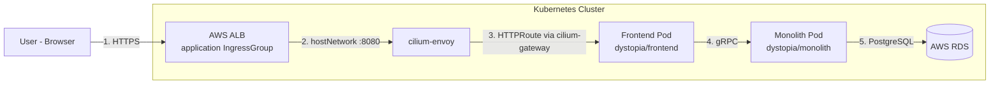
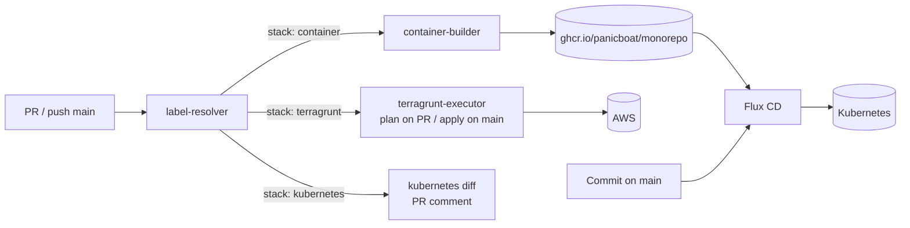

# Monorepo

[🇺🇸 English](README.md) | **日本語**

## 📖 Overview

## 📂 Structure

```
.
├── .github/workflows/   # CI ワークフロー（auto-label / deploy trigger / reusable builders）
├── clusters/            # 環境ごとの Flux CD ソース（Kustomization / ImagePolicy）
├── docs/                # アーキテクチャ・アクセスポリシー
├── proto/
│   └── dystopia/        # dystopia サービス間で共有する gRPC コントラクト
├── dystopia/            # サービス単位のディレクトリ
│   └── {service}/
│       ├── kubernetes/  # Kustomize base / overlays
│       └── README.md    # サービス固有のドキュメント
└── system-components/   # 内部/運用ツール群（顧客向けではない） — dystopia/ と同じ per-service 構造
```

## 🛠 Prerequisites

クラスタの bootstrap、共通プラットフォームコンポーネント、CI が assume する OIDC IAM は [panicboat/platform](https://github.com/panicboat/platform/tree/main/kubernetes) で構成する。本リポジトリからクラスタを操作する前に platform 側を立ち上げておく。

## 🏗 Architecture


```mermaid
graph LR
  User[User - Browser] -- "1. HTTPS" --> ALB[AWS ALB<br>application IngressGroup]

  subgraph "Kubernetes Cluster"
    ALB -- "2. hostNetwork :8080" --> Envoy[cilium-envoy]
    Envoy -- "3. HTTPRoute via cilium-gateway" --> FrontendPod[Frontend Pod<br>dystopia/frontend]
    FrontendPod -- "4. gRPC" --> MonolithPod[Monolith Pod<br>dystopia/monolith]
    MonolithPod -- "5. PostgreSQL" --> RDS[(AWS RDS)]
  end
```

サービス内部のアーキテクチャは各 `dystopia/<service>/README.md` および `docs/ARCHITECTURE.md` を参照する。

## 🚢 Deployment

PR ラベルおよび `main` への push を起点とした CI が GHCR にコンテナイメージを push し、Flux がそれをクラスタに反映する。release-please がサービスごとのバージョニングを担っているため、production のデプロイは moving tag ではなく semver tag に固定される。

### Pipeline Flow


```mermaid
flowchart LR
  PR[PR / push main] --> Resolver[label-resolver]
  Resolver -->|stack: container| Builder[container-builder]
  Resolver -->|stack: terragrunt| Terragrunt[terragrunt-executor<br/>plan on PR / apply on main]
  Resolver -->|stack: kubernetes| Diff[kubernetes diff<br/>PR comment]
  Builder --> GHCR[(ghcr.io/panicboat/monorepo)]
  Terragrunt --> AWS[(AWS)]
  GHCR --> Flux[Flux CD]
  Main[Commit on main] --> Flux
  Flux --> K8s[(Kubernetes)]
```

### Mechanics

#### Trigger

1. [`auto-label--label-dispatcher.yaml`](.github/workflows/auto-label--label-dispatcher.yaml) が PR の更新ごとに [`label-dispatcher`](https://github.com/panicboat/deploy-actions/tree/main/label-dispatcher) を実行し、差分が触れたサービスごとに `deploy:<service>` ラベルを PR に付ける。
2. [`auto-label--deploy-trigger.yaml`](.github/workflows/auto-label--deploy-trigger.yaml) が PR へのラベル付与と `main` への push で起動する。[`label-resolver`](https://github.com/panicboat/deploy-actions/tree/main/label-resolver) が [`workflow-config.yaml`](workflow-config.yaml) の `stacks` を読み、ラベルをデプロイ対象に変換する。
3. 各デプロイ対象は、その stack の reusable workflow に渡される。

#### Stacks

各 stack が対象とするパスは [`workflow-config.yaml`](workflow-config.yaml) の `stacks` で定義している。

| Stack | Workflow | PR | `main` への push |
| --- | --- | --- | --- |
| `container` | [`reusable--container-builder.yaml`](.github/workflows/reusable--container-builder.yaml) | ビルドして GHCR に push | ビルドして GHCR に push |
| `terragrunt` | [`reusable--terragrunt-executor.yaml`](.github/workflows/reusable--terragrunt-executor.yaml) → [`terragrunt-run`](https://github.com/panicboat/panicboat-actions/tree/main/terragrunt-run) | `terragrunt plan` | `terragrunt apply` |
| `kubernetes` | [`reusable--kubernetes-builder.yaml`](.github/workflows/reusable--kubernetes-builder.yaml) | kustomize diff を PR にコメント | 何もしない。apply は Flux が行い、CI は `kubectl apply` を実行しない |

[`dystopia/infrastructure`](dystopia/infrastructure) は frontend と monolith が共有する AWS リソース（Cognito、RDS）を持つ `terragrunt` stack であり、デプロイされるサービスではない。

#### Versioning

1. [`release.yml`](.github/workflows/release.yml) が `release-please-config.json`（例: [`dystopia/monolith/release-please-config.json`](dystopia/monolith/release-please-config.json)）ごとに release-please を実行し、サービスごとに release PR を起票する。
2. release PR をマージすると、release `<service>-vX.Y.Z` が公開される。
3. [`auto-release--trigger.yaml`](.github/workflows/auto-release--trigger.yaml) がその release のコンテナをビルドし、イメージに `vX.Y.Z` の tag を付ける。

サービスごとに config を分けている理由は [`docs/RELEASE_PLEASE.md`](docs/RELEASE_PLEASE.md) に書いてある。

#### GitOps

各サービスは `clusters/<environment>/` 配下にディレクトリを持つ（例: [`clusters/production/dystopia/monolith`](clusters/production/dystopia/monolith)）。

- [`image-policy.yaml`](clusters/production/dystopia/monolith/image-policy.yaml) が GHCR から最も新しい `vX.Y.Z` の tag を選ぶ。
- [`image-automation.yaml`](clusters/production/dystopia/monolith/image-automation.yaml) がその tag をサービスの overlay（例: [`dystopia/monolith/kubernetes/overlays/production`](dystopia/monolith/kubernetes/overlays/production)）にコミットする。クラスタで動いているものとリポジトリにあるものが一致する。

### Related Repositories

- [panicboat/platform](https://github.com/panicboat/platform) — クラスタ bootstrap、共通コンポーネント、OIDC IAM。
- [panicboat/deploy-actions](https://github.com/panicboat/deploy-actions) — PR の変更をデプロイ用ラベルに、ラベルをデプロイ対象に変換する GitHub Actions。
- [panicboat/panicboat-actions](https://github.com/panicboat/panicboat-actions) — panicboat の AWS アカウントに対して Terragrunt を実行する GitHub Actions。
