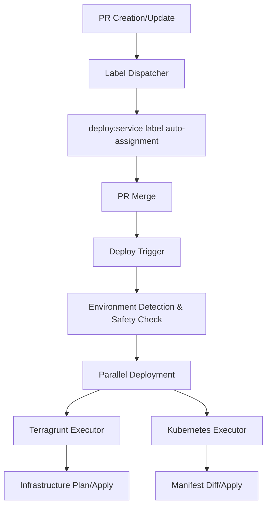

# Monorepo

This repository is a monorepo for managing microservices and modular frontend applications. It provides unified management of cloud-native applications with automated CI/CD pipelines powered by GitHub Actions, supporting both infrastructure (Terragrunt) and application (Kubernetes) deployments.

## Overview

- **Architecture**: Microservices with modular frontend components
- **Infrastructure Management**: Infrastructure as Code with Terragrunt + Terraform
- **CI/CD**: Automated deployment pipelines with label-driven selective deployment
- **Environments**: 3-tier environment structure (develop / staging / production)
- **Deployment Strategy**: Parallel execution of infrastructure and application deployments
- **Target Users**: Developers, DevOps Engineers, System Administrators

## Key Components

- **Microservices**: Independently deployable backend services
- **Modular Frontend**: Component-based frontend applications with independent deployment capabilities
- **Automation System**: Label-driven deployment with parallel execution
- **Configuration Management**: Unified configuration and policy management across environments

This monorepo aims to support scalable and maintainable system development while facilitating collaboration between teams.

## 📁 Service Structure

Each service follows a standardized directory structure supporting multiple deployment stacks:

```
.
├── terragrunt/                       # Infrastructure stack
│   └── envs/{environment}/           # Environment-specific configurations
├── kubernetes/                       # Application stack (if needed)
│   └── overlays/{environment}/       # Environment-specific overlays
├── src/(Application code)            # Implementation
└── docker                            # Dockerfile
```

- **Stack-based Architecture**: Services support multiple deployment stacks (terragrunt, kubernetes, and others)
- **Environment Isolation**: Separate configurations for each environment (develop/staging/production)
- **Extensible Design**: Additional stacks can be easily added to any service as needed

## 🔄 Development Workflow

### Branch Strategy

This repository adopts an environment-based branch strategy:

```
┌─────────────┐     ┌─────────────┐      ┌─────────────┐     ┌──────────────┐
│  feature/*  │────▶│   develop   │─────▶│   staging   │────▶│  production  │
│   branch    │     │   branch    │      │   branch    │     │  branch      │
└─────────────┘     └─────────────┘      └─────────────┘     └──────────────┘
       │                   │                   │                   │
    PR Creation         PR Creation         PR Creation         PR Creation
       │                   │                   │                   │
   Auto-labeling       Auto-labeling       Auto-labeling       Auto-labeling
       │                   │                   │                   │
 ┌───────────┐      ┌───────────────┐    ┌─────────────┐    ┌────────────────┐
 │  develop  │      │  develop/svc  │    │staging/svc  │    │production/svc  │
 │  deploy   │      │  deploy       │    │deploy       │    │deploy          │
 └───────────┘      └───────────────┘    └─────────────┘    └────────────────┘
```

#### Branch Configuration
- **`develop`**: Deploy changed services to development environment
- **`staging`**: Deploy changed services to staging environment
- **`production`**: Deploy changed services to production environment

### Pull Request Flow

1. **Feature Development**: Develop on `feature/*` branches
2. **PR Creation**: Create PR to `develop` branch
3. **Auto-labeling**: Changed services automatically get `deploy:{service}` labels
4. **Review & Merge**: Code review followed by merge
5. **Auto-deployment**: After merge, relevant services automatically deploy to appropriate environment

### Environment Promotion

```
develop environment → staging environment → production environment
 (Service-specific)    (Service-specific)    (Service-specific)
```

## 🤖 CI/CD System

### Workflow Architecture



### Key Workflows

#### 1. Label Dispatcher (`auto-label--label-dispatcher.yaml`)
- **Function**: Detects file changes and automatically assigns `deploy:{service}` labels to changed services
- **Trigger**: PR creation/update
- **Benefits**: Eliminates manual labeling work, clarifies deployment targets

#### 2. Deploy Trigger (`auto-label--deploy-trigger.yaml`)
- **Function**: Executes deployment based on merged PR labels and current branch
- **Multi-Stack Support**: Supports multiple deployment stacks (terragrunt, kubernetes, and others) in parallel
- **Trigger**: Branch push events
- **Safety**: Requires PR-based merges, prevents deployment on direct pushes

#### 3. Terragrunt Executor (`reusable--terragrunt-executor.yaml`)
- **Function**: Infrastructure deployment using Terragrunt + Terraform
- **Modes**: Plan (on PR) / Apply (on merge)
- **AWS Integration**: OIDC authentication with environment-specific IAM roles

#### 4. Kubernetes Executor (`reusable--kubernetes-executor.yaml`)
- **Function**: Application deployment using Kubernetes manifests
- **Modes**: Diff (on PR) / Apply (on merge)
- **GitOps**: Integrates with separate GitOps repository for manifest management

### Deployment Strategy

#### Environment-specific Configuration
The deployment system uses `workflow-config.yaml` to define:

```yaml
environments:
  - environment: develop
    aws_region: ap-northeast-1
    iam_role_plan: arn:aws:iam::559744160976:role/github-oidc-auth-develop-github-actions-role
    iam_role_apply: arn:aws:iam::559744160976:role/github-oidc-auth-develop-github-actions-role

directory_conventions:
  - root: "apps/web/{service}"
    stacks:
      - name: terragrunt
        directory: "terragrunt/envs/{environment}"
      - name: kubernetes
        directory: "kubernetes/overlays/{environment}"

  - root: "services/{service}"
    stacks:
      - name: terragrunt
        directory: "terragrunt/envs/{environment}"
      - name: kubernetes
        directory: "kubernetes/overlays/{environment}"
```

#### Deployment Flow
```bash
# Labels assigned by Label Dispatcher
deploy:api-gateway
deploy:order-service

# Deploy Trigger performs environment detection and parallel execution
develop branch → Deploy to develop environment
  ├── Terragrunt: Infrastructure plan/apply
  └── Kubernetes: Manifest diff/apply (GitOps)
staging branch → Deploy to staging environment
  ├── Terragrunt: Infrastructure plan/apply
  └── Kubernetes: Manifest diff/apply (GitOps)
production branch → Deploy to production environment
  ├── Terragrunt: Infrastructure apply
  └── Kubernetes: Manifest apply (GitOps)
```

### Efficiency Features

- **Selective Deployment**: Execute deployment only for changed services
- **Parallel Processing**: Concurrent deployment of multiple services and deployment stacks
- **Multi-Stack Support**: Flexible support for terragrunt, kubernetes, and additional deployment stacks
- **Resource Optimization**: Eliminate unnecessary executions across all stack types
- **GitOps Integration**: Kubernetes manifests managed via separate repository
- **Preview Capabilities**: Infrastructure plan and manifest diff on PRs

### Safety Features

- **PR Required**: Prevents deployment from direct pushes
- **Environment Isolation**: Environment-specific IAM role access control
- **Deployment Halt**: Automatic stop in uncertain situations
- **OIDC Authentication**: Keyless authentication without long-term credentials
- **Audit Logging**: Record all deployment operations

## 🏗️ Infrastructure Overview

### Technology Stack

- **Terragrunt + Terraform**: Infrastructure as Code
- **Kubernetes**: Container orchestration and application deployment
- **AWS**: Cloud platform
- **GitHub Actions**: CI/CD pipeline and OIDC authentication

### Service Architecture

Each service follows a consistent structure:
- **Microservices**: Independent backend services with their own technology stack
- **Frontend Modules**: Component-based frontend applications with independent deployment capabilities
- **Multi-Stack Deployment**: Services can use multiple deployment stacks as needed:
  - **Terragrunt**: Infrastructure provisioning and management
  - **Kubernetes**: Container orchestration and application deployment
  - **Additional Stacks**: Extensible to support other deployment methods (serverless, static sites, etc.)

---

> This repository provides a foundation for scalable microservice and modular frontend development with comprehensive CI/CD automation.
