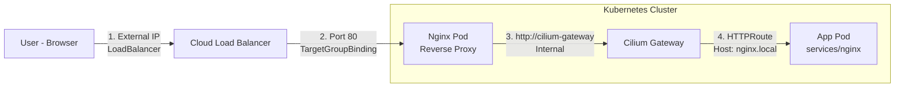

# Monorepo

**English** | [🇯🇵 日本語](README-ja.md)

## 📖 Overview

## 📂 Structure

```
.
├── .github/            # GitHub Actions Workflows
├── clusters/           # Flux CD Cluster definitions
├── demo/               # Demo application
├── openspec/           # OpenAPI specifications
|   proto/              # Protocol Buffers definitions
├── services/           # Microservices source code & manifests
│   └── {service}/      # Service Name
│       ├── workspace/  # Application Source Code
│       ├── kubernetes/ # Kubernetes Manifests (Base/Overlays)
│       └── terragrunt/ # Terraform & Terragrunt configurations
├── templates/          # Kubernetes templates
└── web/                # Frontend source code & manifests
    └── {service}/      # Service Name
        ├── workspace/  # Application Source Code
        ├── kubernetes/ # Kubernetes Manifests (Base/Overlays)
        └── terragrunt/ # Terraform & Terragrunt configurations
```
## 🛠 Prerequisites

- https://github.com/panicboat/platform/tree/main/kubernetes

## 🚀 Getting Started

Add the following to `/etc/hosts`.

```bash
127.0.0.1 nginx.local
```

## 🏗 Architecture



## 📝 Contribution Guide
