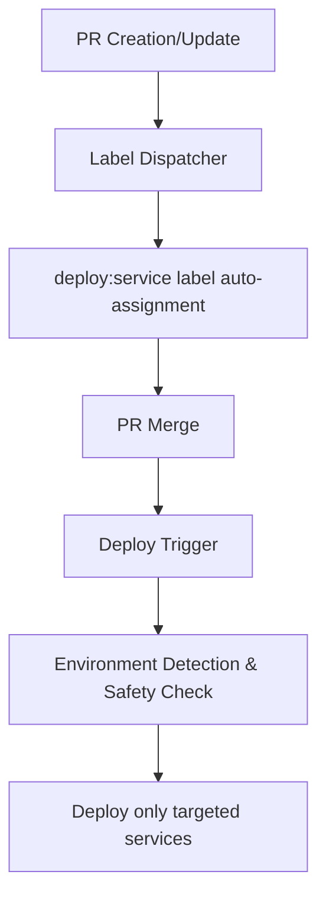

# Monorepo

This repository is a monorepo that provides unified management of multiple services and infrastructure configurations. It manages cloud-native applications and infrastructure on AWS using Terragrunt/Terraform, with automated CI/CD pipelines powered by GitHub Actions.

## Overview

- **Architecture**: Microservice-oriented cloud-native application suite
- **Infrastructure Management**: Infrastructure as Code with Terragrunt + Terraform
- **CI/CD**: Automated deployment pipelines with GitHub Actions
- **Environments**: 3-tier environment structure (develop / staging / production)
- **Target Users**: Developers, DevOps Engineers, System Administrators

## Key Components

- **Services**: Independently deployable microservices
- **Shared Infrastructure**: Common infrastructure like GitHub OIDC authentication and repository management
- **Automation System**: Label-driven deployment and workflow automation
- **Configuration Management**: Unified configuration and policy management across environments

This monorepo aims to support scalable and maintainable system development while facilitating collaboration between teams.

## 📁 Repository Structure

```
monorepo/
├── README.md                          # This file
├── .github/                           # GitHub configuration and workflows
│   ├── workflows/                     # GitHub Actions workflows
│   │   ├── auto-label--*.yaml         # Auto-labeling system
│   │   ├── reusable--*.yaml           # Reusable workflows
│   │   └── claude-code-action.yaml    # AI-assisted development tool
│   ├── scripts/                       # Workflow automation scripts
│   │   ├── shared/                    # Shared components
│   │   ├── label-dispatcher/          # Auto label assignment system
│   │   ├── deploy-trigger/            # Deployment execution control system
│   │   └── config-manager/            # Configuration management & validation system
│   └── renovate.json                  # Dependency auto-update configuration
├── github-oidc-auth/                  # GitHub OIDC authentication infrastructure
├── github-repository/                 # GitHub repository management
└── {service-name}/                    # Individual service directories
    └── (Service-specific files)
```

### Directory Structure Principles

- **Service Separation**: Each service has its own independent directory
- **Shared Infrastructure**: Common infrastructure like authentication and repository management in dedicated directories
- **Automation Centralization**: Workflow automation logic centralized in `.github/scripts/`

## 🔄 Development Workflow

### Branch Strategy

This repository adopts an environment-based branch strategy:

```
┌─────────────┐     ┌─────────────┐      ┌─────────────┐     ┌─────────────┐
│  feature/*  │────▶│   develop   │─────▶│staging/svc  │────▶│production/  │
│   branch    │     │   branch    │      │   branch    │     │ svc branch  │
└─────────────┘     └─────────────┘      └─────────────┘     └─────────────┘
       │                   │                   │                   │
    PR Creation         PR Creation         PR Creation         PR Creation
       │                   │                   │                   │
   Auto-labeling       Auto-labeling       Auto-labeling       Auto-labeling
       │                   │                   │                   │
   ┌─────────┐         ┌─────────┐         ┌─────────┐         ┌──────────┐
   │develop  │         │develop  │         │staging  │         │production│
   │deploy   │         │deploy   │         │deploy   │         │deploy    │
   └─────────┘         └─────────┘         └─────────┘         └──────────┘
```

#### Branch Configuration
- **`develop`**: Development integration branch - deploys all services to develop environment
- **`staging/{service-name}`**: Service-specific staging branches
- **`production/{service-name}`**: Service-specific production branches
- **`feature/*`**: Feature development branches

### Pull Request Flow

1. **Feature Development**: Develop on `feature/*` branches
2. **PR Creation**: Create PR to `develop` branch
3. **Auto-labeling**: Changed services automatically get `deploy:{service}` labels
4. **Review & Merge**: Code review followed by merge
5. **Auto-deployment**: After merge, relevant services automatically deploy to develop environment

### Environment Promotion

```
develop environment → staging environment → production environment
    (All services)      (Service-specific)    (Service-specific)
```

### Automation System

- **Auto-labeling**: Detects file changes and automatically applies appropriate deployment labels
- **Environment-specific Deployment**: Deploys only to appropriate environments based on branch
- **Safety Checks**: Requires PR-based merges and prevents direct push deployments

### Commit Message Convention

```bash
feat(service-name): Add new feature
fix(service-name): Fix bug
docs(service-name): Update documentation
refactor(service-name): Refactor code
```

For detailed automation system information, refer to the documentation in the `.github/scripts/` directory.

## 🤖 Automation System Overview

This monorepo implements a comprehensive automation system to achieve efficient and secure deployments.

### System Architecture



### Key Components

#### 1. Label Dispatcher (Auto Label Assignment)
- **Location**: `.github/scripts/label-dispatcher/`
- **Function**: Detects file changes and automatically assigns `deploy:{service}` labels to changed services
- **Trigger**: PR creation/update
- **Benefits**: Eliminates manual labeling work, clarifies deployment targets

#### 2. Deploy Trigger (Deployment Execution Control)
- **Location**: `.github/scripts/deploy-trigger/`
- **Function**: Executes deployment only to appropriate environments based on merged PR labels and current branch
- **Trigger**: Branch push events
- **Safety**: Requires PR-based merges, stops deployment on direct pushes

#### 3. Config Manager (Configuration Management & Validation)
- **Location**: `.github/scripts/config-manager/`
- **Function**: Validates workflow configurations, system diagnostics, configuration template generation
- **Usage**: System maintenance, troubleshooting

### Deployment Strategy

#### Environment-specific Filtering
```bash
# Labels assigned by Label Dispatcher (no environment specification)
deploy:auth-service
deploy:api-gateway

# Deploy Trigger performs environment detection
develop branch     → Deploy auth-service, api-gateway to develop environment
staging/* branch   → Deploy auth-service, api-gateway to staging environment
production/* branch → Deploy auth-service, api-gateway to production environment
```

#### Efficiency Improvements
- **Selective Deployment**: Execute deployment only for changed services
- **Parallel Processing**: Concurrent deployment of multiple services
- **Resource Optimization**: Eliminate unnecessary Terragrunt executions

### Safety Features

- **PR Required**: Prevents deployment from direct pushes
- **Environment Isolation**: Appropriate access control for each environment
- **Deployment Halt**: Automatic stop in uncertain situations
- **Audit Logging**: Record all deployment operations

### Detailed Documentation

For detailed specifications, configuration methods, and troubleshooting of each system, refer to:

- [Label Dispatcher Details](/.github/scripts/label-dispatcher/README.md)
- [Deploy Trigger Details](/.github/scripts/deploy-trigger/README.md)
- [Config Manager Details](/.github/scripts/config-manager/README.md)
- [Integrated Configuration Guide](/.github/scripts/shared/README.md)

## 🏗️ Infrastructure Overview

### Architecture

This monorepo manages cloud infrastructure on AWS using Terragrunt + Terraform.

#### Environment Configuration
```
AWS Account
├── develop environment    - Development & Integration Testing
├── staging environment    - Staging & Acceptance Testing
└── production environment - Production Operations
```

#### Shared Infrastructure
- **State Management**: State management with S3 bucket + DynamoDB
- **Authentication Infrastructure**: Keyless authentication with GitHub OIDC
- **Audit Logging**: Operation log recording with CloudWatch

### Technology Stack

- **Terragrunt**: Unified infrastructure configuration management and DRY principle implementation
- **Terraform**: AWS resource provisioning
- **AWS**: Cloud platform
- **GitHub Actions**: CI/CD pipeline and OIDC authentication

### Service Structure

Each service manages infrastructure with the following structure:

```
{service}/terragrunt/
├── root.hcl           # Shared configuration
├── Makefile          # Development & operations commands
├── modules/          # Terraform modules
└── envs/             # Environment-specific configurations
    ├── develop/
    ├── staging/
    └── production/
```

### State Management

```
# Development Account
S3: terragrunt-state-{dev-account-id}
├── github-oidc-auth/develop/terraform.tfstate
└── {service-name}/develop/terraform.tfstate

# Staging Account
S3: terragrunt-state-{staging-account-id}
├── github-oidc-auth/staging/terraform.tfstate
└── {service-name}/staging/terraform.tfstate

# Production Account
S3: terragrunt-state-{prod-account-id}
├── github-oidc-auth/production/terraform.tfstate
└── {service-name}/production/terraform.tfstate
```

### Security

- **Account Separation**: Independent AWS accounts for each environment
- **Principle of Least Privilege**: Environment-specific IAM role access control
- **OIDC Authentication**: Keyless authentication without long-term credentials
- **State Encryption**: Encrypted storage of Terraform state files
- **Audit Trail**: Recording of all infrastructure changes

---

> **TODO**: Comprehensive documentation including detailed Terragrunt configuration methods, module creation guides, and troubleshooting will be prepared separately.

For detailed technical specifications and best practices, refer to the documentation within each service's `terragrunt/` directory.
