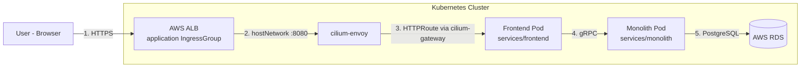
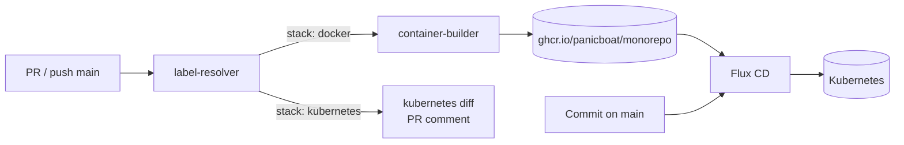

# Monorepo

**English** | [🇯🇵 日本語](README-ja.md)

## 📖 Overview

## 📂 Structure

```
.
├── .github/workflows/   # CI: auto-label, deploy trigger, reusable builders
├── clusters/            # Flux CD sources per environment (Kustomization, ImagePolicy)
├── docs/                # Architecture & access policy
├── proto/               # gRPC contracts shared between services
└── services/            # One directory per service
    └── {service}/
        ├── workspace/   # Application source
        ├── kubernetes/  # Kustomize base & overlays
        └── README.md    # Service-specific notes
```

## 🛠 Prerequisites

Cluster bootstrap, shared platform components, and the OIDC IAM that CI assumes live in [panicboat/platform](https://github.com/panicboat/platform/tree/main/kubernetes). Bring up the platform before targeting the cluster from this repo.

## 🏗 Architecture


```mermaid
graph LR
  User[User - Browser] -- "1. HTTPS" --> ALB[AWS ALB<br>application IngressGroup]

  subgraph "Kubernetes Cluster"
    ALB -- "2. hostNetwork :8080" --> Envoy[cilium-envoy]
    Envoy -- "3. HTTPRoute via cilium-gateway" --> FrontendPod[Frontend Pod<br>services/frontend]
    FrontendPod -- "4. gRPC" --> MonolithPod[Monolith Pod<br>services/monolith]
    MonolithPod -- "5. PostgreSQL" --> RDS[(AWS RDS)]
  end
```

Service-internal architecture is documented in each `services/<service>/README.md` and in `docs/ARCHITECTURE.md`.

## 🚢 Deployment

A PR-label / push-driven CI pipeline produces container images; Flux pulls them from GHCR into the cluster. release-please owns service versioning, so a production deploy is pinned to a semver tag rather than to a moving target.

### Pipeline Flow


```mermaid
flowchart LR
  PR[PR / push main] --> Resolver[label-resolver]
  Resolver -->|stack: docker| Builder[container-builder]
  Resolver -->|stack: kubernetes| Diff[kubernetes diff<br/>PR comment]
  Builder --> GHCR[(ghcr.io/panicboat/monorepo)]
  GHCR --> Flux[Flux CD]
  Main[Commit on main] --> Flux
  Flux --> K8s[(Kubernetes)]
```

### Mechanics

- **Trigger**: `.github/workflows/auto-label--deploy-trigger.yaml` runs on PR labels and main pushes. `panicboat/deploy-actions/label-resolver` reads `workflow-config.yaml` and dispatches to the matching stack workflow.
- **Stacks** (see `stack_conventions` in `workflow-config.yaml`):
  - `docker` → builds `services/{service}/workspace` and pushes to GHCR.
  - `kubernetes` → posts a kustomize diff on the PR. Apply is delegated to Flux; CI does not run `kubectl apply`.
- **Versioning**: release-please (`.github/release-please-config.json`) raises per-service release PRs. Merging the release PR creates a `<service>-vX.Y.Z` tag, which triggers the container build under that tag.
- **GitOps**: `clusters/<environment>/services/<service>/image-policy.yaml` selects the latest matching semver from GHCR. `ImageUpdateAutomation` commits the new tag back into the overlay, keeping what runs in the cluster identical to what is checked in.

### Related Repositories

- [panicboat/platform](https://github.com/panicboat/platform) — cluster bootstrap, shared components, OIDC IAM.
- [panicboat/deploy-actions](https://github.com/panicboat/deploy-actions) — reusable GitHub Actions (`label-resolver`, `container-builder`, `terragrunt`, `auto-approve`).
