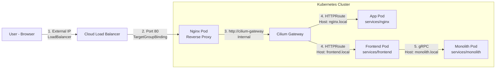
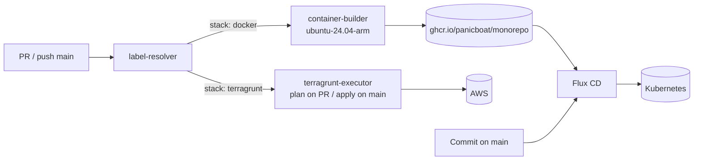

# Monorepo

**English** | [🇯🇵 日本語](README-ja.md)

## 📖 Overview

## 📂 Structure

```
.
├── .github/            # GitHub Actions Workflows
├── clusters/           # Flux CD Cluster definitions
├── proto/              # Protocol Buffers definitions
├── services/           # Services source code & manifests
│   └── {service}/      # Service Name
│       ├── workspace/  # Application Source Code
│       ├── kubernetes/ # Kubernetes Manifests (Base/Overlays)
│       └── terragrunt/ # Terraform & Terragrunt configurations
├── templates/          # Kubernetes templates
└── tests/              # Tests
    └── e2e/            # End-to-End tests
```
## 🛠 Prerequisites

- https://github.com/panicboat/platform/tree/main/kubernetes

## 🚀 Getting Started

Add the following to `/etc/hosts`.

```bash
127.0.0.1 nginx.local
127.0.0.1 frontend.local
127.0.0.1 handbooks.local
```

### 🚀 Running Locally

To edit manifests locally without Flux overwriting changes, suspend the Kustomizations:

```bash
flux suspend kustomization monolith reverse-proxy frontend -n flux-system
```

Then apply your local changes:

```bash
# Monolith
kubectl apply -k services/monolith/kubernetes/overlays/develop

# Reverse Proxy
kubectl apply -k services/reverse-proxy/kubernetes/overlays/develop

# Frontend
kubectl apply -k services/frontend/kubernetes/overlays/develop
```

To resume Flux synchronization (discarding local changes):

```bash
flux resume kustomization monolith reverse-proxy frontend -n flux-system
```

## 🏗 Architecture


```mermaid
graph LR
  User[User - Browser] -- "1. External IP<br>LoadBalancer" --> NginxLB[Cloud Load Balancer]
  NginxLB -- "2. Port 80<br>TargetGroupBinding" --> NginxPod[Nginx Pod<br>Reverse Proxy]

  subgraph "Kubernetes Cluster"
    NginxPod -- "3. http://cilium-gateway<br>Internal" --> CiliumGw[Cilium Gateway]
    CiliumGw -- "4. HTTPRoute<br>Host: nginx.local" --> AppPod[App Pod<br>services/nginx]
    CiliumGw -- "4. HTTPRoute<br>Host: frontend.local" --> FrontendPod[Frontend Pod<br>services/frontend]
    FrontendPod -- "5. gRPC<br>Host: monolith.local" --> MonolithPod[Monolith Pod<br>services/monolith]
  end
```

## 🚢 Deployment

### Trigger

- PR labels or push to `main` activate the pipeline in `.github/workflows/auto-label--deploy-trigger.yaml`.
- Deployment targets are resolved from labels by `panicboat/deploy-actions/label-resolver` against `workflow-config.yaml`.

### Stacks

| Stack | Path Convention | Tooling |
|-------|-----------------|---------|
| Container | `services/{service}/workspace` | Docker → GHCR (`ghcr.io/panicboat/monorepo`), built on `ubuntu-24.04-arm` |
| Infrastructure | `services/{service}/terragrunt/envs/{environment}` | Terragrunt via AWS OIDC |
| Kubernetes | `services/{service}/kubernetes/overlays/{environment}` | Kustomize, reconciled by Flux CD |

### Environments

Defined in `workflow-config.yaml`. Only `develop` is active; `staging` / `production` entries are reserved and currently commented out.

| Environment | AWS Region | AWS Account | Status |
|-------------|------------|-------------|--------|
| develop | ap-northeast-1 | 559744160976 | Active |
| staging | - | - | Reserved |
| production | - | - | Reserved |

### Pipeline Flow


```mermaid
flowchart LR
  Trigger[PR / push main] --> Resolver[label-resolver]
  Resolver -->|stack: docker| Builder[container-builder<br/>ubuntu-24.04-arm]
  Resolver -->|stack: terragrunt| Terragrunt[terragrunt-executor<br/>plan on PR / apply on main]
  Builder --> GHCR[(ghcr.io/panicboat/monorepo)]
  Terragrunt --> AWS[(AWS)]
  GHCR --> Flux[Flux CD]
  Main[Commit on main] --> Flux
  Flux --> K8s[(Kubernetes)]
```

### GitOps Sync (Flux CD)

- Flux `GitRepository` watches this repo's `main` branch.
- Per-service `Kustomization` in `clusters/{environment}/services/{service}/service.yaml` reconciles every 5 minutes against `services/{service}/kubernetes/overlays/{environment}`.
- `nginx` additionally uses `ImageRepository` + `ImagePolicy` + `ImageUpdateAutomation` to auto-bump image tags from Docker Hub every 30 minutes.

### Related Repositories

- [panicboat/platform](https://github.com/panicboat/platform) — cluster bootstrap, shared components, and IAM for OIDC.
- [panicboat/deploy-actions](https://github.com/panicboat/deploy-actions) — reusable GitHub Actions: `label-resolver`, `container-builder`, `terragrunt`, `auto-approve`.

## 📝 Contribution Guide
