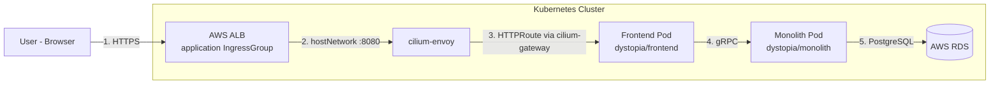
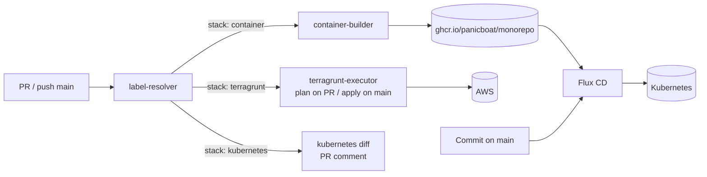

# Monorepo

**English** | [🇯🇵 日本語](README-ja.md)

## 📖 Overview

## 📂 Structure

```
.
├── .github/workflows/   # CI: auto-label, deploy trigger, reusable builders
├── clusters/            # Flux CD sources per environment (Kustomization, ImagePolicy)
├── docs/                # Architecture & access policy
├── proto/
│   └── dystopia/        # gRPC contracts shared between dystopia services
├── dystopia/            # One directory per service
│   └── {service}/
│       ├── kubernetes/  # Kustomize base & overlays
│       └── README.md    # Service-specific notes
└── system-components/   # Internal/ops tooling, not customer-facing — same per-service structure as dystopia/
```

## 🛠 Prerequisites

Cluster bootstrap, shared platform components, and the OIDC IAM that CI assumes live in [panicboat/platform](https://github.com/panicboat/platform/tree/main/kubernetes). Bring up the platform before targeting the cluster from this repo.

## 🏗 Architecture


```mermaid
graph LR
  User[User - Browser] -- "1. HTTPS" --> ALB[AWS ALB<br>application IngressGroup]

  subgraph "Kubernetes Cluster"
    ALB -- "2. hostNetwork :8080" --> Envoy[cilium-envoy]
    Envoy -- "3. HTTPRoute via cilium-gateway" --> FrontendPod[Frontend Pod<br>dystopia/frontend]
    FrontendPod -- "4. gRPC" --> MonolithPod[Monolith Pod<br>dystopia/monolith]
    MonolithPod -- "5. PostgreSQL" --> RDS[(AWS RDS)]
  end
```

Service-internal architecture is documented in each `dystopia/<service>/README.md` and in `docs/ARCHITECTURE.md`.

## 🚢 Deployment

A PR-label / push-driven CI pipeline produces container images; Flux pulls them from GHCR into the cluster. release-please owns service versioning, so a production deploy is pinned to a semver tag rather than to a moving target.

### Pipeline Flow


```mermaid
flowchart LR
  PR[PR / push main] --> Resolver[label-resolver]
  Resolver -->|stack: container| Builder[container-builder]
  Resolver -->|stack: terragrunt| Terragrunt[terragrunt-executor<br/>plan on PR / apply on main]
  Resolver -->|stack: kubernetes| Diff[kubernetes diff<br/>PR comment]
  Builder --> GHCR[(ghcr.io/panicboat/monorepo)]
  Terragrunt --> AWS[(AWS)]
  GHCR --> Flux[Flux CD]
  Main[Commit on main] --> Flux
  Flux --> K8s[(Kubernetes)]
```

### Mechanics

#### Trigger

1. [`auto-label--label-dispatcher.yaml`](.github/workflows/auto-label--label-dispatcher.yaml) runs [`label-dispatcher`](https://github.com/panicboat/deploy-actions/tree/main/label-dispatcher) on every PR update and puts a `deploy:<service>` label on the PR for each service the diff touches.
2. [`auto-label--deploy-trigger.yaml`](.github/workflows/auto-label--deploy-trigger.yaml) runs when a PR is labeled and on every push to `main`. [`label-resolver`](https://github.com/panicboat/deploy-actions/tree/main/label-resolver) reads `stacks` in [`workflow-config.yaml`](workflow-config.yaml) and turns the labels into deploy targets.
3. Each target goes to the reusable workflow of its stack.

#### Stacks

The paths each stack covers are defined in `stacks` in [`workflow-config.yaml`](workflow-config.yaml).

| Stack | Workflow | On a PR | On push to `main` |
| --- | --- | --- | --- |
| `container` | [`reusable--container-builder.yaml`](.github/workflows/reusable--container-builder.yaml) | Build and push to GHCR | Build and push to GHCR |
| `terragrunt` | [`reusable--terragrunt-executor.yaml`](.github/workflows/reusable--terragrunt-executor.yaml) → [`terragrunt-run`](https://github.com/panicboat/panicboat-actions/tree/main/terragrunt-run) | `terragrunt plan` | `terragrunt apply` |
| `kubernetes` | [`reusable--kubernetes-builder.yaml`](.github/workflows/reusable--kubernetes-builder.yaml) | Kustomize diff as a PR comment | Nothing. Flux applies; CI never runs `kubectl apply` |

[`dystopia/infrastructure`](dystopia/infrastructure) is a `terragrunt` stack that holds the AWS resources frontend and monolith share (Cognito, RDS). It is not a deployable service.

#### Versioning

1. [`release.yml`](.github/workflows/release.yml) runs release-please once for every `release-please-config.json` (e.g. [`dystopia/monolith/release-please-config.json`](dystopia/monolith/release-please-config.json)) and raises one release PR per service.
2. Merging a release PR publishes the release `<service>-vX.Y.Z`.
3. [`auto-release--trigger.yaml`](.github/workflows/auto-release--trigger.yaml) builds the container for that release and tags the image `vX.Y.Z`.

[`docs/RELEASE_PLEASE.md`](docs/RELEASE_PLEASE.md) explains why each service has its own config.

#### GitOps

Each service has a directory under `clusters/<environment>/` (e.g. [`clusters/production/dystopia/monolith`](clusters/production/dystopia/monolith)).

- [`image-policy.yaml`](clusters/production/dystopia/monolith/image-policy.yaml) selects the highest `vX.Y.Z` tag on GHCR.
- [`image-automation.yaml`](clusters/production/dystopia/monolith/image-automation.yaml) commits that tag into the service's overlay (e.g. [`dystopia/monolith/kubernetes/overlays/production`](dystopia/monolith/kubernetes/overlays/production)), so what runs in the cluster is what is checked in.

### Related Repositories

- [panicboat/platform](https://github.com/panicboat/platform) — cluster bootstrap, shared components, OIDC IAM.
- [panicboat/deploy-actions](https://github.com/panicboat/deploy-actions) — reusable GitHub Actions (`label-resolver`, `container-builder`, `terragrunt`, `auto-approve`).
