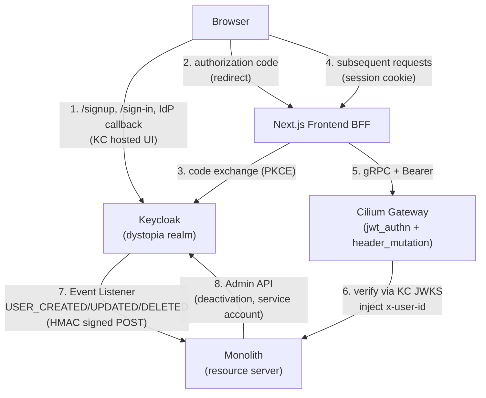
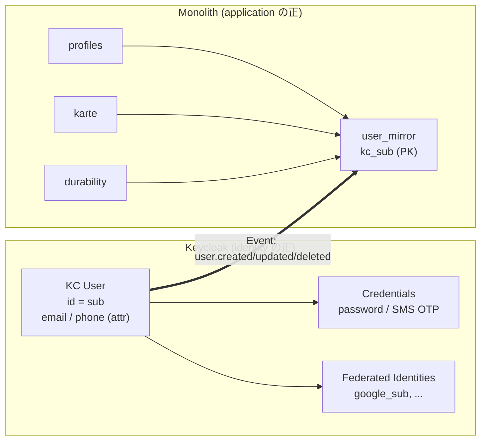
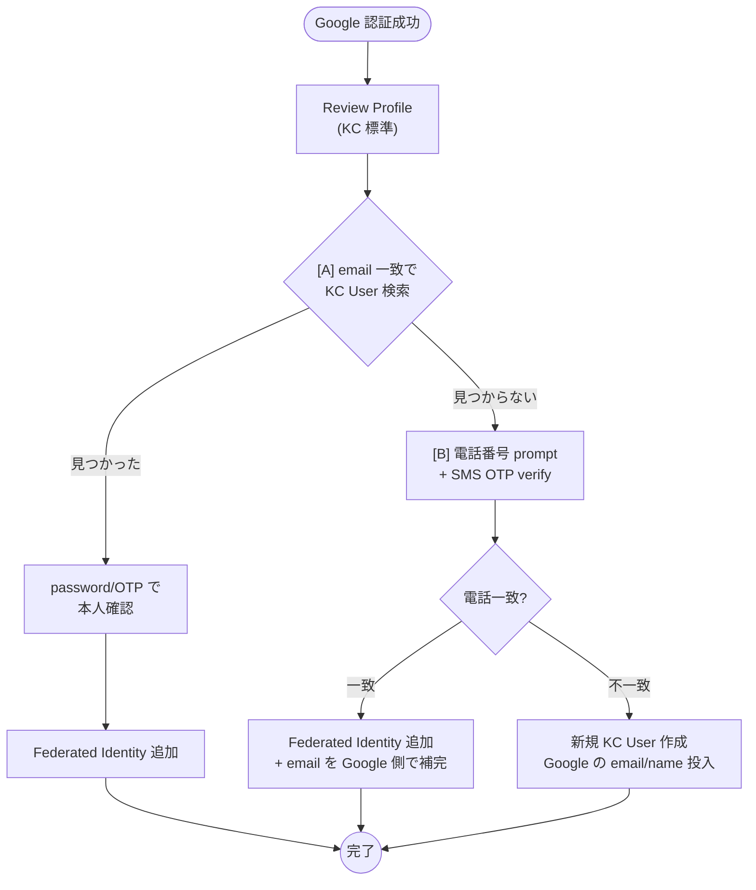

# Keycloak Auth Migration Design — trust boundary shift + IdP delegation

Date: 2026-08-01
Status: Design spec (implementation-ready)
Scope: monolith が持っていた JWT 発行 / SMS 検証 / password / lockout / login UI を Keycloak にフル委譲する (Option C)。認証境界は Cilium Gateway の east-west jwt_authn filter に集約、monolith interceptor は trusted header only に縮退。電話番号登録と Google IdP を First Broker Login flow で結合、SMS Authenticator SPI を signup / password reset / phone verify の 3 か所で共用する。
Related: `2026-05-31-identity-slice-design.md`（本 spec が置き換える現行の認証設計）、`2026-06-02-profile-slice-design.md`（onboarding 以降の profile 保存は継続）

## Goal

**MVP 未リリース**のこのタイミングで、認証機構を Keycloak に集約する。目的は以下の 4 点:

1. 電話番号登録の維持と Google など他 IdP 常用ログインの両立を、1 KC User に複数の認証手段を紐付ける形で実現する
2. JWT 発行 / RSA 鍵管理 / refresh token DB / bcrypt / lockout / SMS 検証 use case を monolith から撤去し、resource server に純化する
3. 認証境界を Cilium Gateway に集約 (jwt_authn filter + header inject)。monolith interceptor は trusted header only、`Auth::JwtCodec` と `jwt` gem 依存を撤去
4. 将来の IdP 追加 (Apple / LINE …) と MFA 追加を realm 設定と theme 微修正で拡張可能な足場を築く

## Decisions（確定）

- **深度**: Option C (KC フル委譲、Authorization Code + PKCE、KC hosted login/registration UI)。A (JWKS 検証を monolith が持つ) と B (認証フローだけ KC) は不採択
- **フェーズング**: KC + Cilium Gateway 東西 filter を同時導入 (spec 1 本、interceptor 1 回書き換え)。dev/prod で verify モードを分けない
- **IdP 紐付け**: First Broker Login flow を A + B hybrid で組む — email 一致 → 電話番号 verify → 新規作成 の Alternative 3 段
- **境界原則**: **インスタンス** (RDS / KC Operator / cilium-gateway / cert-manager) は platform 側で 1 個ずつ立てる。**モジュール** (database 切り出し・自 CR・自 secret) は各 repo が自前で持つ。参照は runtime discovery のみ、**monorepo から platform コード (Terraform module 含む) を import しない**
- **KC 実体の所在**: dystopia の KC は monorepo (`services/keycloak/`) が Keycloak Operator の `Keycloak` CR で declare する。SPI Java コード、KC image build、theme、realm 設定、Cilium filter / GRPCRoute も monorepo 内
- **共有 Postgres**: platform に共有 RDS インスタンスを立て、monorepo が自前の Terraform module で `keycloak_dystopia` database を切る。CNPG は platform install だけ (YAGNI 承知、今回 consume しない)
- **データ扱い**: 既存 users / refresh_tokens / sms_verifications / profiles / karte / durability 系テーブルを全 wipe、application 側 fresh init。migration script なし
- **Cookie**: KC 発行の JWT を httpOnly cookie に直積み (session id + server-side store は採用しない、BFF stateless 維持)
- **Logout**: RP-Initiated Logout の back-channel (redirect なし UX)
- **auto-reactivate 廃止**: deactivation 後の user 自身での復活は不可、admin API 経由 (support 送り)

## Scope

### In scope (この spec = monorepo)

**Monolith**
- `AuthenticationInterceptor` を trusted header only モードに書き換え、`Auth::JwtCodec` と `jwt` gem 依存を撤去
- 認証系 use case (Login / Register / Refresh / Verification::SendCode / VerifyCode / ResetPassword / DeactivateAccount) と対応する gRPC handler の削除
- `user_mirror` テーブル新設 (kc_sub PK)、`identity__event_dedup` テーブル新設。両者は **identity slice に配置** (認証系 use case 撤去後の受け皿として identity slice 名を継続、`HandleKcEvent` use case もここ)
- `POST /internal/kc-events` HTTP エンドポイント (KC Event Listener SPI からの受信、HMAC 検証、dedup)。Hanami HTTP action として identity slice に配置
- profile / karte / durability の FK を `account_id → user_mirror.kc_sub` に張り替え、既存 users / refresh_tokens / sms_verifications を drop
- `services/monolith/kubernetes/base/grpcroute.yaml` (cilium-gateway parentRef、monolith Service 向け)
- `services/monolith/kubernetes/base/cilium-envoy-config.yaml` (jwt_authn filter + header_mutation)
- `services/monolith/kubernetes/base/networkpolicy.yaml` (monolith Pod ingress 制限)

**Frontend BFF**
- Route Handlers 書き換え: Auth Code + PKCE 交換、auth cookie 発行 (BFF stateless、§ Cookie 参照)、gRPC への Bearer 添付は継続
- signup / sign-in / password reset UI を KC hosted page への redirect に一本化 (form 撤去)
- onboarding (profile 保存) は KC 認証後の flow として継続

**Keycloak (dystopia 用の運用実体すべて)**
- `services/keycloak/` を新設
- KC image build (`Dockerfile`): base image FROM `quay.io/keycloak/keycloak:26.x` + SPI JAR + theme を COPY、`kc.sh build` 実行済み image を GHCR に publish
- SPI (`services/keycloak/spi/`, Gradle root project):
  - SMS Authenticator (日本の電話番号形式、SNS 経由送信、rate limit)
  - Event Listener (monolith 宛の event 契約、HMAC-SHA256 署名 POST)
- Theme (`services/keycloak/theme/`, Freemarker + CSS)
- Kubernetes manifest: `Keycloak` CR、`HTTPRoute` for `auth.dystopia.city`、`ExternalSecret`
- 自前 Terraform module: `database/` (`postgresql` provider で共有 RDS 上に `keycloak_dystopia` を作る)、`iam/` (SPI 用 SNS IRSA)、`realm/` (`terraform-provider-keycloak`)

### Out of scope (platform 側 spec で別途)

- `platform-shared-postgres` RDS インスタンスそのもの
- Keycloak Operator の cluster install
- CloudNativePG operator install (YAGNI 承知の platform 投資、この spec は consume しない)
- Cilium 本体・cilium-gateway (既存)
- cert-manager / external-dns / ExternalSecrets Operator (既存)

### Out of scope (要件外)

- MFA / step-up authentication
- Backchannel logout / offline access
- Apple ID / LINE 等の追加 IdP (realm 設定と theme 微修正で後付け可)
- API 呼び出し向け service account / client credentials (`monolith-admin` 除く)
- 監査ログの外部エクスポート
- 既存データの migration (全 wipe 前提)

## Depends on (platform が satisfies する runtime interface)

- **共有 RDS Postgres**: インスタンス識別子 `platform-shared-postgres` で AWS 上に稼働、admin credentials が Secrets Manager `panicboat/platform/shared-postgres/admin` に存在、cluster から到達可能
- **Keycloak Operator**: cluster に install 済み、CRD `k8s.keycloak.org/v2alpha1` が利用可能
- **cilium-gateway**: namespace `default` の Gateway API resource として動作、`parentRefs: cilium-gateway` で相乗り可能
- **cert-manager + external-dns**: HTTPRoute の hostname が Route53 (`dystopia.city` zone) に自動反映、TLS 証明書付与
- **ExternalSecrets Operator**: AWS Secrets Manager からの sync が動作
- **Google Cloud Console 側の OAuth 2.0 client** (Terraform 外の manual gate): redirect URI `https://auth.dystopia.city/realms/dystopia/broker/google/endpoint` を登録済み、client_id / client_secret が Secrets Manager `panicboat/dystopia/keycloak/google-idp` に保管

## Architecture

### Component

- **Keycloak (`dystopia-keycloak`)**: monorepo が Keycloak Operator の `Keycloak` CR で declare、realm `dystopia` を保持。認証機構 (login / registration / phone verify / password reset / IdP federation / session / refresh / brute-force detection) の source of truth
- **Cilium Gateway**: 既存の `cilium-gateway` を parentRef。monolith 向け新規 `GRPCRoute` + `CiliumEnvoyConfig` (`jwt_authn` + `header_mutation`) を追加し、east-west で JWT verify + header inject
- **Frontend BFF (Next.js)**: OIDC client。Auth Code + PKCE handshake、auth cookie 発行 (JWT を httpOnly cookie に直積み、BFF stateless)、gRPC への Bearer 添付
- **Monolith Resource Server (Ruby / Hanami)**: interceptor は trusted header only、`user_mirror` 保持、`/internal/kc-events` 受け口、application slices (profile / karte / durability)
- **SPI (`services/keycloak/spi/`, Gradle)**: SMS Authenticator + Event Listener + Theme。KC image に焼き込み
- **Realm config (`services/keycloak/terragrunt/modules/realm/`)**: `terraform-provider-keycloak` で declarative 管理

### Data flow



### Trust boundaries

- **monolith Pod ingress**: `NetworkPolicy` で `cilium-gateway` Pod と `keycloak` Pod のみ許可、他は拒否
- **cilium-gateway の header inject**: `OVERWRITE_IF_EXISTS_OR_ADD` で client-supplied `x-user-*` は必ず上書き。`authorization` header は strip
- **KC → monolith event**: `X-Keycloak-Event-Signature` header に HMAC-SHA256、monolith が verify
- **KC admin credentials**: `panicboat/dystopia/keycloak/*` (Secrets Manager) → ExternalSecret 経由で cluster に降ろす。CI からは AWS credentials で読む

## Data model

### `user_mirror` テーブル (新設)

**役割**: KC User の kc_sub を PK として持つ最小限の mirror。application 側 FK のターゲット。identity 属性 (email / phone / display name) は KC と profile slice が持ち、mirror には**重複させない**。

| 列 | 型 | 説明 |
|---|---|---|
| `kc_sub` | `uuid` (PK) | KC User の id (JWT `sub` claim と一致) |
| `created_at` | `timestamptz NOT NULL` | KC の `USER_CREATED` event 受信時刻 |
| `updated_at` | `timestamptz NOT NULL` | 最終 event 反映時刻 |
| `deactivated_at` | `timestamptz NULL` | KC で disable された時刻。NULL なら active |

### `identity__event_dedup` テーブル (新設)

| 列 | 型 | 説明 |
|---|---|---|
| `event_id` | `uuid` (PK) | KC Event Listener SPI が発行する uuid v7 |
| `received_at` | `timestamptz NOT NULL` | 初回受信時刻 |

TTL 30 日、cron で古い行を掃除。

### Application 側 FK の張り替え

現状の全 slices で `account_id` は `users.id` (uuidv7) を参照。全 wipe 前提で以下に張り替え、型も `uuid` (Postgres native) に統一:

- `profiles.account_id` → `user_mirror.kc_sub`
- `karte_entries.account_id` (および karte slice の全表) → `user_mirror.kc_sub`
- `durability_*.account_id` (durability slice の全表) → `user_mirror.kc_sub`

**FK constraint**: `ON DELETE RESTRICT`。KC で user delete するとき、application 側 record を先に始末してから mirror を消す運用 (逆順で消えると referential integrity が壊れる)。

### 削除するテーブル

Explore で確認済:
- `identity__users`
- `identity__refresh_tokens`
- `identity__sms_verifications`

および identity slice 内の付随的な relation (存在すれば洗い出して drop migration に含める)。

### Entity ownership



## Auth flows

### Signup (phone + password)

1. Browser: `/signup` クリック → Frontend が KC `/realms/dystopia/protocol/openid-connect/registrations` に redirect (`client_id=dystopia-bff`, PKCE, `redirect_uri=https://dystopia.city/auth/callback`)
2. KC hosted registration UI: 電話番号入力フォーム (theme + SMS Authenticator SPI)
3. SPI が SNS 経由で OTP を送信
4. Browser で OTP 入力 → SPI verify
5. Password 入力 (KC 標準の password validation)
6. KC が User record を作成 → Event Listener SPI が `POST /internal/kc-events` (`USER_CREATED`) を monolith に送信、`user_mirror` upsert
7. KC が authorization code を発行、Browser を `/auth/callback` に redirect
8. BFF が code + PKCE verifier を KC `/token` に POST → access / refresh / id_token 受領
9. BFF が auth cookie を発行 (`access_token` + `refresh_token`、§ Cookie 参照) (§ Cookie 参照)
10. Frontend が `/onboarding` へ → profile slice に displayName / username を gRPC 経由で保存

### Login (password)

1. Browser: `/sign-in` クリック → KC `/protocol/openid-connect/auth` に redirect (PKCE)
2. KC hosted UI: 電話 + password 入力 → verify (KC が bcrypt チェック)、KC session cookie set
3. KC が authorization code を発行、Browser を `/auth/callback` に redirect
4. 以降 signup の (8)-(10) と同じ (onboarding はスキップ)

**変化**: monolith `Login` use case は削除。bcrypt / lockout / auto-reactivate は KC の Brute-force Detection と service account 経由の admin 復活に置換。

### Login (Google IdP) — First Broker Login A+B hybrid



いずれの経路も KC が `USER_CREATED` or `USER_UPDATED` event を monolith に flush、`user_mirror` upsert。

### Refresh (transparent、BFF 実装)

1. gRPC 呼び出しで `UNAUTHENTICATED` (Cilium が expired と判定して 401)
2. BFF が `refresh_token` cookie を読み、KC `/token` に `grant_type=refresh_token` で POST
3. KC が新 access + 新 refresh を返す (refresh rotation、KC default)
4. BFF が両 cookie を上書き
5. 元の gRPC 呼び出しを retry (新 access で)

**同時 refresh**: singleflight で 1 度だけ refresh grant を叩く。現行 `callWithRefresh` に mutex を追加。

### Logout

1. Browser: "Log out" → BFF `POST /api/auth/logout`
2. BFF が KC `/protocol/openid-connect/logout` に POST (RP-Initiated Logout back-channel、`client_id`, `client_secret`, `refresh_token`)
3. KC が session と refresh を無効化
4. BFF が cookie clear (`Max-Age=0`)
5. 200 応答、Frontend が `/` に navigate (redirect なし UX)

### Password reset

1. KC login page の "Forgot password" → KC の Reset Credential flow に遷移
2. Custom flow: 電話番号入力 → SMS Authenticator SPI で OTP verify
3. OTP 成功 → 新 password 入力 → KC credential 更新
4. `USER_UPDATED` event は monolith で no-op (state 変化なし)

### Account deactivation

1. Frontend BFF `POST /api/deactivate` (`access_token` cookie で本人特定) → monolith gRPC 呼び出し
2. Monolith が **`monolith-admin` service account** で KC `/admin/realms/dystopia/users/{kc_sub}` に `PUT { enabled: false }`
3. KC が `USER_UPDATED` を event として発火 → `/internal/kc-events` → `user_mirror.deactivated_at` set
4. **復活は support 経由**。自動再有効化は廃止 (KC の credential 検証は monolith の外で、login 成功に hook できないため)

## Cookie / session model

### Cookie の内容

BFF が発行する httpOnly cookie:

| Cookie | 中身 | TTL | 用途 |
|---|---|---|---|
| `access_token` | KC 発行の access JWT (そのまま) | KC access lifespan (15 min) | gRPC の Bearer 添付 |
| `refresh_token` | KC 発行の refresh | KC refresh lifespan (30 日) | 401 時の refresh grant |
| `oidc_state` | 署名済み JSON: `{ state, code_verifier, nonce, return_to }` | 5 分 | OIDC 遷移中の CSRF / PKCE / replay 防止 |

### Cookie 属性

- `HttpOnly`
- `Secure` (HTTPS のみ、local dev 用 `INSECURE_COOKIES` escape hatch 維持)
- `SameSite=Lax` (OIDC callback GET redirect は通り、cross-site POST は cookie が送出されず CSRF 防止)
- `Path=/`
- `Domain` 指定なし (host-only)

### なぜ session id + server-side store ではないか

- BFF stateful 化に必要な Redis / Postgres session store を新規に立てる infra コストが不要
- 中央 revocation は KC の refresh 無効化 + 短い access TTL (15 min) で実質担保
- 現行 pattern (JWT を httpOnly cookie に直積み) の延長で書けるため cognitive load 最小
- Cookie size: KC の access JWT は 1-2KB 想定、header 4KB limit 内

### Rotation

現行 `frontend/workspace/src/lib/auth/refresh-on-unauthenticated.ts` の宛先を KC に差し替える。singleflight で同時 401 を集約。

### CSRF 対策

- BFF の変更系エンドポイント (`POST /api/*`): `SameSite=Lax` で cross-site POST では cookie 送出されず、CSRF token 不要
- OIDC callback (`GET /auth/callback`): `oidc_state` cookie の `state` param が redirect URL クエリと一致するか検証
- PKCE: `oidc_state` cookie の `code_verifier` を KC `/token` に送出

## Interface contracts

### KC が発行する access_token の claims

```json
{
  "iss": "https://auth.dystopia.city/realms/dystopia",
  "aud": ["dystopia-bff"],
  "azp": "dystopia-bff",
  "sub": "<KC User id (uuid)>",
  "iat": 1735689600,
  "exp": 1735690500,
  "jti": "<uuid>",
  "typ": "Bearer",
  "realm_access": { "roles": ["default-roles-dystopia"] }
}
```

- `sub` = KC User id (uuid)、monolith の `user_mirror.kc_sub` と一致
- `aud` に `dystopia-bff` を含める。Cilium jwt_authn がこの aud を強制
- 電話番号 / email は claim に含めない (monolith が必要としないため。BFF が必要なら UserInfo endpoint 経由)

### Cilium `jwt_authn` filter の config 期待値

`services/monolith/kubernetes/base/cilium-envoy-config.yaml`:

```yaml
jwt_authn:
  providers:
    keycloak:
      issuer: https://auth.dystopia.city/realms/dystopia
      audiences: [dystopia-bff]
      remote_jwks:
        http_uri:
          uri: https://auth.dystopia.city/realms/dystopia/protocol/openid-connect/certs
          cluster: keycloak_jwks
          timeout: 3s
        cache_duration: 300s
      forward: false                    # Bearer は monolith に渡さない
      payload_in_metadata: jwt_payload
  rules:
    - match: { prefix: "/" }
      requires: { provider_name: keycloak }
```

- 失敗時: 401 を Cilium が直返、monolith に届かない
- JWKS fetch 3 秒 timeout、5 分 cache。cache 中は KC が落ちても検証続行

### header_mutation → gRPC metadata

| gRPC metadata key | 由来 | 型 |
|---|---|---|
| `x-user-id` | JWT `sub` claim | uuid 文字列 |
| `x-account-id` | JWT `sub` claim (現状 x-user-id と同値、将来 identity/account 分離の余地) | uuid 文字列 |
| `x-user-roles` | JWT `realm_access.roles` を `,` join | カンマ区切り文字列 |

同時に `authorization` header は strip、client-supplied `x-user-*` は `OVERWRITE_IF_EXISTS_OR_ADD` で必ず上書き (spoof 防止)。

### Monolith `AuthenticationInterceptor` の header 読み取り契約

- `x-user-id` metadata が存在 → `Current.user_id` にセット
- `x-user-id` が存在しない or 空文字: `Current.user_id = nil` のまま、ハンドラ側で `authenticate_user!` が `UNAUTHENTICATED` を返す
- `x-account-id` / `x-user-roles` は当面読むだけで context に流さない (フックの下地)
- **JWT の decode は行わない**、`Auth::JwtCodec` module を削除、`jwt` gem を Gemfile から drop

### `POST /internal/kc-events` request contract

**Method**: POST
**Path**: `/internal/kc-events`
**Content-Type**: `application/json`

**Headers**:
- `X-Keycloak-Event-Signature: sha256=<hex>` — body の HMAC-SHA256 (共有鍵 `panicboat/dystopia/keycloak/event-listener-hmac`)
- `X-Keycloak-Event-Id: <uuid>` — dedup key (body の `event_id` と一致)

**Body**:

```json
{
  "event_id": "<uuid v7>",
  "event_type": "USER_CREATED | USER_UPDATED | USER_DELETED",
  "kc_sub": "<uuid>",
  "occurred_at": "<ISO 8601>",
  "attributes": { "enabled": true | false }
}
```

**Response**:
- `200 OK`: 正常処理 or dedup 済み no-op
- `401 Unauthorized`: HMAC 検証失敗 (KC 側は retry せずアラート)
- `409 Conflict`: `USER_DELETED` で application 側 record が残っており FK RESTRICT で削除不可 (KC 側は retry せず、operator が手動介入)
- `5xx`: 一時障害。KC 側は指数バックオフで retry

### BFF が使う OIDC endpoints

すべて `https://auth.dystopia.city/realms/dystopia/protocol/openid-connect/` 配下:

| 用途 | Path | Method |
|---|---|---|
| Login redirect target | `auth` | GET (browser) |
| Registration redirect target | `registrations` | GET (browser) |
| Token exchange (code / refresh) | `token` | POST (BFF server-side) |
| Logout | `logout` | POST (BFF server-side、back-channel) |
| UserInfo (必要時のみ) | `userinfo` | GET (BFF server-side) |
| JWKS (BFF は使わない、Cilium 用) | `certs` | GET |

### KC clients

**`dystopia-bff`** (Confidential OIDC client for BFF)
- Access type: `confidential`
- Standard flow: 有効 (Authorization Code + PKCE)
- Direct access grant: 無効
- Service accounts: 無効
- Valid redirect URIs: `https://dystopia.city/auth/callback`
- Web origins: `https://dystopia.city`
- PKCE: `S256` 強制
- client_secret: Secrets Manager `panicboat/dystopia/keycloak/client-bff`

**`monolith-admin`** (Service account for deactivation)
- Access type: `confidential`
- Standard flow: 無効
- Service accounts: 有効 (Client credentials grant)
- Role: `realm-management.manage-users`
- client_secret: Secrets Manager `panicboat/dystopia/keycloak/client-monolith-admin`

### Google IdP redirect URI

- **KC 側 (Terraform 管理)**: alias `google`、`sync_mode = IMPORT`、`trust_email = false`
- **Google 側 (manual gate)**: Authorized redirect URIs に `https://auth.dystopia.city/realms/dystopia/broker/google/endpoint`
- client_id / client_secret: Secrets Manager `panicboat/dystopia/keycloak/google-idp`

## Realm configuration

`services/keycloak/terragrunt/modules/realm/` に `terraform-provider-keycloak` で declare。

### Realm 本体

- realm: `dystopia`
- locale: default `ja`、supported `[ja, en]`
- Token lifespan: `access_token = 15m`、`sso_session_idle = 30d`、`sso_session_max = 30d`
- Registration: `registration_allowed = true`、`registration_email_as_username = false`、`edit_username_allowed = false`
- Password reset: `reset_password_allowed = true`
- Theme: login / account / email = `dystopia`
- Brute force: `protected = true`、`permanent_lockout = false`、`max_login_failures = 5`、`failure_reset_time = 900`、`max_failure_wait = 900` (15 min lockout、現行値と一致)
- Password policy: `length(8) and notUsername and passwordHistory(3)` (現行 monolith 相当)

### Clients

上述の `dystopia-bff` と `monolith-admin` を declare。両 client の生成 secret を `aws_secretsmanager_secret_version` で Secrets Manager に write。

### Google Identity Provider

```hcl
resource "keycloak_oidc_google_identity_provider" "google" {
  realm             = keycloak_realm.dystopia.id
  alias             = "google"
  client_id         = data.aws_secretsmanager_secret_version.google_idp.data["client_id"]
  client_secret     = data.aws_secretsmanager_secret_version.google_idp.data["client_secret"]
  trust_email       = false
  store_token       = false
  first_broker_login_flow_alias = keycloak_authentication_flow.first_broker_login.alias
  sync_mode         = "IMPORT"
}
```

### Authentication Flows

**Custom Registration Flow** (`dystopia-registration`):
```
Registration Page Form (theme で phone 入力欄追加)
  ├─ [REQUIRED] Registration User Profile        (KC 標準)
  ├─ [REQUIRED] Phone Number Format Validation   (SPI)
  ├─ [REQUIRED] SMS Verify                       (SPI)
  ├─ [REQUIRED] Registration User Creation       (KC 標準)
  └─ [REQUIRED] Registration Password Validation (KC 標準)
```

**Custom First Broker Login Flow** (`dystopia-first-broker-login`):
```
Review Profile (KC 標準)
Handle Existing Account [REQUIRED sub-flow]
  ├─ [ALTERNATIVE] Confirm Link Existing Account by Email  (KC 標準)
  │    └─ Verify Existing Account by Re-authentication      (KC 標準)
  ├─ [ALTERNATIVE] Confirm Link Existing Account by Phone  (SPI)
  │    └─ (SPI 内で kc_sub 検索 → 一致すれば link + email 補完)
  └─ [ALTERNATIVE] Create New User                          (KC 標準)
```

**Custom Reset Credential Flow** (`dystopia-reset-credential`):
```
Choose User (KC 標準)
SMS Verify (SPI)
Reset Password (KC 標準)
```

Realm settings で `reset_credentials_flow = dystopia-reset-credential`、Google IdP で `first_broker_login_flow_alias = dystopia-first-broker-login`。

### Event Listener

```hcl
resource "keycloak_realm_events" "dystopia" {
  events_enabled       = true
  admin_events_enabled = false
  events_listeners     = ["jboss-logging", "monolith-event-listener"]
  enabled_event_types  = ["REGISTER", "UPDATE_PROFILE", "DELETE_ACCOUNT", "USER_DISABLED_BY_PERMANENT_LOCKOUT"]
}

resource "keycloak_generic_component" "event_listener_config" {
  provider_id   = "monolith-event-listener"
  provider_type = "org.keycloak.events.EventListenerProvider"
  config = {
    webhook_url        = "http://monolith.default.svc.cluster.local/internal/kc-events"
    hmac_secret_key    = data.aws_secretsmanager_secret_version.event_hmac.secret_string
    retry_max_attempts = "5"
    timeout_seconds    = "10"
  }
}
```

## Testing

memory feedback "Dogfood finds unit gaps" を踏まえ、**unit → contract → e2e → 実機 dogfood** の 4 段。

### Unit tests

- **Monolith rspec**: `Identity::UseCases::HandleKcEvent`, `Identity::Relations::UserMirror`, `Interceptors::AuthenticationInterceptor`, application slices の FK 変更後全 use case, `Grpc::Authenticatable#authenticate_user!`
- **Frontend BFF vitest**: `/auth/sign-in` の redirect URL 構築 (PKCE / state / nonce), `/auth/callback` の state 検証と code exchange, `/auth/logout` の KC 呼び出しと cookie clear, `callWithRefresh` の singleflight
- **Realm config Terraform plan**: `terraform plan` の JSON output を parse し realm attribute / client / IdP / flow の期待値を assert

### Contract tests

- **Cilium jwt_authn ↔ Monolith header contract**: kind で Envoy config を立て、KC の JWKS で verify → header inject → mocked gRPC server で `x-user-id` 受信を assert
- **KC Event Listener ↔ `/internal/kc-events`**: pact-style で body schema を固定、consumer/producer 両側で検証
- **BFF ↔ KC OIDC**: `.well-known/openid-configuration` の期待 endpoint、`dystopia-bff` で Authorization Code + PKCE flow が通ること

### Integration tests

- Monolith DB migration が clean state から fresh init で完走
- `terragrunt apply` で realm が created、2 度目 apply で drift = 0

### End-to-end tests (kind + KC + Cilium harness)

`services/keycloak/test/e2e/` に harness を用意 (Makefile 起点):

- **cluster**: kind 1 node + Cilium (helm) + Gateway API + Keycloak Operator + External Secrets Operator
- **KC**: monorepo が build した `dystopia-keycloak` image を kind に load、`Keycloak` CR で起動
- **Monolith / Frontend**: build して kind に load、kustomize base で起動
- **SMS**: SPI を test mode に切り替え、OTP を Redis に write、e2e から read
- **Google IdP**: Wiremock で OAuth 2.0 endpoint を模擬、または test-only Google account

E2E test suite:
- signup 完走 (phone → OTP → password → user_mirror 生成)
- login (password) 完走
- login (Google 経由、A: email 一致 link)
- login (Google 経由、B: 電話 verify link)
- login (Google 経由、新規作成)
- refresh (access_token 手動 expire → transparent refresh)
- logout (cookie clear + KC session 消滅)
- deactivation (monolith → KC admin API → event → `user_mirror.deactivated_at`)

### Dogfood

E2E green の後、**実機 iOS Safari / Android Chrome で dogfood 1 セッション**:

- signup → onboarding → 主要 slice の全操作
- password reset → 復帰
- Google 経由 新規 + 既存 link
- 別端末で login (KC session が独立か確認)
- refresh 発火 (access 切れの跨ぎ)
- deactivation → 復帰不可 UX (support 送り)

発見 bug は spec に failure_scenario として追記、対応後 e2e に落とし込む。

### この spec で扱わないテスト

- SMS Authenticator SPI 内部ロジック (Java/Kotlin の unit test は SPI project 側で)
- Event Listener SPI 内部ロジック
- KC Operator の cluster レベル動作
- CNPG operator の動作
- Cilium 本体 (jwt_authn の filter 実装は Envoy 依存)

これらは platform 側 spec の contract test / e2e test で担保される。

## Rollout / cutover

pre-launch (MVP 未リリース) を活かした **greenfield hard cutover**。dual-write / shadow / gradual migration なし。

### Cutover 前に満たされている前提

- Platform 側 spec 完了 (Keycloak Operator, 共有 RDS, Google Cloud Console OAuth client 発行、redirect URI 登録)
- monorepo 側で `services/keycloak/spi/`, `theme/`, `Dockerfile`, Terraform module, Kubernetes manifest がすべて merge 済み
- CI で SPI JAR + KC image build → GHCR/ECR に push 済み

### Deployment 順序 (production)

1. Platform 側前提と外部作業を verify (Keycloak Operator CRD, RDS 到達性, Google redirect URI)
2. `services/keycloak/terragrunt/modules/database/` apply → `keycloak_dystopia` database + credentials in Secrets Manager
3. `services/keycloak/terragrunt/modules/iam/` apply → SPI 用 SNS IAM + IRSA
4. `services/keycloak/kubernetes/` apply → ExternalSecret sync、Keycloak CR で KC 起動、HTTPRoute で DNS + TLS 反映、`https://auth.dystopia.city/realms/master` が 200
5. `services/keycloak/terragrunt/modules/realm/` apply → realm / clients / IdP / flows / SPI activation / event listener 設定完了、client_secret が Secrets Manager に write される
6. Monolith 新 image を deploy → migration 完走 (drop → create → seed)、gRPC Ready、`POST /internal/kc-events` が HMAC 検証で 200
7. Monolith の `grpcroute.yaml` + `cilium-envoy-config.yaml` + `networkpolicy.yaml` apply → Cilium が jwt_authn filter load、JWKS fetch 成功、curl 検証で Bearer なし=401 / Bearer あり=200
8. Frontend 新 image を deploy → `/auth/sign-in` が KC redirect を返す、OIDC flow が browser で完走
9. Staging で E2E test suite 全 pass
10. 実機 dogfood 1 セッション

**Step 6-8 の間は application 非稼働、pre-launch 前提で許容。**

### Rollback

- Step 1-5 いずれか失敗: `terragrunt destroy` + Keycloak CR 削除 + database drop で clean revert (state 依存なし)
- Step 6 失敗: 旧 image に revert、ただし migration が前進済みなので **RDS snapshot restore** が必要
- Step 8 失敗: frontend 単独 revert は不可 (monolith 側が新の auth 使わない状態のため)、full revert (frontend + monolith + Keycloak + realm + DB restore) の一式

**判定**: Step 9 の E2E で fail、Step 10 の dogfood で release blocker → 全体 rollback。partial rollout はしない (dual state の複雑さを避ける)。

### Cutover 後の cleanup

- `interceptor.rb` の Bearer decode 分岐 (line 36-46) は Step 6 で削除済み
- `line 37 "Gateway Offloading (Future / Cilium)"` コメントは本 spec で本命化されたので削除
- 本 spec を `docs/superpowers/specs/` に commit
- artifact (Option C 比較図、`https://claude.ai/code/artifact/f3707368-0674-446c-b589-176a6bf8bfa3`) は brainstorming フェーズの記録として履歴に残すのみ、本文リンクなし
- memory update: `project_auth_migration_complete_2026-XX-XX.md` に完了記録、旧 identity slice の話は historical マーク

### リリース判定

Step 10 の dogfood 全 pass = MVP リリース可判定。本 spec のスコープはここで完了、後続の別 spec (追加 IdP、MFA、監査ログ export など) に引き継ぐ。

## Failure scenarios (追記予定)

E2E および dogfood で発見された bug をここに追記し、対応後 test に落とし込む。
