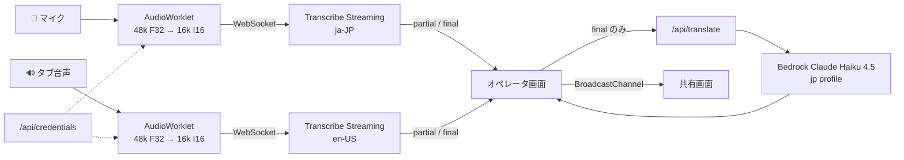

# Realtime Meeting Translator: Browser-based Bidirectional Speech Translation

## Background

英語話者とのオンライン会議を、日本語話者側のブラウザだけで双方向にリアルタイム
翻訳するツール。会議ツール側の設定変更も、OS への追加ソフトウェア導入も伴わない
ことを前提に置く。

役割は 2 つある。

- **先方の英語 → 日本語字幕**: 自分だけが見る。聞き取りの補助
- **自分の日本語 → 英訳**: 画面共有で先方に見せる。発話の代わりになる

利用者は作者 1 人、実行はローカルの Mac のみで、デプロイしない。

会議は Zoom で行い、**先方は Zoom デスクトップアプリ、自分は Zoom Web Client
（ブラウザ）で参加する**。双方がリモートでそれぞれ自分のマイクを使うため、
先方の音声はネットワーク越しにデジタルのまま Zoom タブへ届く。これを
`getDisplayMedia` のタブ音声として取得することが本設計の前提であり、音質の
劣化なしに言語を決め打ちできる根拠になっている。

**ブラウザは Chrome または Edge に限定する。** Firefox と Safari は
`getDisplayMedia` の audio 指定を無視するため、タブ音声を取得できない。

自分が Zoom をデスクトップアプリで使う場合、macOS の Chrome はシステム音声を
取得できずタブ音声のみ対応するため、この経路は成立しない。仮想オーディオ
デバイスの導入が必要になり、「追加ソフトウェアなし」という前提が崩れる。

## Verified Findings

設計判断の根拠。すべて一次資料または実機で確認した。

- **Amazon Transcribe streaming は `ja-JP` / `en-US` の双方に対応する。** 一部言語は
  Tokyo リージョンで streaming が使えないが、日本語と英語はその制限の対象外
  （[supported-languages](https://docs.aws.amazon.com/transcribe/latest/dg/supported-languages.html)）
- **`@aws-sdk/client-transcribe-streaming` はブラウザで動作し、ブラウザ環境では
  自動的に WebSocket transport を使う。** AWS event stream のバイナリフレーミングも
  SDK 側が処理するため、自前実装が不要
  （[aws-sdk-js-v3 #4522](https://github.com/aws/aws-sdk-js-v3/discussions/4522)）
- **Bedrock はブラウザから直接呼べない。** エンドポイントが CORS ヘッダを返さず、
  preflight が 403 で弾かれる。AWS のサンプル実装でも解はバックエンドプロキシ
  （[aws-bedrock-with-rag-and-react #32](https://github.com/aws-samples/aws-bedrock-with-rag-and-react/issues/32)）
- **`jp.anthropic.claude-haiku-4-5-20251001-v1:0` がアカウント上で ACTIVE。**
  `aws bedrock list-inference-profiles --region ap-northeast-1` で確認。AWS の
  regional availability ドキュメントは Tokyo に Claude の in-region 提供がないと
  読めるが、実アカウントでは `jp.*` プロファイルが利用可能で、`global.*` を
  経由する必要がない
- **Zoom Web Client が使えるかは先方（ホスト）の設定に依存する。** 「Join from
  your browser」リンクは 2026-02-07 から既定で有効になったが、それ以前に無効かつ
  ロックされていた設定は無効のまま残る。会議当日にブラウザ参加ができない可能性が
  あるため、事前に会議 URL を開いてリンクの有無を確認する運用が要る
  （[Zoom KB0084678](https://support.zoom.com/hc/en/article?id=zm_kb&sysparm_article=KB0084678)）
- **タブ音声キャプチャは Chrome / Edge のみ。** Firefox と Safari は
  `getDisplayMedia` の audio を無視する
  （[MDN Screen Capture API](https://developer.mozilla.org/en-US/docs/Web/API/Screen_Capture_API/Using_Screen_Capture)）
- **1 本のマイクで両者の音声を拾う構成も技術的には成立するが採用しない。**
  `echoCancellation: false` でスピーカー由来の音を拾え、Transcribe の
  `identify-multiple-languages` で日英混在ストリームも扱える（PCM 限定）。
  採用しないのは、スピーカー→空気→マイクの経路で認識精度が落ちること、言語識別に
  最低 1 秒の発話を要してレイテンシが増えること、そして誤識別時に翻訳の向きが
  逆転しうることによる。**言語の決め打ちという構造的な保証を、確率的な判定に
  置き換えることになる**のが決定的な理由
  （[lang-id-stream](https://docs.aws.amazon.com/transcribe/latest/dg/lang-id-stream.html)、
  [MDN echoCancellation](https://developer.mozilla.org/en-US/docs/Web/API/MediaTrackConstraints/echoCancellation)）
- **`sts:GetFederationToken` に session policy を付けて権限を絞れる。**
  `transcribe:StartStreamTranscription` のみを許可した一時クレデンシャルが実際に
  発行できることを実機で確認した

採用しなかった選択肢も記録しておく。

- **Web Speech API**: Chrome 133 で `SpeechRecognition.start(audioTrack)` が追加され、
  タブ音声も認識できるようになったため STT コストをゼロにできた。精度が読めない点を
  嫌って採用しなかった
- **Amazon Translate**: $15 / 100 万文字、無料枠 200 万文字/月×12 か月。レイテンシは
  Bedrock より低いが、文単位の直訳で文脈を持てないため採用しなかった

## Design

### 1. 配置 — `tools/realtime-meeting-translator`

`workflow-config.yaml` の `stack_conventions` は `dystopia/{service}` と
`system-components/{service}` の 2 つを root として定義し、いずれも container /
terragrunt / kubernetes の stack を備えることを前提としている。本ツールは
Dockerfile も `kubernetes/` も持たないローカル専用ツールであり、
`system-components/` に置くと規約を満たさない異物になる。

そのため `stack_conventions` の外側に `tools/` を新設する。label-dispatcher が
デプロイ対象として検出せず、`release-please-config.json` の `packages` にも
登録しないためリリース対象にもならない。

フレームワークは Next.js（App Router）を使う。ブラウザから直接呼べない Bedrock の
代理と、`~/.aws` の権限を使うクレデンシャル発行の 2 つにサーバ側の実行環境が必要で、
route handler がそれを最小の記述で与えるため。`dystopia/frontend` と同じ構成に
なるため、パッケージマネージャも pnpm で揃える。ローカル実行専用であり、
`next build` によるプロダクションビルドは行わず `next dev` のみを使う。

### 2. 音声の取り込み — 2 ソースを言語固定で扱う

本ツールの構造上の要は、**入力を 2 本の独立したストリームとして扱い、
それぞれ言語を決め打ちする**点にある。話者分離も言語自動判定も不要になる。

| ソース | 取得 API | 言語 | 用途 |
|---|---|---|---|
| 自分のマイク | `getUserMedia({ audio: true })` | `ja-JP` 固定 | 英訳して共有画面へ |
| Zoom タブの音声 | `getDisplayMedia({ audio: true, video: true })` | `en-US` 固定 | 和訳して自分の画面へ |

`getDisplayMedia` で `video: true` を指定するのは、Chrome がタブ共有時に video
トラックを要求するためであり、受け取った video トラックは即座に停止して破棄する。

Transcribe が要求するのは **16 kHz の 16 bit signed PCM** であるのに対し、ブラウザの
マイクは通常 48 kHz Float32 を出力する。AudioWorklet で変換する。48000 / 16000 = 3
であるため、3 サンプルの平均を取って 1 サンプルに畳む。単純な間引きではなく平均を
取るのは、簡易ローパスとして折り返し雑音を抑えるため。

AudioWorklet の `process()` は 128 サンプル単位で呼ばれる（48 kHz で約 2.67 ms）。
これをそのまま送るとフレームが細かすぎるため、変換後のサンプルを 100 ms 分
（16000 × 0.1 = 1600 サンプル = 3200 バイト）バッファリングしてから送出する。

### 3. Transcribe セッション — ブラウザから直結する

音声データはローカルサーバを経由しない。ブラウザ内の SDK が Transcribe と直接
WebSocket を張る。



`TranscriptEvent` の `Transcript.Results[]` は `IsPartial` フラグを持つ。partial は
表示のみに使い、**翻訳は `IsPartial: false` の確定結果だけに投げる**。partial ごとに
投げると訳文がちらついて読めず、トークンも無駄になる。

会議中にセッションが切れるのが最悪の失敗なので、WebSocket の `onclose` を捕捉して
自動再接続する。長時間の接続や無音の継続で切断されうるため、再接続は例外処理では
なく通常動作として扱う。再接続中は UI にその状態を出す。

### 4. 翻訳 — Bedrock Claude Haiku 4.5

`/api/translate` が `ConverseStream` を呼ぶ。モデルは
`jp.anthropic.claude-haiku-4-5-20251001-v1:0` を第一候補とする。低レイテンシ帯で
あることに加え、`jp.*` プロファイルであるため**会議内容が日本国内に留まる**。
訳質が不足する場合のフォールバックは `jp.anthropic.claude-sonnet-4-6`。

**直近の確定発話を文脈として渡す**。これが Amazon Translate に対する優位の本体で、
代名詞の解決と専門用語の一貫性がここで決まる。文脈は直近 6 発話を上限とする
リングバッファで保持し、際限なく伸びないようにする。

ストリーミングを使うのは first token を早く返して体感レイテンシを稼ぐため。

### 5. 画面構成 — オペレータ画面と共有画面を分ける

**自分用の画面をそのまま共有してはならない。** 先方の発言の日本語訳が同じ画面に
あると、相手は自分の発言が翻訳・記録されている画面を見ることになる。ウィンドウを
分けて、共有画面には自分の発言の英訳だけを出す。

| 画面 | 内容 | 見る人 |
|---|---|---|
| オペレータ画面 | 先方の英語＋和訳 / 自分の日本語＋英訳 / 開始停止・音声ソース選択 | 自分だけ |
| 共有画面 | 自分の発言の英訳のみ。大きく表示、直近 3 件 | 画面共有で先方 |

共有画面は別タブで開き、Zoom の「画面の共有」でそのタブを指定する。先方の音声
取得に使う `getDisplayMedia` とは別々の共有なので競合しない。

**ただし常時共有を前提にしない。** 画面共有は本来「資料を見せるとき」の動作で、
会議中ずっと出しっぱなしにすると先方の画面で共有内容が主役になり、顔が小さくなって
会話の質が落ちる。相手が資料を共有したい場面とも競合する。普段は自分の画面で英訳を
見ながら話し、**長い説明や誤解が生じた場面だけ共有に切り替える**運用とする。
共有画面は独立したページなので、共有しない会議で開かなくても他の機能に影響しない。

タブ間の状態同期は `BroadcastChannel`（同一オリジンのタブ間通信）で行い、サーバを
経由しない。

**共有画面には確定した英訳だけを流す。** partial をそのまま出すと認識が揺れるたびに
文字が書き換わり、先方が読めない。ここはオペレータ画面と挙動を意図的に変える。

### 6. クレデンシャル — 権限を分けて渡す

Transcribe はブラウザ直結のため、ブラウザ側に認証情報が必要になる。

`/api/credentials` がローカルの `~/.aws` の権限で `sts:GetFederationToken` を呼び、
**`transcribe:StartStreamTranscription` だけを許可した session policy 付きの一時
クレデンシャル**を返す。有効期間は会議 1 回分を想定して 3600 秒とする。

Bedrock を呼ぶ権限はブラウザに渡さず、サーバ側に留める。ブラウザ側の認証情報が
漏れても、できることは音声の文字起こしに限られる。

## Changes

新規ファイルのみ。既存ファイルへの変更は README の Structure に 1 行加えるだけ。

```
tools/realtime-meeting-translator/
├── app/
│   ├── page.tsx                    オペレータ画面
│   ├── present/page.tsx            共有画面
│   └── api/
│       ├── credentials/route.ts    GetFederationToken による一時クレデンシャル発行
│       └── translate/route.ts      Bedrock ConverseStream の代理
├── lib/
│   ├── audio/
│   │   ├── capture.ts              getUserMedia / getDisplayMedia
│   │   ├── pcm.ts                  48k Float32 → 16k Int16（純粋関数）
│   │   └── pcm-worklet.ts          AudioWorklet processor
│   ├── transcribe.ts               ストリームセッションと自動再接続
│   ├── translate.ts                翻訳クライアントと文脈リングバッファ
│   └── channel.ts                  BroadcastChannel のラッパ
├── package.json
└── README.md                       セットアップと会議前の起動手順
```

`README.md`（リポジトリ root）の Structure に `tools/` を追記する。

## Testing

使い捨て前提のツールであっても、**壊れたときに原因の切り分けに最も時間を食う部分**は
テストする。具体的には次の 2 つで、どちらも純粋関数として切り出す。

- `lib/audio/pcm.ts` の変換: 48 kHz Float32 から 16 kHz Int16 への畳み込み。
  ここが壊れると「無音になる」「文字化けする」という切り分けにくい症状になる
- `lib/translate.ts` の文脈リングバッファ: 上限を超えたときの切り捨てと順序

AWS 呼び出し自体はモックせず、実機確認に委ねる。Transcribe の認識精度と
エンドツーエンドのレイテンシは、実装後に実際の音声で確認する。

テストランナーは vitest（`dystopia/frontend` と同じ）。

## Out of Scope

- **TTS による音声出力**: 英訳を合成音声で会議に流すこと。仮想オーディオデバイスの
  導入が必要になり、「追加ソフトウェアなし」という前提が崩れる
- **1 マイクに両者の音声を混ぜる構成**: 対面会議、またはスピーカーから出る先方の声を
  自分のマイクで拾う形。技術的には成立するが、Verified Findings に記した理由
  （音質の劣化・言語識別の遅延・翻訳の向きの逆転）により採用しない
- **仮想オーディオデバイスを使う構成**: 自分が Zoom をデスクトップアプリで使う場合の
  経路。「追加ソフトウェアなし」という前提を捨てれば精度は保てるが、本設計では
  Zoom Web Client での参加を前提とする
- **認証とデプロイ**: 利用者が 1 人でローカル実行に限るため不要
- **議事録の保存・書き出し**: 会議中の翻訳に用途を絞る
