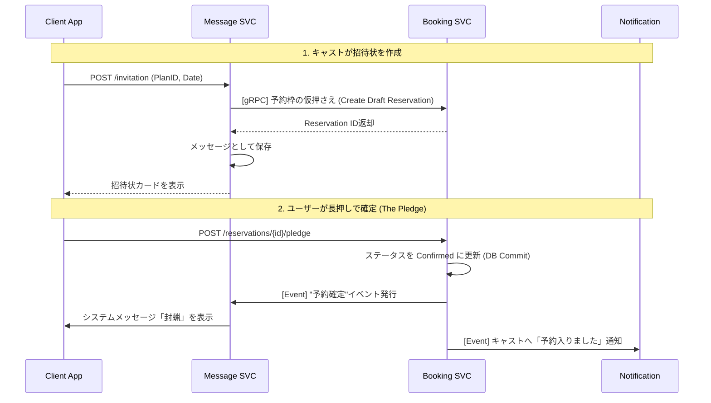

# Microservices Architecture

### Microservices Architecture (案)

#### 1. Identity Service (認証・認可)

全ての入り口となるゲートキーパーです。

* **責務:** ユーザー登録、SMS認証、JWT発行、ロール管理（Cast/Guest）。
* **DB:** `users`, `auth_logs`
* **なぜ分ける？:** セキュリティリスクを局所化するため。また、将来的に店舗向け管理画面など別のフロントエンドができた際も共通利用するため。

#### 2. Portfolio Service (カタログ・検索)

最もアクセス負荷が高い「参照系」のサービスです。

* **責務:**
* キャストのプロフィール情報（写真、タグ）の管理。
* リアルタイムステータス（Online/Tonight）の保持。
* 検索・フィルタリング。
* フォロー関係の管理。

* **DB:** `casts`, `tags`, `follows`
* **特性:** 読み込みが圧倒的に多い。Redis等のキャッシュ戦略が肝になる。
* **なぜ分ける？:** ユーザーが一番見る画面であり、ここが落ちても「予約」や「チャット」は生かしておきたいため。

#### 3. Offer Service (提供情報)

キャストが提供するプラン・スケジュールを管理するサービスです。

* **責務:**
* 料金プラン（Plan）の管理。
* 提供可能日時（Schedule）の管理。
* 予約可能枠（Availability）の計算。

* **DB:** `plans`, `schedules`
* **特性:** 予約機能（Booking Service）と密接に連携する。
* **なぜ分ける？:** プロフィール（Portfolio）と提供情報（Offer）は責務が異なるため。

#### 4. Message Service (チャット・通信)

WebSocketを扱う「リアルタイム系」のサービスです。

* **責務:**
* チャットルームの管理、メッセージの送受信。
* 招待状（Invitation）のペイロード生成。
* 未読管理、Web Push通知のトリガー。

* **DB:** `rooms`, `messages`
* **特性:** 長時間のコネクション維持が必要。RDBよりもNoSQL（CassandraやDynamoDB）や、軽量なKVストアが向いている場合がある。
* **なぜ分ける？:** スケーリングの特性（CPU/メモリ負荷）が他と全く異なるため。

#### 5. Booking Service (予約・取引)

データの整合性が命となる「トランザクション系」のサービスです。

* **責務:**
* 招待状（Offer）から予約（Confirmation）へのステータス遷移。
* **「長押し」による確定処理（排他制御）。**
* No Show（無断キャンセル）のステータス更新。
* 将来的な決済処理の統合。

* **DB:** `reservations`
* **特性:** 絶対にデータをロストしてはいけない。ACID特性が重要。Offer Service と連携してプラン・スケジュール情報を参照する。
* **なぜ分ける？:** ビジネスの核（金銭や信用の授受）であり、他の機能の変更によるバグの影響を避けるため。

#### 6. Trust Service (信用・評価)

非同期で処理しても良い「集計・分析系」のサービスです。

* **責務:**
* レビューの投稿受付と保存。
* **レーダーチャート（5角形パラメータ）の再計算。**
* 顧客のNo Showカウントの管理。
* キャスト用CRMメモ（顧客カルテ）の管理。

* **DB:** `reviews`, `radar_stats`, `customers`, `customer_memos`
* **特性:** 結果整合性（Eventual Consistency）で良い。レビュー投稿後、レーダーチャートへの反映は数秒遅れても問題ない。

---

### 具体的な連携フロー例： 「招待状を送って、予約する」

マイクロサービス化すると、1つのアクションが複数のサービスを跨ぐことになります。

### この構成のメリット・デメリット

**メリット:**

* **障害分離:** チャットサーバーが落ちても、プロフィールは見れるし、過去の予約履歴（Booking Svc）も確認できる。
* **開発速度:** 「Bookingチーム」は予約ロジックだけに集中し、「Portfolioチーム」はプロフィールのUI改善に集中できる。
* **技術選定:** チャットはGo言語、集計はPython、他はNode.jsのように適材適所で言語を選べる。

**デメリット（今のフェーズで行わない理由）:**

* **分散トランザクション:** 「予約はできたけど、チャットに通知が飛ばない」といった不整合への対処（Sagaパターン等）が必要になり、コードが激増する。
* **デプロイ複雑化:** 5つのサービスとDBを管理・監視するコストがかかる。
* **オーバーヘッド:** サービス間通信による遅延が発生する。

### 結論

**「Message (Chat)」とそれ以外** という2分割が、最初に検討すべき境界線になるでしょう。
チャット機能だけはWebSocketのコネクション管理など特性が特殊なので、ユーザー数が急増した時にそこだけ切り出すのが最も現実的なシナリオです。

今の段階では、「頭の中でこの境界線を意識しながら、モジュラモノリス（フォルダを綺麗に分ける）で作る」のが正解です！
