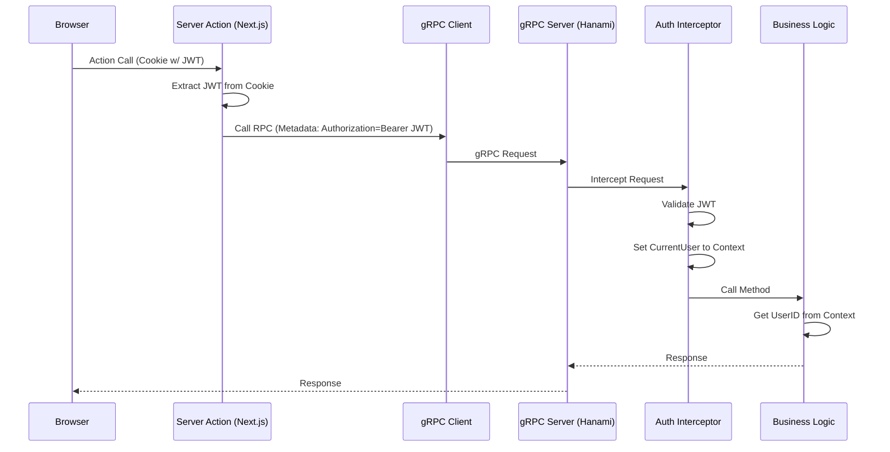

# Architecture Skeleton

## Goal
新しいキャストプラットフォーム機能をサポートするための、システム全体のアーキテクチャフレームワークを定義します。

## Scope
- サービス境界の定義（Frontend, BFF, Monolith Backend）。
- 認証戦略の確立（JWT, Sessions）。
- API通信の標準化（gRPC, Connect）。
- コンテキスト伝播メカニズムの定義（Metadata handlers）。

## Detailed Design

### 1. Service Boundaries
- **Frontend (Web/Heaven)**: Next.js App Router。BFF (Backend for Frontend) として機能し、クライアントサイドへのレンダリングと、Server Actions を通じたバックエンドとの通信を担当。セッション（Cookie）の管理者はここ。
- **Backend (Monolith)**: Hanami ベースのモジュラーモノリス。ビジネスロジックとデータ永続化を担当。ステートレスであり、リクエストごとの認証コンテキストに依存する。

### 2. Authentication & Context Propagation
本番運用に耐えうる認証フローを確立します。クライアントから送られてきた認証トークンをバックエンドで検証し、コンテキストとして利用可能な状態にします。

### 3. Backend Implementation Strategy
- **Gem**: `gruf` を使用し、gRPC サーバーとして機能させる。
- **Interceptor**: `Gruf::Interceptors::ServerInterceptor` を継承した `AuthenticationInterceptor` を実装する。ここで JWT の検証とデコードを行う。
- **Context Access**: `Gruf::CallContext` または `Thread.current` をラップしたヘルパーモジュール（例: `Monolith::Current`）を用意し、各サービス層からは `Current.user_id` のようにアクセス可能にする。これにより、メソッド引数でのバケツリレーを排除する。

### 4. Shared Kernel / Lib
- 認証ロジックなどの横断的関心事は `slices/identity` に閉じるか、あるいは全スライスから参照可能な `lib/monolith/interceptor` などに配置する。今回は Modular Monolith であるため、`identity` スライスがトークン検証ロジックを提供し、共有の Interceptor がそれを利用する形を推奨する。

### 5. Authentication Strategy for Polyglot Microservices
マイクロサービス化において、異なる言語（Go, Rust, Node.js等）が混在する場合、Ruby Gem のようなコード共有は機能しません。そのため、より一般的で言語非依存な以下のパターンを将来的なゴールとして設定します。

### 5. Authentication Strategy for Polyglot Microservices
Cilium を採用している本環境において、Envoy 等の Sidecar プロセスを各 Pod に配置するパターンは採用しません。代わりに、以下の戦略を将来的なゴールとして設定します。

#### A. Cilium Service Mesh / Gateway API Pattern (Future Offloading)
Cilium Service Mesh (Ingress / Gateway API) 機能を活用し、クラスタのエッジまたはノードレベルで認証をオフロードするパターンです。
- リクエストが各サービスに到達する前に、Cilium (Envoy-based proxy inside/outside) が JWT を検証します。
- 検証済みのリクエストのみがアプリケーションに到達します。
- アプリケーションは `X-User-Id` ヘッダーを信頼してユーザー特定を行います。

#### B. Standardized Middleware Pattern (Current & Polyglot)
Gateway でのオフロードが整うまでの間、または Gateway を通過しないサービス間通信（East-West）において、言語ごとの標準ライブラリ（Middleware）で認証を行うパターンです。
- **Shared Kernel の真の価値**: コードそのものではなく、**「認証仕様（トークン形式、署名鍵の配布方法、検証ルール）」の標準化**にあります。
- 現在の Ruby 実装はこの「標準仕様」の最初のリファレンス実装（Reference Implementation）と位置付けます。将来 Go/Rust 等でサービスを書く際は、この共通仕様に従って各言語の薄い Middleware を実装します。

**結論**:
当面は Ruby モノリスであるため、Shared Lib (Middleware) パターンを採用します。これは将来的に **Cilium Gateway によるオフロード** へ移行する際も、アプリ側は「ヘッダー/コンテキストから ID を取る」というインターフェースを変えることなく、インフラ側の設定変更のみで移行可能です。
