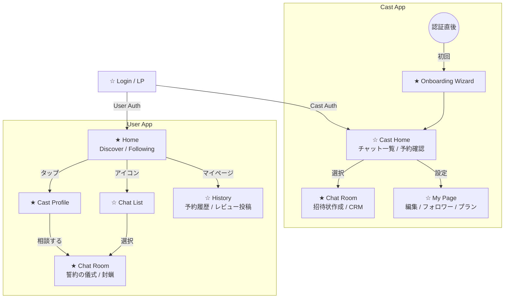

# 画面構成

大きく **A. 共通**, **B. Cast App**, **C. User App** の3つに分けて整理します。

### A. Entry (入り口)

* **☆ Login / LP:**
* サービスへの入り口。
* 「キャストとしてログイン」「ゲストとして利用開始」の分岐。
* SMS認証画面。

---

### B. Cast App (キャスト側)

キャストは「業務ツール」としての効率性が求められます。

1. **★ Onboarding Wizard (初期設定)**
* 初回ログイン時のみ表示。

2. **☆ Cast Home (チャット一覧 & ダッシュボード)**
* **【提案】** アプリ起動直後の画面。
* **未読チャット**の一覧（LINEのトーク一覧に近い）。
* **「本日の予約」**がある場合は最上部にアラート表示。
* ここから個別のチャットルームへ飛びます。

3. **★ Chat Room (対客室)**
* メッセージ送信、招待状作成(Drawer)、CRMメモ(Drawer)、No Show報告。

4. **☆ My Page (管理画面)**
* **プロフィール編集:** 写真やタグの変更。
* **★ フォロワーリスト:**
* **プラン設定:** 招待状プリセットの編集。
* **売上確認:** (MVPでは簡易的でOK)

---

### C. User App (ユーザー側)

ユーザーは「探索」と「没入」が求められます。

1. **★ Home (探索 & フォロー)**
* **Discoverタブ:** 新規キャスト探し。
* **Followingタブ:** フォロー中キャストのステータス確認。
* **☆ Chat Listへの入り口:** ヘッダー等にアイコンが必要。

2. **★ Cast Profile (プロフィール)**
* 詳細閲覧、フォロー、チャット開始。

3. **☆ Chat List (トーク一覧)**
* **【提案】** 複数の嬢と同時進行でやり取りする場合の管理画面。
* 未読バッジ表示。

4. **★ Chat Room (User View)**
* メッセージ閲覧。
* **招待状の開封 & 誓約（長押し儀式）**。
* ※ここが「Cast側チャット」と対になる画面です。

5. **☆ History / My Page**
* **【提案】** 過去の「誓約（予約）」履歴。
* **レビュー投稿:** `visited` になった予約に対してレビューを書く画面。

---

## 画面遷移図

最小構成版の全体像を可視化しました。`[ ]` は画面、`-->` は遷移を表します。

